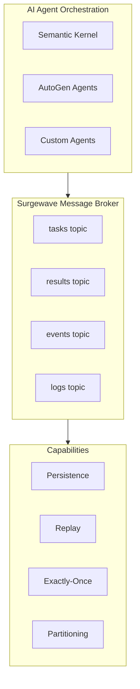
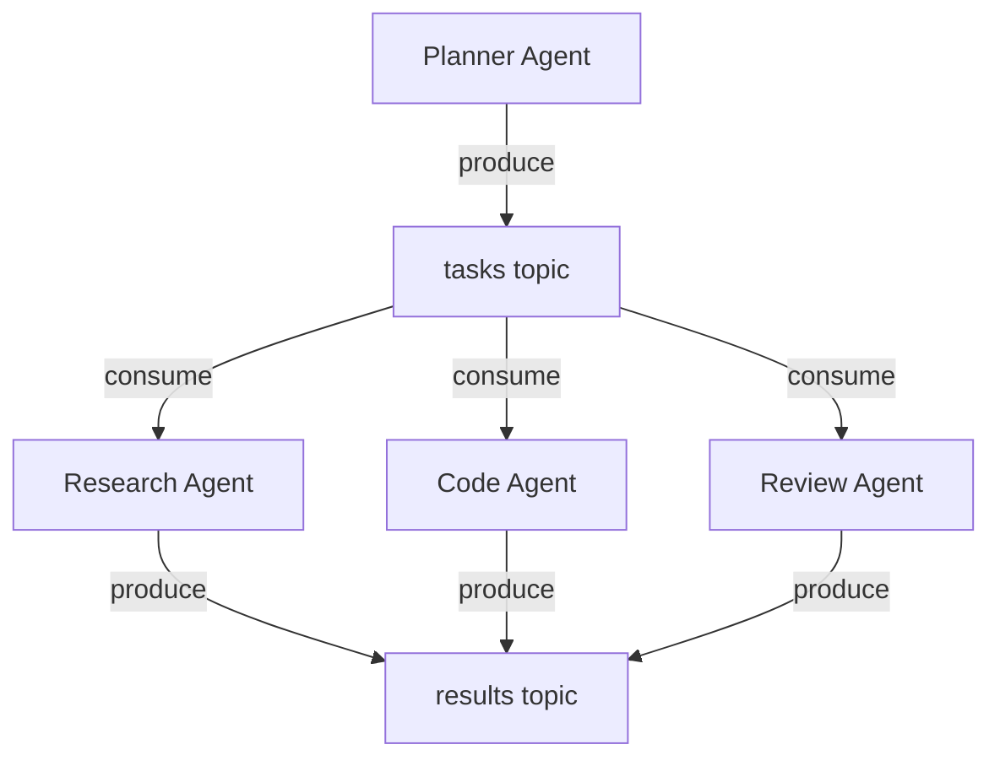
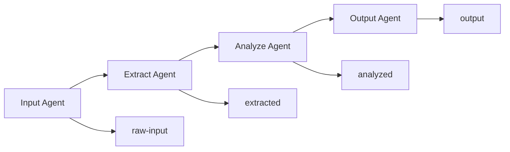
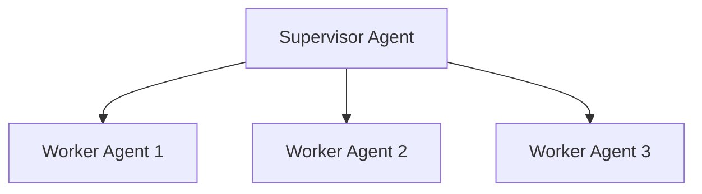
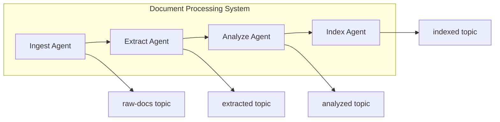
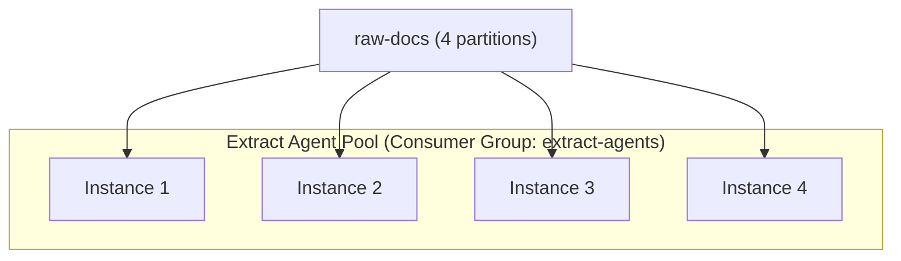

# Agent Integration

Surgewave serves as the communication backbone for multi-agent AI systems, enabling event-driven architectures with Microsoft's AI frameworks including Semantic Kernel, AutoGen, and Microsoft.Extensions.AI.

## Why Surgewave + Agent Frameworks?

### The Challenge

Modern AI agent systems face coordination challenges:
- Agents need reliable message delivery
- State must persist across failures
- Multiple agents process different tasks
- Results need aggregation and routing
- Systems must scale horizontally

### The Solution

Surgewave provides the infrastructure layer:



## Key Benefits

| Benefit | Description |
|---------|-------------|
| **Decoupling** | Agents communicate via topics, not direct calls |
| **Persistence** | Messages survive agent restarts |
| **Replay** | Reprocess from any offset for debugging |
| **Scaling** | Add agent instances with consumer groups |
| **Observability** | Full audit trail of agent interactions |
| **Exactly-Once** | Prevent duplicate processing |

## Architecture Patterns

### Pattern 1: Task Distribution

Distribute work across specialized agents:



### Pattern 2: Event-Driven Pipeline

Chain agents in processing pipeline:



### Pattern 3: Supervisor Hierarchy

Hierarchical agent coordination:



## Semantic Kernel Integration

### Setup with Dependency Injection

```csharp
using Microsoft.SemanticKernel;
using Microsoft.Extensions.DependencyInjection;
using Microsoft.Extensions.Hosting;
using Kuestenlogik.Surgewave.Client;

var builder = Host.CreateApplicationBuilder(args);

// Register Surgewave client
builder.Services.AddSingleton<ISurgewaveClient>(sp =>
    new SurgewaveClient(builder.Configuration["Surgewave:BootstrapServers"]!));

builder.Services.AddSingleton<ISurgewaveProducer>(sp =>
    sp.GetRequiredService<ISurgewaveClient>().CreateProducer());

builder.Services.AddSingleton<ISurgewaveConsumer>(sp =>
    sp.GetRequiredService<ISurgewaveClient>().CreateConsumer(new ConsumerConfig
    {
        GroupId = "semantic-kernel-agents",
        AutoOffsetReset = AutoOffsetReset.Earliest
    }));

// Register Semantic Kernel
builder.Services.AddKernel()
    .AddOpenAIChatCompletion(
        modelId: "gpt-4o",
        apiKey: builder.Configuration["OpenAI:ApiKey"]!);

// Register agent services
builder.Services.AddHostedService<TaskProcessorAgent>();
builder.Services.AddHostedService<SummarizerAgent>();

var app = builder.Build();
await app.RunAsync();
```

### Basic Setup

```csharp
using Microsoft.SemanticKernel;
using Kuestenlogik.Surgewave.Client;

// Create Surgewave client
var surgewave = new SurgewaveClient("localhost:9092");

// Create Semantic Kernel
var kernel = Kernel.CreateBuilder()
    .AddOpenAIChatCompletion("gpt-4o", apiKey)
    .Build();
```

### Agent with Surgewave Consumer

```csharp
public class SurgewaveSemanticKernelAgent
{
    private readonly Kernel _kernel;
    private readonly ISurgewaveConsumer _consumer;
    private readonly ISurgewaveProducer _producer;

    public async Task RunAsync(CancellationToken ct)
    {
        await foreach (var message in _consumer.ConsumeAsync(ct))
        {
            // Process with Semantic Kernel
            var task = JsonSerializer.Deserialize<AgentTask>(message.Value);

            var result = await _kernel.InvokePromptAsync(
                task.Prompt,
                new KernelArguments { ["input"] = task.Input }
            );

            // Publish result to Surgewave
            await _producer.ProduceAsync("results", new Message
            {
                Key = message.Key,
                Value = JsonSerializer.SerializeToUtf8Bytes(new
                {
                    TaskId = task.Id,
                    Result = result.ToString(),
                    ProcessedAt = DateTime.UtcNow
                })
            });

            await _consumer.CommitAsync(message);
        }
    }
}
```

### Using Semantic Kernel Plugins

```csharp
// Define a plugin
public class DataPlugin
{
    private readonly ISurgewaveProducer _producer;

    [KernelFunction("store_result")]
    [Description("Store analysis result to Surgewave")]
    public async Task StoreResultAsync(
        [Description("The result to store")] string result,
        [Description("The category")] string category)
    {
        await _producer.ProduceAsync($"results-{category}", new Message
        {
            Value = Encoding.UTF8.GetBytes(result)
        });
    }
}

// Register plugin
kernel.Plugins.AddFromObject(new DataPlugin(producer));
```

### Tool Calling with Function Execution

```csharp
public class ToolCallingAgent : BackgroundService
{
    private readonly Kernel _kernel;
    private readonly ISurgewaveConsumer _consumer;
    private readonly ISurgewaveProducer _producer;

    public ToolCallingAgent(Kernel kernel, ISurgewaveConsumer consumer, ISurgewaveProducer producer)
    {
        _kernel = kernel;
        _consumer = consumer;
        _producer = producer;

        // Register Surgewave-integrated tools
        _kernel.Plugins.AddFromObject(new SurgewaveTools(_producer), "surgewave");
        _kernel.Plugins.AddFromObject(new SearchTools(), "search");
    }

    protected override async Task ExecuteAsync(CancellationToken ct)
    {
        await foreach (var message in _consumer.ConsumeAsync("agent-requests", ct))
        {
            var request = JsonSerializer.Deserialize<AgentRequest>(message.Value);

            // Enable automatic function calling
            var settings = new OpenAIPromptExecutionSettings
            {
                ToolCallBehavior = ToolCallBehavior.AutoInvokeKernelFunctions,
                Temperature = 0.7
            };

            var result = await _kernel.InvokePromptAsync(
                request.Prompt,
                new KernelArguments(settings));

            await _producer.ProduceAsync("agent-responses", new
            {
                RequestId = request.Id,
                Response = result.ToString(),
                ToolsUsed = result.Metadata?["ToolCalls"]
            });
        }
    }
}

// Surgewave-integrated tools the agent can call
public class SurgewaveTools
{
    private readonly ISurgewaveProducer _producer;

    public SurgewaveTools(ISurgewaveProducer producer) => _producer = producer;

    [KernelFunction("publish_event")]
    [Description("Publish an event to a Surgewave topic for other agents")]
    public async Task<string> PublishEventAsync(
        [Description("Topic name")] string topic,
        [Description("Event type")] string eventType,
        [Description("Event data as JSON")] string data)
    {
        await _producer.ProduceAsync(topic, new Message
        {
            Key = Encoding.UTF8.GetBytes(eventType),
            Value = Encoding.UTF8.GetBytes(data)
        });
        return $"Published {eventType} to {topic}";
    }

    [KernelFunction("request_analysis")]
    [Description("Request another agent to analyze data")]
    public async Task<string> RequestAnalysisAsync(
        [Description("Type of analysis: sentiment, summary, classification")] string analysisType,
        [Description("Text to analyze")] string text)
    {
        var requestId = Guid.NewGuid().ToString();
        await _producer.ProduceAsync("analysis-requests", new
        {
            Id = requestId,
            Type = analysisType,
            Text = text,
            RequestedAt = DateTime.UtcNow
        });
        return $"Analysis request {requestId} submitted";
    }
}
```

### Streaming Responses

```csharp
public class StreamingAgent : BackgroundService
{
    private readonly Kernel _kernel;
    private readonly ISurgewaveConsumer _consumer;
    private readonly ISurgewaveProducer _producer;

    protected override async Task ExecuteAsync(CancellationToken ct)
    {
        await foreach (var message in _consumer.ConsumeAsync("stream-requests", ct))
        {
            var request = JsonSerializer.Deserialize<StreamRequest>(message.Value);
            var streamId = Guid.NewGuid().ToString();

            // Notify stream started
            await _producer.ProduceAsync("stream-events", new
            {
                StreamId = streamId,
                RequestId = request.Id,
                Event = "started"
            });

            var fullResponse = new StringBuilder();

            // Stream chunks to Surgewave topic
            await foreach (var chunk in _kernel.InvokePromptStreamingAsync(request.Prompt, ct: ct))
            {
                var text = chunk.ToString();
                fullResponse.Append(text);

                await _producer.ProduceAsync("stream-chunks", new
                {
                    StreamId = streamId,
                    Chunk = text,
                    Timestamp = DateTime.UtcNow
                });
            }

            // Notify stream completed
            await _producer.ProduceAsync("stream-events", new
            {
                StreamId = streamId,
                RequestId = request.Id,
                Event = "completed",
                FullResponse = fullResponse.ToString()
            });
        }
    }
}
```

### RAG Query Agent

```csharp
public class RagQueryAgent : BackgroundService
{
    private readonly Kernel _kernel;
    private readonly ISurgewaveConsumer _consumer;
    private readonly ISurgewaveProducer _producer;
    private readonly QdrantClient _qdrant;
    private readonly IEmbeddingGenerator<string, Embedding<float>> _embedder;

    protected override async Task ExecuteAsync(CancellationToken ct)
    {
        await foreach (var message in _consumer.ConsumeAsync("rag-queries", ct))
        {
            var query = JsonSerializer.Deserialize<RagQuery>(message.Value);

            // Generate query embedding
            var queryEmbedding = await _embedder.GenerateAsync([query.Question]);

            // Search Qdrant for relevant documents
            var searchResults = await _qdrant.SearchAsync(
                collectionName: "documents",
                vector: queryEmbedding[0].Vector.ToArray(),
                limit: 5);

            // Build context from retrieved documents
            var context = string.Join("\n\n", searchResults.Select(r =>
                $"[Source: {r.Payload["source"]}]\n{r.Payload["content"]}"));

            // Generate answer with context
            var prompt = $"""
                Answer the question based on the following context.
                If the context doesn't contain relevant information, say so.

                Context:
                {context}

                Question: {query.Question}

                Answer:
                """;

            var answer = await _kernel.InvokePromptAsync(prompt);

            await _producer.ProduceAsync("rag-answers", new
            {
                QueryId = query.Id,
                Question = query.Question,
                Answer = answer.ToString(),
                Sources = searchResults.Select(r => r.Payload["source"]).ToList(),
                Timestamp = DateTime.UtcNow
            });
        }
    }
}
```

### Conversation Memory with Surgewave

```csharp
public class ConversationalAgent : BackgroundService
{
    private readonly Kernel _kernel;
    private readonly ISurgewaveConsumer _consumer;
    private readonly ISurgewaveProducer _producer;
    private readonly IChatCompletionService _chat;

    protected override async Task ExecuteAsync(CancellationToken ct)
    {
        await foreach (var message in _consumer.ConsumeAsync("chat-messages", ct))
        {
            var chatMessage = JsonSerializer.Deserialize<ChatMessage>(message.Value);

            // Load conversation history from Surgewave topic
            var history = await LoadConversationHistoryAsync(chatMessage.ConversationId);

            // Add new user message
            history.AddUserMessage(chatMessage.Content);

            // Generate response
            var response = await _chat.GetChatMessageContentAsync(history);

            // Save assistant response to history
            history.AddAssistantMessage(response.Content!);

            // Persist conversation turn to Surgewave
            await _producer.ProduceAsync("conversation-history", new
            {
                ConversationId = chatMessage.ConversationId,
                Role = "assistant",
                Content = response.Content,
                Timestamp = DateTime.UtcNow
            });

            // Send response
            await _producer.ProduceAsync("chat-responses", new
            {
                ConversationId = chatMessage.ConversationId,
                MessageId = chatMessage.Id,
                Response = response.Content
            });
        }
    }

    private async Task<ChatHistory> LoadConversationHistoryAsync(string conversationId)
    {
        var history = new ChatHistory("You are a helpful assistant.");

        // Query Surgewave for conversation history (using dedicated consumer)
        var historyConsumer = _surgewave.CreateConsumer(new ConsumerConfig
        {
            GroupId = $"history-reader-{Guid.NewGuid()}",
            AutoOffsetReset = AutoOffsetReset.Earliest
        });

        await foreach (var msg in historyConsumer.ConsumeAsync("conversation-history"))
        {
            var turn = JsonSerializer.Deserialize<ConversationTurn>(msg.Value);
            if (turn.ConversationId != conversationId) continue;

            if (turn.Role == "user")
                history.AddUserMessage(turn.Content);
            else
                history.AddAssistantMessage(turn.Content);
        }

        return history;
    }
}
```

## AutoGen Integration

### Multi-Agent Conversation via Surgewave

```csharp
using AutoGen.Core;
using Kuestenlogik.Surgewave.Client;

public class SurgewaveAgentRuntime
{
    private readonly ISurgewaveConsumer _consumer;
    private readonly ISurgewaveProducer _producer;
    private readonly IAgent[] _agents;

    public async Task RunConversationAsync(CancellationToken ct)
    {
        await foreach (var message in _consumer.ConsumeAsync("conversations", ct))
        {
            var conversation = JsonSerializer.Deserialize<Conversation>(message.Value);

            // Route to appropriate agent
            var agent = SelectAgent(conversation.CurrentStep);

            var response = await agent.GenerateReplyAsync(
                conversation.Messages.Select(m => new TextMessage(m.Role, m.Content))
            );

            // Continue conversation or finalize
            if (conversation.IsComplete)
            {
                await _producer.ProduceAsync("completed", message.Value);
            }
            else
            {
                conversation.Messages.Add(new(agent.Name, response.Content));
                conversation.CurrentStep++;
                await _producer.ProduceAsync("conversations",
                    JsonSerializer.SerializeToUtf8Bytes(conversation));
            }
        }
    }
}
```

### Agent Group Chat

```csharp
public async Task RunGroupChatAsync()
{
    var researcher = new AssistantAgent("Researcher", systemMessage: "You research topics");
    var critic = new AssistantAgent("Critic", systemMessage: "You critique research");
    var writer = new AssistantAgent("Writer", systemMessage: "You write final content");

    await foreach (var task in _consumer.ConsumeAsync("group-tasks", ct))
    {
        var groupChat = new GroupChat([researcher, critic, writer]);

        var messages = new List<IMessage>();
        await foreach (var msg in groupChat.SendAsync(task.Prompt, maxRound: 10))
        {
            messages.Add(msg);

            // Stream progress to Surgewave
            await _producer.ProduceAsync("agent-activity", new
            {
                TaskId = task.Id,
                Agent = msg.From,
                Content = msg.Content,
                Timestamp = DateTime.UtcNow
            });
        }

        // Final result
        await _producer.ProduceAsync("results", new
        {
            TaskId = task.Id,
            FinalResult = messages.Last().Content,
            ConversationLength = messages.Count
        });
    }
}
```

### Two-Agent Collaboration

```csharp
public class TwoAgentCollaboration : BackgroundService
{
    private readonly ISurgewaveConsumer _consumer;
    private readonly ISurgewaveProducer _producer;

    protected override async Task ExecuteAsync(CancellationToken ct)
    {
        // Create specialized agents
        var coder = new AssistantAgent(
            name: "Coder",
            systemMessage: "You are a software developer. Write clean, working code.",
            llmConfig: new ConversableAgentConfig { Temperature = 0.2f });

        var reviewer = new AssistantAgent(
            name: "Reviewer",
            systemMessage: "You review code for bugs, security issues, and best practices.",
            llmConfig: new ConversableAgentConfig { Temperature = 0.3f });

        await foreach (var message in _consumer.ConsumeAsync("code-requests", ct))
        {
            var request = JsonSerializer.Deserialize<CodeRequest>(message.Value);

            // Step 1: Coder writes code
            var codeResponse = await coder.GenerateReplyAsync(
                [new TextMessage(Role.User, $"Write code for: {request.Task}")]);

            await _producer.ProduceAsync("agent-activity", new
            {
                RequestId = request.Id,
                Agent = "Coder",
                Action = "code_written",
                Content = codeResponse.Content
            });

            // Step 2: Reviewer reviews
            var reviewResponse = await reviewer.GenerateReplyAsync([
                new TextMessage(Role.User, $"Review this code:\n{codeResponse.Content}")
            ]);

            await _producer.ProduceAsync("agent-activity", new
            {
                RequestId = request.Id,
                Agent = "Reviewer",
                Action = "code_reviewed",
                Content = reviewResponse.Content
            });

            // Step 3: Coder fixes based on review
            var fixedCode = await coder.GenerateReplyAsync([
                new TextMessage(Role.User, $"Original code:\n{codeResponse.Content}"),
                new TextMessage(Role.User, $"Review feedback:\n{reviewResponse.Content}"),
                new TextMessage(Role.User, "Fix the code based on the review.")
            ]);

            // Publish final result
            await _producer.ProduceAsync("code-results", new
            {
                RequestId = request.Id,
                Task = request.Task,
                OriginalCode = codeResponse.Content,
                Review = reviewResponse.Content,
                FinalCode = fixedCode.Content
            });
        }
    }
}
```

### State Machine Agent

```csharp
public class StateMachineAgent : BackgroundService
{
    private readonly ISurgewaveConsumer _consumer;
    private readonly ISurgewaveProducer _producer;
    private readonly Dictionary<string, IAgent> _agents;

    protected override async Task ExecuteAsync(CancellationToken ct)
    {
        await foreach (var message in _consumer.ConsumeAsync("workflow-tasks", ct))
        {
            var task = JsonSerializer.Deserialize<WorkflowTask>(message.Value);

            // State machine transitions
            var state = task.State ?? "start";
            var context = task.Context ?? new Dictionary<string, object>();

            while (state != "complete" && state != "failed")
            {
                var agent = _agents[state];
                var response = await agent.GenerateReplyAsync(
                    [new TextMessage(Role.User, JsonSerializer.Serialize(context))]);

                // Parse agent decision
                var decision = JsonSerializer.Deserialize<AgentDecision>(response.Content!);

                // Log state transition
                await _producer.ProduceAsync("workflow-transitions", new
                {
                    TaskId = task.Id,
                    FromState = state,
                    ToState = decision.NextState,
                    AgentOutput = decision.Output,
                    Timestamp = DateTime.UtcNow
                });

                // Update context and state
                context[state + "_result"] = decision.Output;
                state = decision.NextState;
            }

            await _producer.ProduceAsync("workflow-complete", new
            {
                TaskId = task.Id,
                FinalState = state,
                Context = context
            });
        }
    }
}

public record AgentDecision(string NextState, string Output, Dictionary<string, object>? Data);
```

## Microsoft.Extensions.AI Integration

### Chat Client with Surgewave Logging

```csharp
using Microsoft.Extensions.AI;
using Kuestenlogik.Surgewave.Client;

public class SurgewaveLoggingChatClient : IChatClient
{
    private readonly IChatClient _inner;
    private readonly ISurgewaveProducer _producer;

    public async Task<ChatResponse> GetResponseAsync(
        IEnumerable<ChatMessage> messages,
        ChatOptions? options = null,
        CancellationToken ct = default)
    {
        // Log request to Surgewave
        await _producer.ProduceAsync("llm-requests", new
        {
            Messages = messages,
            Model = options?.ModelId,
            Timestamp = DateTime.UtcNow
        });

        var response = await _inner.GetResponseAsync(messages, options, ct);

        // Log response to Surgewave
        await _producer.ProduceAsync("llm-responses", new
        {
            Response = response.Message.Text,
            Usage = response.Usage,
            Timestamp = DateTime.UtcNow
        });

        return response;
    }
}
```

### Embedding Pipeline

```csharp
public class EmbeddingPipeline
{
    private readonly IEmbeddingGenerator<string, Embedding<float>> _embedder;
    private readonly ISurgewaveConsumer _consumer;
    private readonly ISurgewaveProducer _producer;

    public async Task ProcessAsync(CancellationToken ct)
    {
        var batch = new List<(Message, string)>();

        await foreach (var message in _consumer.ConsumeAsync("documents", ct))
        {
            var doc = JsonSerializer.Deserialize<Document>(message.Value);
            batch.Add((message, doc.Content));

            if (batch.Count >= 100)
            {
                // Batch embed
                var embeddings = await _embedder.GenerateAsync(
                    batch.Select(b => b.Item2).ToList());

                // Publish embeddings
                for (int i = 0; i < batch.Count; i++)
                {
                    await _producer.ProduceAsync("embeddings", new
                    {
                        Id = batch[i].Item1.Key,
                        Embedding = embeddings[i].Vector.ToArray()
                    });
                }

                batch.Clear();
            }
        }
    }
}
```

### Function Calling with Microsoft.Extensions.AI

```csharp
public class FunctionCallingAgent : BackgroundService
{
    private readonly IChatClient _chatClient;
    private readonly ISurgewaveConsumer _consumer;
    private readonly ISurgewaveProducer _producer;

    protected override async Task ExecuteAsync(CancellationToken ct)
    {
        // Define available functions
        var tools = new List<AITool>
        {
            AIFunctionFactory.Create(SearchDocuments),
            AIFunctionFactory.Create(StoreResult),
            AIFunctionFactory.Create(NotifyAgent)
        };

        await foreach (var message in _consumer.ConsumeAsync("function-requests", ct))
        {
            var request = JsonSerializer.Deserialize<FunctionRequest>(message.Value);

            var options = new ChatOptions { Tools = tools };
            var messages = new List<ChatMessage>
            {
                new(ChatRole.System, "You are an assistant that can search documents, store results, and notify other agents."),
                new(ChatRole.User, request.Prompt)
            };

            // Loop until no more tool calls
            while (true)
            {
                var response = await _chatClient.GetResponseAsync(messages, options, ct);
                messages.Add(response.Message);

                var toolCalls = response.Message.Contents
                    .OfType<FunctionCallContent>()
                    .ToList();

                if (toolCalls.Count == 0)
                {
                    // No more tools to call, we have the final response
                    await _producer.ProduceAsync("function-results", new
                    {
                        RequestId = request.Id,
                        Response = response.Message.Text
                    });
                    break;
                }

                // Execute tool calls
                foreach (var toolCall in toolCalls)
                {
                    var result = await toolCall.InvokeAsync(ct);
                    messages.Add(new ChatMessage(ChatRole.Tool, [result]));

                    // Log tool execution
                    await _producer.ProduceAsync("tool-executions", new
                    {
                        RequestId = request.Id,
                        Tool = toolCall.Name,
                        Arguments = toolCall.Arguments,
                        Result = result.Result
                    });
                }
            }
        }
    }

    [Description("Search documents for relevant information")]
    private async Task<string> SearchDocuments(
        [Description("The search query")] string query,
        [Description("Maximum results")] int limit = 5)
    {
        // Search implementation
        return $"Found {limit} documents matching '{query}'";
    }

    [Description("Store a result for later retrieval")]
    private async Task<string> StoreResult(
        [Description("Key to store under")] string key,
        [Description("Value to store")] string value)
    {
        await _producer.ProduceAsync("stored-results", new { Key = key, Value = value });
        return $"Stored '{key}'";
    }

    [Description("Notify another agent to perform a task")]
    private async Task<string> NotifyAgent(
        [Description("Agent name")] string agentName,
        [Description("Task description")] string task)
    {
        await _producer.ProduceAsync($"agent-{agentName}-tasks", new { Task = task });
        return $"Notified {agentName}";
    }
}
```

### Caching Middleware with Surgewave

```csharp
public class SurgewaveCachingChatClient : DelegatingChatClient
{
    private readonly ISurgewaveProducer _producer;
    private readonly ISurgewaveConsumer _consumer;
    private readonly TimeSpan _cacheDuration;

    public SurgewaveCachingChatClient(
        IChatClient inner,
        ISurgewaveProducer producer,
        ISurgewaveConsumer consumer,
        TimeSpan? cacheDuration = null)
        : base(inner)
    {
        _producer = producer;
        _consumer = consumer;
        _cacheDuration = cacheDuration ?? TimeSpan.FromHours(1);
    }

    public override async Task<ChatResponse> GetResponseAsync(
        IEnumerable<ChatMessage> messages,
        ChatOptions? options = null,
        CancellationToken ct = default)
    {
        var cacheKey = ComputeCacheKey(messages, options);

        // Check cache (Surgewave compacted topic)
        var cached = await GetFromCacheAsync(cacheKey, ct);
        if (cached != null)
        {
            await _producer.ProduceAsync("cache-hits", new
            {
                CacheKey = cacheKey,
                Timestamp = DateTime.UtcNow
            });
            return cached;
        }

        // Call underlying client
        var response = await base.GetResponseAsync(messages, options, ct);

        // Store in cache
        await _producer.ProduceAsync("llm-cache", new Message
        {
            Key = Encoding.UTF8.GetBytes(cacheKey),
            Value = JsonSerializer.SerializeToUtf8Bytes(new CacheEntry
            {
                Response = response,
                ExpiresAt = DateTime.UtcNow.Add(_cacheDuration)
            })
        });

        return response;
    }

    private string ComputeCacheKey(IEnumerable<ChatMessage> messages, ChatOptions? options)
    {
        var content = string.Join("|", messages.Select(m => $"{m.Role}:{m.Text}"));
        var hash = SHA256.HashData(Encoding.UTF8.GetBytes(content + options?.ModelId));
        return Convert.ToBase64String(hash);
    }
}
```

### Prompt Template Pipeline

```csharp
public class PromptPipelineAgent : BackgroundService
{
    private readonly IChatClient _client;
    private readonly ISurgewaveConsumer _consumer;
    private readonly ISurgewaveProducer _producer;

    // Prompt templates stored as constants or loaded from config
    private readonly Dictionary<string, string> _templates = new()
    {
        ["summarize"] = "Summarize the following text in {length} sentences:\n\n{text}",
        ["translate"] = "Translate the following text to {language}:\n\n{text}",
        ["analyze"] = "Analyze the sentiment and key themes in:\n\n{text}",
        ["extract"] = "Extract {entity_type} entities from:\n\n{text}"
    };

    protected override async Task ExecuteAsync(CancellationToken ct)
    {
        await foreach (var message in _consumer.ConsumeAsync("prompt-pipeline", ct))
        {
            var request = JsonSerializer.Deserialize<PipelineRequest>(message.Value);

            // Execute pipeline stages
            var context = new Dictionary<string, string>(request.InitialContext);
            var results = new List<StageResult>();

            foreach (var stage in request.Stages)
            {
                if (!_templates.TryGetValue(stage.Template, out var template))
                {
                    results.Add(new StageResult(stage.Name, null, $"Unknown template: {stage.Template}"));
                    continue;
                }

                // Substitute variables
                var prompt = template;
                foreach (var (key, value) in context.Concat(stage.Variables))
                {
                    prompt = prompt.Replace($"{{{key}}}", value);
                }

                // Execute
                var response = await _client.GetResponseAsync(prompt, ct: ct);
                var output = response.Message.Text ?? "";

                // Store output in context for next stage
                context[stage.OutputKey] = output;

                results.Add(new StageResult(stage.Name, output, null));

                // Log stage completion
                await _producer.ProduceAsync("pipeline-stages", new
                {
                    RequestId = request.Id,
                    Stage = stage.Name,
                    Template = stage.Template,
                    Output = output[..Math.Min(200, output.Length)]
                });
            }

            await _producer.ProduceAsync("pipeline-results", new
            {
                RequestId = request.Id,
                Stages = results,
                FinalContext = context
            });
        }
    }
}

public record PipelineRequest(string Id, List<PipelineStage> Stages, Dictionary<string, string> InitialContext);
public record PipelineStage(string Name, string Template, string OutputKey, Dictionary<string, string> Variables);
public record StageResult(string Stage, string? Output, string? Error);
```

## Complete Example: Document Processing System

### Architecture



### Ingest Agent

```csharp
public class IngestAgent : BackgroundService
{
    private readonly ISurgewaveProducer _producer;
    private readonly IFileWatcher _watcher;

    protected override async Task ExecuteAsync(CancellationToken ct)
    {
        await foreach (var file in _watcher.WatchAsync(ct))
        {
            var content = await File.ReadAllBytesAsync(file.Path);

            await _producer.ProduceAsync("raw-docs", new Message
            {
                Key = Encoding.UTF8.GetBytes(file.Name),
                Value = JsonSerializer.SerializeToUtf8Bytes(new
                {
                    FileName = file.Name,
                    Content = Convert.ToBase64String(content),
                    ContentType = file.Extension,
                    IngestedAt = DateTime.UtcNow
                })
            });
        }
    }
}
```

### Extract Agent (Semantic Kernel)

```csharp
public class ExtractAgent : BackgroundService
{
    private readonly Kernel _kernel;
    private readonly ISurgewaveConsumer _consumer;
    private readonly ISurgewaveProducer _producer;

    protected override async Task ExecuteAsync(CancellationToken ct)
    {
        await foreach (var message in _consumer.ConsumeAsync("raw-docs", ct))
        {
            var doc = JsonSerializer.Deserialize<RawDocument>(message.Value);

            var extractedText = await _kernel.InvokePromptAsync(@"
                Extract the main text content from this document.
                Remove headers, footers, and formatting.

                Document: {{$input}}
            ", new KernelArguments { ["input"] = doc.Content });

            await _producer.ProduceAsync("extracted", new
            {
                Id = doc.FileName,
                Text = extractedText.ToString(),
                OriginalType = doc.ContentType
            });

            await _consumer.CommitAsync(message);
        }
    }
}
```

### Analyze Agent (AutoGen)

```csharp
public class AnalyzeAgent : BackgroundService
{
    private readonly IAgent _summarizer;
    private readonly IAgent _classifier;
    private readonly ISurgewaveConsumer _consumer;
    private readonly ISurgewaveProducer _producer;

    protected override async Task ExecuteAsync(CancellationToken ct)
    {
        await foreach (var message in _consumer.ConsumeAsync("extracted", ct))
        {
            var doc = JsonSerializer.Deserialize<ExtractedDocument>(message.Value);

            // Parallel analysis
            var summaryTask = _summarizer.GenerateReplyAsync(
                [new TextMessage(Role.User, $"Summarize: {doc.Text}")]);
            var classifyTask = _classifier.GenerateReplyAsync(
                [new TextMessage(Role.User, $"Classify into categories: {doc.Text}")]);

            await Task.WhenAll(summaryTask, classifyTask);

            await _producer.ProduceAsync("analyzed", new
            {
                Id = doc.Id,
                Text = doc.Text,
                Summary = summaryTask.Result.Content,
                Categories = classifyTask.Result.Content
            });
        }
    }
}
```

### Index Agent (Surgewave + Qdrant)

Uses Surgewave's OpenAI and Qdrant connectors:

```json
{
  "connectors": [
    {
      "name": "embed-analyzed",
      "config": {
        "connector.class": "OpenAISinkConnector",
        "mode": "embeddings",
        "topics": "analyzed",
        "input.field": "Text",
        "output.field": "embedding"
      }
    },
    {
      "name": "store-vectors",
      "config": {
        "connector.class": "QdrantSinkConnector",
        "topics": "analyzed-embeddings",
        "collection": "documents",
        "vector.field": "embedding",
        "payload.fields": "Id,Summary,Categories"
      }
    }
  ]
}
```

## Scaling Agents

### Horizontal Scaling

Use Surgewave consumer groups:

```csharp
var consumer = surgewave.CreateConsumer(new ConsumerConfig
{
    GroupId = "extract-agents",  // Same group ID
    Topics = ["raw-docs"]
});

// Run multiple instances - Surgewave partitions work automatically
```

### Agent Pools



## Error Handling

### Dead Letter Queue

```csharp
try
{
    var result = await ProcessAsync(message);
    await _producer.ProduceAsync("results", result);
}
catch (Exception ex)
{
    // Send to DLQ
    await _producer.ProduceAsync("dlq-extract", new
    {
        OriginalMessage = message.Value,
        Error = ex.Message,
        StackTrace = ex.StackTrace,
        FailedAt = DateTime.UtcNow,
        RetryCount = GetRetryCount(message) + 1
    });
}
```

### Retry Topic

```csharp
// Separate consumer for retries with delay
await foreach (var message in _consumer.ConsumeAsync("retry-extract", ct))
{
    var retryInfo = JsonSerializer.Deserialize<RetryMessage>(message.Value);

    if (retryInfo.RetryCount < 3)
    {
        await Task.Delay(TimeSpan.FromSeconds(Math.Pow(2, retryInfo.RetryCount)));
        await _producer.ProduceAsync("raw-docs", retryInfo.OriginalMessage);
    }
    else
    {
        await _producer.ProduceAsync("failed-permanently", message.Value);
    }
}
```

## Monitoring

### Agent Metrics via Surgewave

```csharp
public class MetricsMiddleware
{
    public async Task ProcessAsync(Message message, Func<Task> next)
    {
        var sw = Stopwatch.StartNew();

        try
        {
            await next();

            await _metricsProducer.ProduceAsync("agent-metrics", new
            {
                Agent = _agentName,
                MessageId = message.Key,
                ProcessingTimeMs = sw.ElapsedMilliseconds,
                Status = "success"
            });
        }
        catch (Exception ex)
        {
            await _metricsProducer.ProduceAsync("agent-metrics", new
            {
                Agent = _agentName,
                MessageId = message.Key,
                ProcessingTimeMs = sw.ElapsedMilliseconds,
                Status = "error",
                Error = ex.Message
            });
            throw;
        }
    }
}
```

## See Also

- [AI Overview](index.md) - Architecture patterns
- [OpenAI Connector](openai.md) - Cloud embeddings
- [Ollama Connector](ollama.md) - Local inference
- [Qdrant Connector](qdrant.md) - Vector storage
