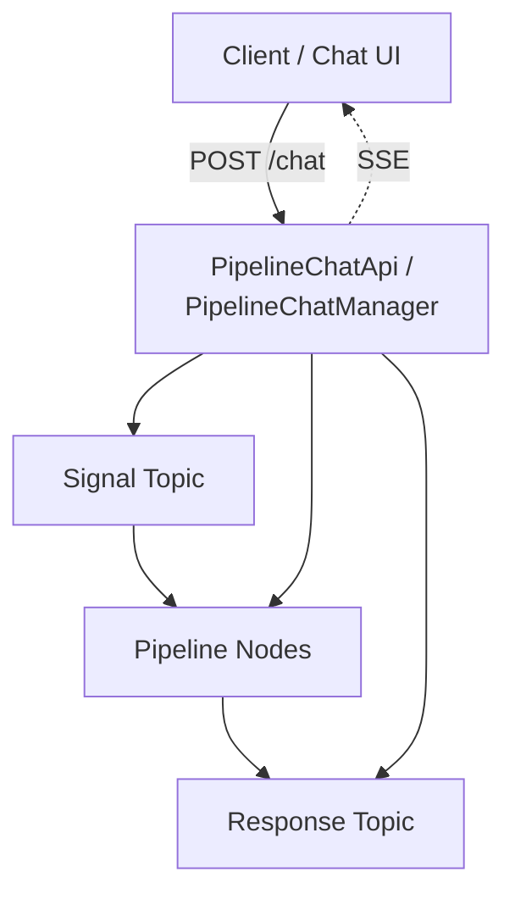

# Pipeline Chat API

Surgewave provides a REST API for interactive chat with agent-based AI pipelines. Users can send messages to running pipelines and receive responses synchronously, asynchronously, or via Server-Sent Events (SSE) streaming.

## Architecture



User messages are produced to a signal topic (`_pipeline-chat-{pipelineId}-signal`), processed by the pipeline, and responses are consumed from the response topic (`_pipeline-chat-{pipelineId}-response`).

## REST Endpoints

All endpoints are under `/api/pipelines/{pipelineId}/chat`.

### Send Message (Synchronous)

```http
POST /api/pipelines/{pipelineId}/chat
Content-Type: application/json

{
    "message": "What is the current status?",
    "sessionId": "optional-session-id"
}
```

Response:

```json
{
    "sessionId": "abc123",
    "messageId": "msg-001",
    "content": "The pipeline is running normally...",
    "role": "assistant",
    "timestamp": "2025-03-14T10:30:00Z",
    "metadata": {}
}
```

### Stream Message (SSE)

```http
POST /api/pipelines/{pipelineId}/chat/stream
Content-Type: application/json

{
    "message": "Explain the pipeline topology",
    "sessionId": "session-42"
}
```

The response is a `text/event-stream` with three event types:

```
event: token
data: {"type":"token","token":"The"}

event: token
data: {"type":"token","token":" pipeline"}

event: done
data: {"type":"done","sessionId":"session-42","messageId":"msg-002","fullContent":"The pipeline..."}
```

| Event Type | Description |
|------------|-------------|
| `token` | A partial token of the response |
| `done` | Final event with the complete response |
| `error` | Error occurred during processing |

### Send Message (Fire-and-Forget)

```http
POST /api/pipelines/{pipelineId}/chat/async
Content-Type: application/json

{
    "message": "Process this in the background",
    "sessionId": "session-42"
}
```

Returns immediately with the message ID for later correlation:

```json
{
    "sessionId": "session-42",
    "messageId": "msg-003"
}
```

### Session Management

**List sessions:**

```http
GET /api/pipelines/{pipelineId}/chat/sessions
```

```json
{
    "pipelineId": "my-pipeline",
    "sessions": [
        {
            "sessionId": "session-42",
            "messageCount": 10,
            "pendingCount": 0,
            "createdAt": "2025-03-14T09:00:00Z",
            "lastActivityAt": "2025-03-14T10:30:00Z"
        }
    ]
}
```

**Get conversation history:**

```http
GET /api/pipelines/{pipelineId}/chat/sessions/{sessionId}/history
```

```json
{
    "sessionId": "session-42",
    "pipelineId": "my-pipeline",
    "messages": [
        { "id": "msg-001", "role": "user", "content": "Hello", "timestamp": "..." },
        { "id": "msg-002", "role": "assistant", "content": "Hi there!", "timestamp": "..." }
    ],
    "createdAt": "2025-03-14T09:00:00Z",
    "lastActivityAt": "2025-03-14T10:30:00Z"
}
```

**Delete a session:**

```http
DELETE /api/pipelines/{pipelineId}/chat/sessions/{sessionId}
```

Returns `204 No Content` on success.

**Get topic info (for pipeline wiring):**

```http
GET /api/pipelines/{pipelineId}/chat/topics
```

```json
{
    "pipelineId": "my-pipeline",
    "signalTopic": "_pipeline-chat-my-pipeline-signal",
    "responseTopic": "_pipeline-chat-my-pipeline-response"
}
```

## Session Management

The `PipelineChatManager` handles session lifecycle:

- **Auto-creation**: Sessions are created on first message if no `sessionId` is provided
- **Idle cleanup**: Sessions idle longer than `SessionIdleTimeout` (default: 30 minutes) are cleaned up
- **Response timeout**: Waiting for a pipeline response times out after `ResponseTimeout` (default: 60 seconds)

## Chat UI

Surgewave Control includes a built-in chat interface:

- **ChatDrawer** - A slide-out chat panel accessible from any page in the Control UI
- **Dedicated chat page** - Full-screen chat interface at `/chat`

Both components connect to the SSE streaming endpoint for real-time token-by-token response display.

## Next Steps

- [Guardrails](guardrails.md) - Content safety for AI pipelines
- [Agent Memory](agent-memory.md) - Persistent memory for AI agents
- [Agent Integration](agent-integration.md) - Multi-agent architectures
