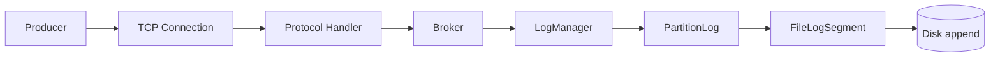
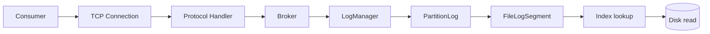
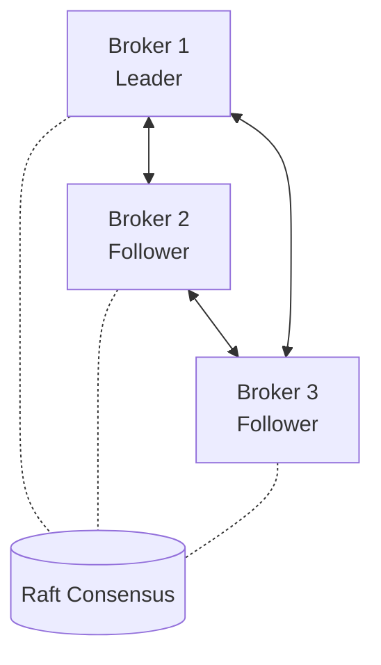
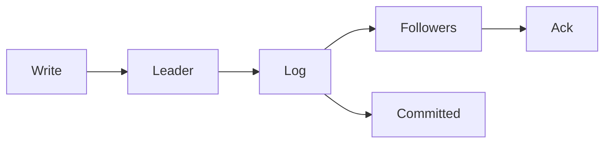

# Surgewave Architecture

## Overview

Surgewave is a Kafka-protocol-compatible message broker written in .NET 10/C# 14. This document describes the internal architecture and design decisions.

### Key Features
- **Full Kafka wire protocol compatibility** - works with existing Kafka clients
- **Transactions with exactly-once semantics** - idempotent producers, transactional consumers
- **Security** - TLS/SSL, SASL (PLAIN, SCRAM), ACL authorization
- **Surgewave Streams** - Kafka Streams-compatible stream processing
- **Surgewave Connect** - Kafka Connect-compatible connector framework
- **Schema Registry** - Avro, JSON Schema, Protobuf support
- **Tiered Storage** - offload to S3/Azure Blob
- **Log Compaction** - key-based deduplication
- **Quotas** - rate limiting with token bucket algorithm

## Core Concepts

### 1. Log-Structured Storage

Surgewave uses an append-only log structure similar to Kafka:

- **Messages** are immutable records with offset, timestamp, key, value, and headers
- **Segments** are fixed-size log files (default 1GB) with accompanying index files
- **Partitions** consist of multiple segments, managed by `PartitionLog`
- **Topics** contain multiple partitions, coordinated by `LogManager`

### 2. Message Flow

#### Write Path (Producer)



#### Read Path (Consumer)



## Component Deep Dive

### FileLogSegment

The fundamental storage unit:

- **File Format**: `[baseOffset].log` and `[baseOffset].index`
- **Index Structure**: Maps offset → file position for fast lookups
- **Write Strategy**: Sequential writes with periodic fsync
- **Read Strategy**: Index-based seeks + sequential reads

```csharp
// Simplified segment structure
class FileLogSegment {
    FileStream _logFile;           // Actual message data
    FileStream _indexFile;         // Offset → position mapping
    Dictionary<long, long> _index; // In-memory cache
    long _baseOffset;              // First offset in segment
    long _currentOffset;           // Next offset to write
}
```

### PartitionLog

Manages multiple segments for a partition:

- **Segment Rolling**: Creates new segment when current is full
- **Multi-Segment Reads**: Spans reads across segments if needed
- **Offset Management**: Tracks high watermark and log start offset
- **Thread Safety**: Uses locks for concurrent access

### LogManager

Top-level coordinator:

- **Topic Registry**: Maintains topic metadata
- **Partition Mapping**: Maps `TopicPartition` to `PartitionLog`
- **Auto-Creation**: Creates topics on first write
- **Lifecycle Management**: Handles creation/deletion

### Protocol Layer

Implements Kafka's binary protocol:

- **Request Parsing**: Reads size-prefixed binary requests
- **Response Serialization**: Writes size-prefixed binary responses
- **API Keys**: Supports Produce, Fetch, Metadata (extensible)
- **Error Handling**: Uses Kafka-compatible error codes

### Network Layer

TCP-based client/server:

- **Async I/O**: Uses async/await for all network operations
- **Connection Pooling**: One connection per client
- **Backpressure**: Throttling via timeout and max request size
- **Graceful Shutdown**: Clean connection termination

## Data Structures

### Message Format

| Field          | Size (bytes) |
|----------------|--------------|
| Offset         | 8            |
| Timestamp      | 8            |
| Key Length     | 4            |
| Key Data       | variable     |
| Value Length   | 4            |
| Value Data     | variable     |
| Headers Length | 4            |
| Headers Data   | variable     |

### Index Format

Repeated entries of:

| Field         | Size (bytes) |
|---------------|--------------|
| Offset        | 8            |
| File Position | 8            |

## Performance Optimizations

### 1. Zero-Copy Reads
- Uses `ReadOnlyMemory<byte>` to avoid unnecessary copies
- Direct file I/O without intermediate buffers

### 2. Sequential I/O
- Append-only writes optimize for disk throughput
- Index structure allows fast random reads

### 3. Batching
- Messages are written in batches
- Index updates are batched

### 4. Memory Efficiency
- Structs instead of classes where possible
- Memory pooling for large buffers (future)

### 5. Async All The Way
- No thread blocking on I/O
- Efficient use of thread pool

## Scalability Considerations

### Current Status (Single-Node)
- ✅ High-performance storage with memory-mapped I/O
- ✅ Tiered storage for offloading to S3/Azure Blob
- ✅ Log compaction and retention policies
- ✅ Partition-level parallelism
- ⚠️ Single-node only (no distributed consensus yet)

### Future Improvements
- **Multi-Node Clustering**: Raft or similar consensus
- **Replication**: Leader-follower replication
- **Partitioning**: Distribute partitions across nodes
- **Load Balancing**: Client-side partition assignment

## Comparison with Kafka

| Feature | Kafka | Surgewave |
|---------|-------|--------------|
| Language | Java/Scala | C# 14 |
| Protocol | Custom Binary | Kafka-compatible |
| Storage | Segment-based log | Segment-based log |
| Coordination | ZooKeeper/KRaft | None (single-node) |
| Replication | Multi-replica | Planned |
| Compression | Snappy, LZ4, etc. | ✅ Gzip, Snappy, LZ4, Zstd |
| Transactions | Full support | ✅ Exactly-once semantics |
| Admin API | Extensive | ✅ Full admin APIs |
| SASL/TLS | ✅ | ✅ PLAIN, SCRAM, TLS |
| ACLs | ✅ | ✅ Full ACL support |
| Schema Registry | Via Confluent | ✅ Built-in |
| Streams API | Kafka Streams | ✅ Surgewave Streams |
| Connect | Kafka Connect | ✅ Surgewave Connect |
| Tiered Storage | ✅ | ✅ S3, Azure Blob |
| Quotas | ✅ | ✅ Token bucket |
| Log Compaction | ✅ | ✅ Full support |

## Design Principles

1. **Simplicity First**: Favor simple solutions over complex ones
2. **Kafka Compatibility**: Maintain wire protocol compatibility
3. **Performance**: Optimize for throughput and latency
4. **Reliability**: Ensure data durability
5. **Observability**: Log important operations
6. **Extensibility**: Design for future enhancements

## Security

Implemented:
- ✅ TLS/SSL encryption for transport security
- ✅ SASL authentication (PLAIN, SCRAM-SHA-256, SCRAM-SHA-512)
- ✅ ACL-based authorization (Read, Write, Create, Delete, Describe, Alter, etc.)
- ✅ Per-client quotas with token bucket rate limiting

## Monitoring and Observability

Implemented:
- ✅ OpenTelemetry-compatible metrics using `System.Diagnostics.Metrics`
- ✅ Prometheus metrics endpoint (`/metrics`)
- ✅ Distributed tracing with `System.Diagnostics.ActivitySource`
- ✅ Health check API (`/health`)
- ✅ Console logging with structured format

### Metrics Available

| Metric | Type | Description |
|--------|------|-------------|
| `surgewave_connections_total` | Counter | Total connections established |
| `surgewave_connections_active` | UpDownCounter | Current active connections |
| `surgewave_requests_total` | Counter | Total requests by API type |
| `surgewave_request_duration_ms` | Histogram | Request processing duration |
| `surgewave_messages_produced_total` | Counter | Total messages produced |
| `surgewave_bytes_produced_total` | Counter | Total bytes produced |
| `surgewave_produce_latency_ms` | Histogram | Produce request latency |
| `surgewave_messages_fetched_total` | Counter | Total messages fetched |
| `surgewave_bytes_fetched_total` | Counter | Total bytes fetched |
| `surgewave_fetch_latency_ms` | Histogram | Fetch request latency |
| `surgewave_transactions_total` | Counter | Total transactions started |
| `surgewave_throttled_requests_total` | Counter | Total throttled requests |
| `surgewave_errors_total` | Counter | Total errors by type |
| `surgewave_topics` | ObservableGauge | Number of topics |
| `surgewave_partitions` | ObservableGauge | Number of partitions |
| `surgewave_log_size_bytes` | ObservableGauge | Total log size |

### Activity Tracing

Supports OpenTelemetry distributed tracing with activities for:
- `surgewave.produce` - Producer operations
- `surgewave.fetch` - Consumer fetch operations
- `surgewave.transaction` - Transaction lifecycle
- `surgewave.request.*` - All API requests

## Testing Strategy

- **Unit Tests**: Core components (FileLogSegment, PartitionLog, etc.)
- **Integration Tests**: End-to-end producer/consumer flows
- **Performance Tests**: Throughput and latency benchmarks
- **Compatibility Tests**: Verify Kafka client compatibility

## Future Architecture

### Multi-Node Cluster



### Replication



## Conclusion

Surgewave provides a solid foundation for Kafka-compatible streaming with room for growth. The architecture prioritizes simplicity while maintaining compatibility and performance.
