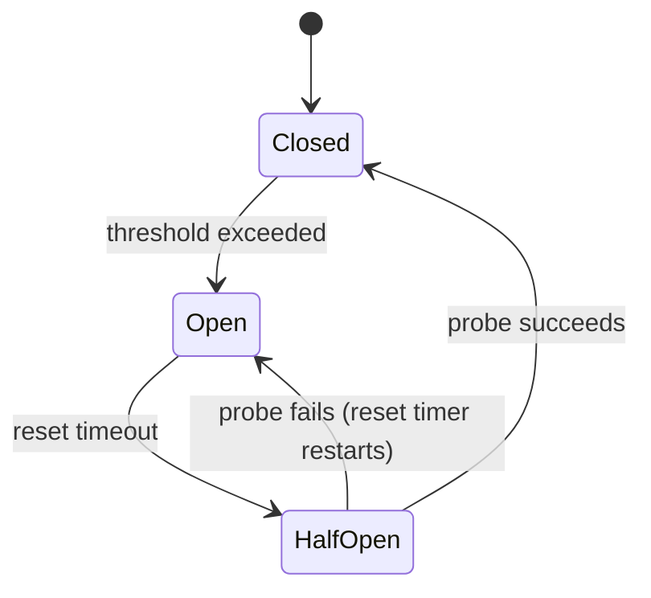

# Circuit Breaker

The Circuit Breaker prevents cascading failures in stream processing topologies by fast-failing
requests when a downstream dependency is consistently unhealthy, and automatically probing for
recovery after a configurable timeout.

## Overview

In a Streams pipeline, processors often call external services (databases, REST APIs, caches). If
that service becomes unavailable, every record in the stream will fail and retry, wasting resources
and amplifying load on an already-degraded system.

A circuit breaker sits in front of the external call and tracks consecutive failures. Once failures
exceed a threshold, the breaker *opens* and starts rejecting requests immediately — no network
round-trip required. After a reset timeout, one probe request is allowed through; if it succeeds
the breaker closes again.



## States

| State | Behaviour |
|-------|-----------|
| `Closed` | Normal operation; all requests pass through |
| `Open` | Requests are immediately rejected (`AllowRequest()` returns `false`) |
| `HalfOpen` | One probe request is allowed; success → Closed, failure → Open |

## Usage

### Standalone

```csharp
using Kuestenlogik.Surgewave.Streams.Resilience;

var breaker = new CircuitBreaker(
    failureThreshold: 5,
    resetTimeout: TimeSpan.FromSeconds(30));

async Task<Result> CallExternalServiceAsync(Order order)
{
    if (!breaker.AllowRequest())
        throw new CircuitBreakerOpenException("External service unavailable");

    try
    {
        var result = await _httpClient.PostAsJsonAsync("/process", order);
        breaker.RecordSuccess();
        return result;
    }
    catch (Exception)
    {
        breaker.RecordFailure();
        throw;
    }
}
```

### In a Streams topology

Wrap the external call inside a `MapValues` or `Peek` step:

```csharp
var breaker = new CircuitBreaker(failureThreshold: 3, resetTimeout: TimeSpan.FromSeconds(10));

builder.Stream<string, Order>("orders")
    .MapValues((key, order) =>
    {
        if (!breaker.AllowRequest())
        {
            // Skip enrichment when circuit is open; emit the bare order
            return new EnrichedOrder(order, enrichment: null);
        }

        try
        {
            var enrichment = _enrichmentService.Enrich(order);
            breaker.RecordSuccess();
            return new EnrichedOrder(order, enrichment);
        }
        catch (Exception)
        {
            breaker.RecordFailure();
            return new EnrichedOrder(order, enrichment: null);
        }
    })
    .To("enriched-orders");
```

### Combined with retry

The circuit breaker pairs naturally with `StreamsRetryPolicy`. Place the breaker check before
the retry so that open-circuit failures do not consume retry budget:

```csharp
var breaker = new CircuitBreaker(failureThreshold: 5);
var retryConfig = new StreamsRetryConfig
{
    MaxRetries = 3,
    BackoffStrategy = BackoffStrategy.ExponentialWithJitter,
    ShouldRetry = ex => ex is not CircuitBreakerOpenException
};

stream
    .WithRetry(retryConfig)
    .MapValues((key, value) =>
    {
        if (!breaker.AllowRequest())
            throw new CircuitBreakerOpenException();

        try
        {
            var result = ExternalCall(value);
            breaker.RecordSuccess();
            return result;
        }
        catch
        {
            breaker.RecordFailure();
            throw;
        }
    })
    .To("results");
```

## API Reference

### Constructor

```csharp
public CircuitBreaker(
    int failureThreshold = 5,
    TimeSpan resetTimeout = default)  // default: 30 seconds
```

| Parameter | Description |
|-----------|-------------|
| `failureThreshold` | Consecutive failures before the circuit opens (default: 5) |
| `resetTimeout` | Time in the Open state before a probe is allowed (default: 30 s) |

### Methods

| Method | Description |
|--------|-------------|
| `AllowRequest()` | Returns `true` if the request should proceed; transitions Open → HalfOpen when the reset timeout has elapsed |
| `RecordSuccess()` | Resets the failure counter; transitions HalfOpen → Closed |
| `RecordFailure()` | Increments the failure counter; transitions Closed/HalfOpen → Open when threshold is reached |

### `State` property

```csharp
public CircuitBreakerState State { get; }
```

Returns the current `CircuitBreakerState` (`Closed`, `Open`, or `HalfOpen`). Useful for health
checks and metrics:

```csharp
// Report circuit state to a health check
if (breaker.State == CircuitBreakerState.Open)
    context.AddError("External service circuit is open");
```

## Thread Safety

`CircuitBreaker` is fully thread-safe. All state transitions use `Interlocked` operations so the
same instance can be shared across multiple processors in a parallel topology without locking.

## Monitoring

Instrument the circuit breaker with OpenTelemetry counters alongside your processor metrics:

```csharp
private static readonly Counter<long> _circuitOpened =
    Meter.CreateCounter<long>("surgewave_streams_circuit_opened_total");

var breaker = new CircuitBreaker(failureThreshold: 5);

// In your failure handler:
breaker.RecordFailure();
if (breaker.State == CircuitBreakerState.Open)
    _circuitOpened.Add(1, new TagList { { "processor", "enrichment" } });
```

## Configuration Guidance

| Scenario | `failureThreshold` | `resetTimeout` |
|----------|--------------------|----------------|
| Fast-responding dependency (< 10 ms) | 5–10 | 10–30 s |
| Slow or bursty dependency (100 ms+) | 3–5 | 30–60 s |
| Critical path; prefer availability | 10+ | 5–10 s |
| Non-critical enrichment | 3 | 5 s |

Set `resetTimeout` long enough to let the dependency recover, but short enough that the system
does not remain degraded longer than necessary.

## Next Steps

- [Kafka Streams](features/streams.md) — Retry & backoff, backpressure
- [Interactive Queries](interactive-queries.md) — Query state stores over REST
- [Monitoring](monitoring/) — OpenTelemetry metrics
