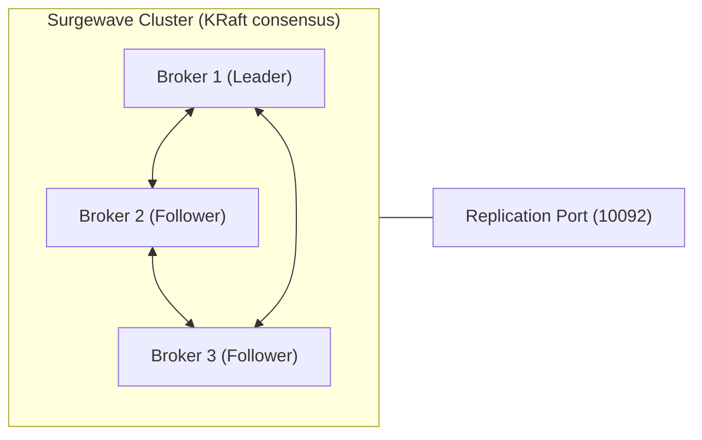

# Clustering Overview

Multi-broker setup for high availability and scalability.

## Architecture



## Features

| Feature | Description |
|---------|-------------|
| [Replication](replication.md) | Partition data replication |
| [KRaft](raft.md) | Consensus without ZooKeeper |
| [Failover](failover.md) | Automatic leader election |

## Quick Setup

### 3-Node Cluster

**Broker 1:**
```json
{
  "Surgewave": {
    "BrokerId": 1,
    "Host": "broker1",
    "Port": 9092,
    "ClusterNodes": "broker1:9092,broker2:9092,broker3:9092",
    "UseRaftConsensus": true
  }
}
```

**Broker 2:**
```json
{
  "Surgewave": {
    "BrokerId": 2,
    "Host": "broker2",
    "Port": 9092,
    "ClusterNodes": "broker1:9092,broker2:9092,broker3:9092",
    "UseRaftConsensus": true
  }
}
```

**Broker 3:**
```json
{
  "Surgewave": {
    "BrokerId": 3,
    "Host": "broker3",
    "Port": 9092,
    "ClusterNodes": "broker1:9092,broker2:9092,broker3:9092",
    "UseRaftConsensus": true
  }
}
```

## Cluster Settings

| Setting | Default | Description |
|---------|---------|-------------|
| `ClusterNodes` | "" | Comma-separated broker endpoints |
| `ClusterId` | "surgewave-cluster" | Cluster identifier |
| `UseRaftConsensus` | false | Enable KRaft consensus |
| `ReplicationPort` | 10092 | Replication traffic port |
| `MinInSyncReplicas` | 1 | Minimum ISR for writes |

## CLI Commands

```bash
# Cluster status
surgewave cluster status
surgewave cluster nodes

# Partition operations
surgewave partitions elect-leader --topic my-topic
surgewave partitions elect-leader --all
```

## Replication Factor

Create topics with replication:

```bash
surgewave topics create my-topic --partitions 6 --replication-factor 3
```

## High Availability

For production:
- **3+ brokers** - Tolerate 1 failure
- **5 brokers** - Tolerate 2 failures
- **Replication factor 3** - Data durability
- **min.insync.replicas 2** - Write availability

## Next Steps

- [Replication](replication.md) - Data replication details
- [KRaft](raft.md) - Consensus protocol
- [Failover](failover.md) - Failure handling
