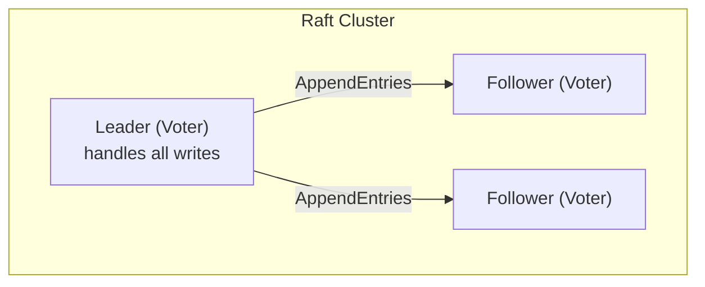

# KRaft Consensus

Raft-based consensus for ZooKeeper-free operation.

## Overview

KRaft (Kafka Raft) provides:
- No ZooKeeper dependency
- Metadata stored in Surgewave topics
- Faster controller failover
- Simpler operations

## Configuration

```json
{
  "Surgewave": {
    "UseRaftConsensus": true,
    "RaftDataDirectory": "./raft",
    "RaftElectionTimeoutMinMs": 150,
    "RaftElectionTimeoutMaxMs": 300,
    "RaftHeartbeatIntervalMs": 50
  }
}
```

## How It Works



## APIs

| API | Key | Description |
|-----|-----|-------------|
| Vote | 52 | Leader election voting |
| BeginQuorumEpoch | 53 | Start new leader term |
| EndQuorumEpoch | 54 | End leader term |
| DescribeQuorum | 55 | Query quorum state |
| FetchSnapshot | 59 | Fetch metadata snapshot |

## Leader Election

1. **Election Timeout** - Follower becomes candidate
2. **Request Votes** - Candidate requests votes
3. **Majority Wins** - First to majority becomes leader
4. **Heartbeats** - Leader sends periodic heartbeats

```
Term 1: Broker1 is leader
        ↓ (Broker1 fails)
Term 2: Broker2 wins election
        ↓ (Broker1 returns as follower)
```

## Broker Registration

Brokers register with controller:

```
1. BrokerRegistration (API 62)
   - BrokerId, Rack, Endpoints
2. BrokerHeartbeat (API 63)
   - Periodic liveness signal
3. Controller updates metadata
```

## Configuration Options

| Setting | Default | Description |
|---------|---------|-------------|
| `RaftElectionTimeoutMinMs` | 150 | Min election timeout |
| `RaftElectionTimeoutMaxMs` | 300 | Max election timeout |
| `RaftHeartbeatIntervalMs` | 50 | Heartbeat interval |
| `RaftDataDirectory` | ./raft | Raft log storage |

## Raft Log

Raft log persisted to disk:

```
raft/
├── log/
│   ├── 00000000000000000000.log
│   └── 00000000000000001000.log
├── snapshots/
│   └── snapshot-1000.dat
└── metadata.json
```

## Quorum Operations

```bash
# View quorum state
surgewave cluster status

# Output:
# Cluster ID: surgewave-cluster
# Controller: Broker 1
# Quorum:
#   Leader: 1 (epoch: 5)
#   Voters: [1, 2, 3]
#   Observers: []
```

## Failure Scenarios

### Leader Failure

1. Followers detect missing heartbeats
2. Election timeout triggers
3. New leader elected (majority quorum)
4. Clients redirect to new leader

### Network Partition

```
[Broker1] | [Broker2, Broker3]
          |
   Minority │ Majority
   (steps down) (elects new leader)
```

Minority partition cannot elect leader (no quorum).

## Exponential Backoff

RPC retries use exponential backoff:

```
Attempt 1: 100ms
Attempt 2: 200ms
Attempt 3: 400ms
...
Max: 5000ms
```

## Monitoring

| Metric | Description |
|--------|-------------|
| `surgewave_raft_term` | Current raft term |
| `surgewave_raft_leader` | Current leader ID |
| `surgewave_raft_elections_total` | Election count |
| `surgewave_raft_log_end_offset` | Log end offset |

## Best Practices

1. **Odd number of voters** - 3 or 5 for clean majority
2. **Low latency network** - Election timeouts depend on RTT
3. **Persistent storage** - SSDs for raft log
4. **Monitor elections** - Frequent elections indicate issues

## Next Steps

- [Failover](failover.md) - Failure handling
- [Replication](replication.md) - Data replication
