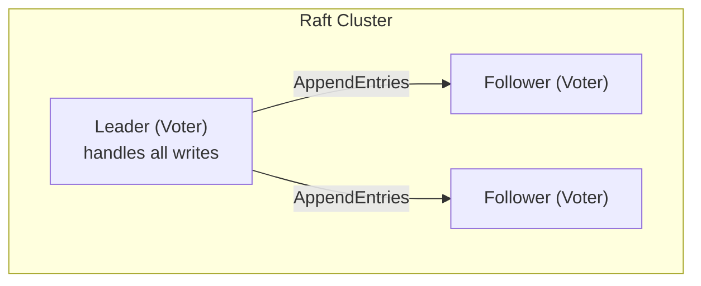

# KRaft Consensus

Raft-based consensus for ZooKeeper-free operation.

## Overview

KRaft (Kafka Raft) provides:
- No ZooKeeper dependency
- Metadata stored in Surgewave topics
- Faster controller failover
- Simpler operations

## Configuration

```json
{
  "Surgewave": {
    "UseRaftConsensus": true,
    "RaftDataDirectory": "./raft",
    "RaftElectionTimeoutMinMs": 150,
    "RaftElectionTimeoutMaxMs": 300,
    "RaftHeartbeatIntervalMs": 50
  }
}
```

## How It Works


```mermaid
flowchart TB
  subgraph Raft["Raft Cluster"]
    L["Leader (Voter)<br/>handles all writes"]
    F1["Follower (Voter)"]
    F2["Follower (Voter)"]
    L -->|AppendEntries| F1
    L -->|AppendEntries| F2
  end
```

## APIs

| API | Key | Description |
|-----|-----|-------------|
| Vote | 52 | Leader election voting |
| BeginQuorumEpoch | 53 | Start new leader term |
| EndQuorumEpoch | 54 | End leader term |
| DescribeQuorum | 55 | Query quorum state |
| FetchSnapshot | 59 | Fetch metadata snapshot |

## Leader Election

1. **Election Timeout** - Follower becomes candidate
2. **Request Votes** - Candidate requests votes
3. **Majority Wins** - First to majority becomes leader
4. **Heartbeats** - Leader sends periodic heartbeats

```
Term 1: Broker1 is leader
        ↓ (Broker1 fails)
Term 2: Broker2 wins election
        ↓ (Broker1 returns as follower)
```

## Broker Registration

Brokers register with controller:

```
1. BrokerRegistration (API 62)
   - BrokerId, Rack, Endpoints
2. BrokerHeartbeat (API 63)
   - Periodic liveness signal
3. Controller updates metadata
```

## Configuration Options

| Setting | Default | Description |
|---------|---------|-------------|
| `RaftElectionTimeoutMinMs` | 150 | Min election timeout |
| `RaftElectionTimeoutMaxMs` | 300 | Max election timeout |
| `RaftHeartbeatIntervalMs` | 50 | Heartbeat interval |
| `RaftDataDirectory` | ./raft | Raft log storage |
| `ProcessRoles` | broker,controller | What this node does |
| `ControllerQuorumVoters` | *(empty)* | Nodes that vote, as `id@host:port` |

## Roles and the Controller Quorum

By default every node runs in **combined mode** — it is both a broker and a controller, and
every broker votes on metadata. That is the right shape for a single broker, for an embedded
host, and for a small cluster.

The quorum then grows with the cluster, and a metadata write waits for a majority of *all*
brokers. To keep it fixed, name the voters:

```json
{
  "Surgewave": {
    "UseRaftConsensus": true,
    "ProcessRoles": "broker",
    "ControllerQuorumVoters": "1@controller-1:9093,2@controller-2:9093,3@controller-3:9093"
  }
}
```

Nodes 1, 2 and 3 carry `"ProcessRoles": "broker,controller"` (or `"controller"` alone for
dedicated controllers). Every other broker sets `"ProcessRoles": "broker"` and becomes an
**observer**: it receives and serves the metadata log but does not vote, so adding brokers no
longer makes metadata writes slower.

`ControllerQuorumVoters` and `ClusterNodes` answer different questions and neither derives from
the other — cluster nodes say who exists, the voter list says who decides. They are checked
against each other at startup: a voter no broker knows about is rejected, because it would be
counted towards the majority and never answer.

Prefer an odd number of voters. Four voters need three to agree, exactly as five do, so the
fourth adds a node that can fail without adding a failure the quorum survives; Surgewave logs
a warning for an even count rather than refusing it, since it is a legitimate intermediate
state during a rolling change.

Changing the voter set on a running cluster (KIP-853 online reconfiguration) is not
implemented — the list is read at startup.

## Raft Log

Raft log persisted to disk:

```
raft/
├── log/
│   ├── 00000000000000000000.log
│   └── 00000000000000001000.log
├── snapshots/
│   └── snapshot-1000.dat
└── metadata.json
```

## Quorum Operations

```bash
# View quorum state
surgewave cluster status

# Output:
# Cluster ID: surgewave-cluster
# Controller: Broker 1
# Quorum:
#   Leader: 1 (epoch: 5)
#   Voters: [1, 2, 3]
#   Observers: []
```

## Failure Scenarios

### Leader Failure

1. Followers detect missing heartbeats
2. Election timeout triggers
3. New leader elected (majority quorum)
4. Clients redirect to new leader

### Network Partition

```
[Broker1] | [Broker2, Broker3]
          |
   Minority │ Majority
   (steps down) (elects new leader)
```

Minority partition cannot elect leader (no quorum).

## Exponential Backoff

RPC retries use exponential backoff:

```
Attempt 1: 100ms
Attempt 2: 200ms
Attempt 3: 400ms
...
Max: 5000ms
```

## Monitoring

| Metric | Description |
|--------|-------------|
| `surgewave_raft_term` | Current raft term |
| `surgewave_raft_leader` | Current leader ID |
| `surgewave_raft_elections_total` | Election count |
| `surgewave_raft_log_end_offset` | Log end offset |

## Best Practices

1. **Odd number of voters** - 3 or 5 for clean majority
2. **Low latency network** - Election timeouts depend on RTT
3. **Persistent storage** - SSDs for raft log
4. **Monitor elections** - Frequent elections indicate issues

## Next Steps

- [Failover](failover.md) - Failure handling
- [Replication](replication.md) - Data replication
