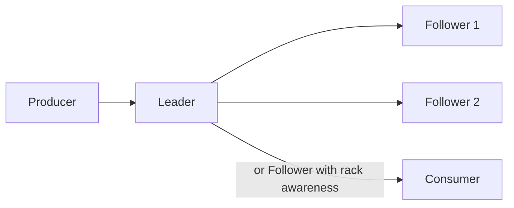

# Replication

Partition data replication across brokers.

## Overview

Each partition has:
- **One Leader** - Handles all reads/writes
- **N-1 Followers** - Replicate from leader
- **ISR (In-Sync Replicas)** - Up-to-date replicas

## How It Works



## Configuration

### Topic Replication

```bash
# Create with replication
surgewave topics create events --partitions 6 --replication-factor 3

# Describe replicas
surgewave topics describe events
```

### Broker Settings

```json
{
  "Surgewave": {
    "DefaultReplicationFactor": 3,
    "MinInSyncReplicas": 2,
    "ReplicaLagTimeMaxMs": 10000,
    "ReplicaLagMaxMessages": 4000,
    "ReplicaFetchMaxBytes": 1048576,
    "ReplicaFetchWaitMaxMs": 500
  }
}
```

## ISR Management

Replicas stay in ISR if:
1. Connected to leader
2. Lag < `ReplicaLagTimeMaxMs`
3. Lag < `ReplicaLagMaxMessages`

```
ISR = {Broker1, Broker2, Broker3}

If Broker3 falls behind:
ISR = {Broker1, Broker2}  (shrunk after grace period)

When Broker3 catches up:
ISR = {Broker1, Broker2, Broker3}  (expanded)
```

## High Watermark

Consumers only read up to the high watermark — the highest offset replicated
to every in-sync replica. Offsets above the watermark exist on the leader but
are not yet visible to consumers.

| Replica    | 0 | 1 | 2 | 3 | 4 | 5 | 6 | 7 | 8 |
|------------|---|---|---|---|---|---|---|---|---|
| Leader     | ✓ | ✓ | ✓ | ✓ | ✓ | ✓ | ✓ | ✓ | ✓ |
| Follower 1 | ✓ | ✓ | ✓ | ✓ | ✓ | ✓ | ✓ |   |   |
| Follower 2 | ✓ | ✓ | ✓ | ✓ | ✓ | ✓ |   |   |   |

High watermark = **offset 6**. Every replica has fully committed offsets
0-5, so HW points one past the last universally committed offset (Kafka
convention: HW is the first offset not yet considered committed; consumers
read everything strictly below it). Follower 2 lags by one record; offsets
7-8 exist on the leader only.

## Acknowledgments

| acks | Durability | Latency |
|------|------------|---------|
| 0 | None | Lowest |
| 1 | Leader only | Low |
| all | All ISR | Highest |

```csharp
var producer = new SurgewaveProducer<string, string>(options =>
{
    options.Acks = Acks.All;  // Wait for all ISR
});
```

## Rack Awareness

Place replicas across racks:

```json
{
  "Surgewave": {
    "BrokerId": 1,
    "Rack": "rack-a"
  }
}
```

Surgewave ensures replicas spread across racks when possible.

## Reassignment

Move partitions between brokers:

```bash
# Elect preferred leader
surgewave partitions elect-leader --topic my-topic

# Check reassignment status
surgewave partitions describe --topic my-topic
```

## Throttling

Limit replication bandwidth:

```json
{
  "Surgewave": {
    "ReassignmentThrottleBytesPerSec": 52428800,
    "ReassignmentMaxConcurrent": 4
  }
}
```

## Monitoring

| Metric | Description |
|--------|-------------|
| `surgewave_isr_shrinks_total` | ISR shrink events |
| `surgewave_isr_expands_total` | ISR expand events |
| `surgewave_under_replicated_partitions` | Under-replicated count |
| `surgewave_replica_lag_messages` | Follower message lag |
| `surgewave_replica_lag_ms` | Follower time lag |

## Best Practices

1. **Use replication factor 3** - Tolerate 1 broker failure
2. **Set min.insync.replicas 2** - Require 2 replicas for writes
3. **Monitor ISR** - Watch for under-replication
4. **Use racks** - Spread replicas across failure domains

## Next Steps

- [KRaft](raft.md) - Consensus protocol
- [Failover](failover.md) - Leader election
