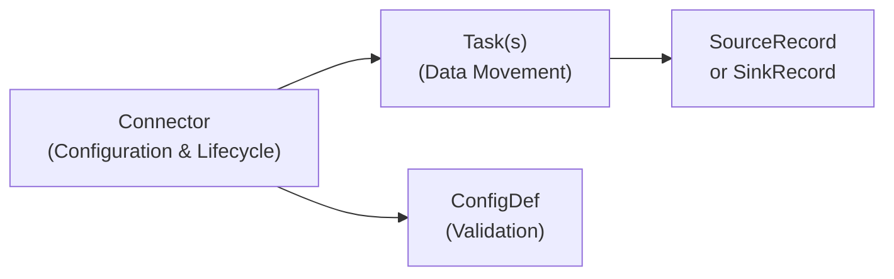

# Building Custom Connectors

This guide covers everything you need to build custom connectors for Surgewave, enabling integration with any data source or sink.

## Architecture Overview

Surgewave Connect follows the Kafka Connect architecture:



**Connector**: Manages configuration and creates tasks
**Task**: Performs the actual data movement
**ConfigDef**: Declares and validates configuration
**Records**: Data units moved between systems

## Project Setup

### Create Project

```bash
dotnet new classlib -n MyCompany.Surgewave.Connect.MyService
cd MyCompany.Surgewave.Connect.MyService
dotnet add reference ../Kuestenlogik.Surgewave.Connect/Kuestenlogik.Surgewave.Connect.csproj
```

### Project Structure

```
MyCompany.Surgewave.Connect.MyService/
├── MyCompany.Surgewave.Connect.MyService.csproj
├── MyServiceConnectorConfig.cs    # Configuration constants
├── MyServiceSourceConnector.cs    # Source connector
├── MyServiceSourceTask.cs         # Source task
├── MyServiceSinkConnector.cs      # Sink connector
└── MyServiceSinkTask.cs           # Sink task
```

## Source Connector

### Connector Class

The connector manages configuration and creates tasks:

```csharp
using Kuestenlogik.Surgewave.Connect;
using Kuestenlogik.Surgewave.Connect.Configuration;

namespace MyCompany.Surgewave.Connect.MyService;

public sealed class MyServiceSourceConnector : SourceConnector
{
    private readonly Dictionary<string, string> _config = new();

    // Connector version
    public override string Version => "1.0.0";

    // Task class to instantiate
    public override Type TaskClass => typeof(MyServiceSourceTask);

    // Configuration definition
    public override ConfigDef Config => new ConfigDef()
        .Define("myservice.endpoint", ConfigType.String, Importance.High,
            "Service endpoint URL")
        .Define("myservice.api.key", ConfigType.Password, Importance.High,
            "API key for authentication")
        .Define("topic", ConfigType.String, Importance.High,
            "Destination Surgewave topic")
        .Define("poll.interval.ms", ConfigType.Long, 10000L, Importance.Medium,
            "Polling interval in milliseconds")
        .Define("batch.size", ConfigType.Int, 100L, Importance.Medium,
            "Maximum records per poll");

    public override void Start(IDictionary<string, string> config)
    {
        // Validate required configuration
        if (!config.TryGetValue("myservice.endpoint", out var endpoint) ||
            string.IsNullOrWhiteSpace(endpoint))
        {
            throw new ArgumentException("Missing required config: myservice.endpoint");
        }

        if (!config.TryGetValue("topic", out var topic) ||
            string.IsNullOrWhiteSpace(topic))
        {
            throw new ArgumentException("Missing required config: topic");
        }

        // Store configuration for tasks
        foreach (var kvp in config)
            _config[kvp.Key] = kvp.Value;
    }

    public override void Stop()
    {
        _config.Clear();
    }

    public override IReadOnlyList<IDictionary<string, string>> TaskConfigs(int maxTasks)
    {
        // Return config for each task
        // For simple connectors, single task is common
        return [new Dictionary<string, string>(_config)];
    }
}
```

### Task Class

The task performs the actual data fetching:

```csharp
using System.Text;
using System.Text.Json;
using Kuestenlogik.Surgewave.Connect;

namespace MyCompany.Surgewave.Connect.MyService;

public sealed class MyServiceSourceTask : SourceTask
{
    private string _endpoint = "";
    private string _apiKey = "";
    private string _topic = "";
    private long _pollIntervalMs = 10000;
    private int _batchSize = 100;

    private HttpClient? _client;
    private DateTimeOffset _lastPollTime = DateTimeOffset.MinValue;

    // Offset tracking
    private readonly Dictionary<string, object> _sourcePartition = new();
    private string _lastCursor = "";

    public override string Version => "1.0.0";

    public override void Start(IDictionary<string, string> config)
    {
        _endpoint = config["myservice.endpoint"];
        _apiKey = GetConfigValue(config, "myservice.api.key", "");
        _topic = config["topic"];
        _pollIntervalMs = GetConfigLong(config, "poll.interval.ms", 10000);
        _batchSize = GetConfigInt(config, "batch.size", 100);

        // Set up partition for offset tracking
        _sourcePartition["endpoint"] = _endpoint;

        // Restore offset from previous run
        var storedOffset = Context.OffsetStorageReader?.Offset(_sourcePartition);
        if (storedOffset?.TryGetValue("cursor", out var cursor) == true)
        {
            _lastCursor = cursor?.ToString() ?? "";
        }

        // Initialize HTTP client
        _client = new HttpClient();
        _client.DefaultRequestHeaders.Add("Authorization", $"Bearer {_apiKey}");
    }

    public override void Stop()
    {
        _client?.Dispose();
        _client = null;
    }

    protected override void Dispose(bool disposing)
    {
        if (disposing)
        {
            _client?.Dispose();
            _client = null;
        }
        base.Dispose(disposing);
    }

    public override async Task<IReadOnlyList<SourceRecord>> PollAsync(
        CancellationToken cancellationToken)
    {
        // Rate limiting
        var elapsed = (DateTimeOffset.UtcNow - _lastPollTime).TotalMilliseconds;
        if (elapsed < _pollIntervalMs)
        {
            await Task.Delay((int)(_pollIntervalMs - elapsed), cancellationToken);
        }
        _lastPollTime = DateTimeOffset.UtcNow;

        if (_client == null)
            return [];

        // Fetch data from service
        var url = $"{_endpoint}/events?cursor={_lastCursor}&limit={_batchSize}";
        var response = await _client.GetAsync(url, cancellationToken);
        response.EnsureSuccessStatusCode();

        var json = await response.Content.ReadAsStringAsync(cancellationToken);
        var data = JsonSerializer.Deserialize<EventResponse>(json);

        if (data?.Events == null || data.Events.Count == 0)
            return [];

        var records = new List<SourceRecord>();

        foreach (var evt in data.Events)
        {
            // Update cursor for offset tracking
            _lastCursor = evt.Id;

            var sourceOffset = new Dictionary<string, object>
            {
                ["cursor"] = _lastCursor
            };

            records.Add(new SourceRecord
            {
                SourcePartition = _sourcePartition,
                SourceOffset = sourceOffset,
                Topic = _topic,
                Key = Encoding.UTF8.GetBytes(evt.Id),
                Value = JsonSerializer.SerializeToUtf8Bytes(evt),
                Timestamp = evt.Timestamp
            });
        }

        return records;
    }

    // Helper methods
    private static string GetConfigValue(IDictionary<string, string> config,
        string key, string defaultValue)
        => config.TryGetValue(key, out var value) && !string.IsNullOrEmpty(value)
            ? value : defaultValue;

    private static long GetConfigLong(IDictionary<string, string> config,
        string key, long defaultValue)
        => config.TryGetValue(key, out var value) && long.TryParse(value, out var l)
            ? l : defaultValue;

    private static int GetConfigInt(IDictionary<string, string> config,
        string key, int defaultValue)
        => config.TryGetValue(key, out var value) && int.TryParse(value, out var i)
            ? i : defaultValue;
}

// Data model
internal record EventResponse(List<Event> Events, string? NextCursor);
internal record Event(string Id, string Type, JsonElement Data, DateTimeOffset Timestamp);
```

## Sink Connector

### Connector Class

```csharp
using Kuestenlogik.Surgewave.Connect;
using Kuestenlogik.Surgewave.Connect.Configuration;

namespace MyCompany.Surgewave.Connect.MyService;

public sealed class MyServiceSinkConnector : SinkConnector
{
    private readonly Dictionary<string, string> _config = new();

    public override string Version => "1.0.0";
    public override Type TaskClass => typeof(MyServiceSinkTask);

    public override ConfigDef Config => new ConfigDef()
        .Define("myservice.endpoint", ConfigType.String, Importance.High,
            "Service endpoint URL")
        .Define("myservice.api.key", ConfigType.Password, Importance.High,
            "API key for authentication")
        .Define("topics", ConfigType.String, Importance.High,
            "Source Surgewave topics (comma-separated)")
        .Define("batch.size", ConfigType.Int, 100L, Importance.Medium,
            "Records per batch request")
        .Define("retry.max.attempts", ConfigType.Int, 3L, Importance.Medium,
            "Maximum retry attempts");

    public override void Start(IDictionary<string, string> config)
    {
        if (!config.TryGetValue("myservice.endpoint", out var endpoint) ||
            string.IsNullOrWhiteSpace(endpoint))
        {
            throw new ArgumentException("Missing required config: myservice.endpoint");
        }

        if (!config.TryGetValue("topics", out var topics) ||
            string.IsNullOrWhiteSpace(topics))
        {
            throw new ArgumentException("Missing required config: topics");
        }

        foreach (var kvp in config)
            _config[kvp.Key] = kvp.Value;
    }

    public override void Stop()
    {
        _config.Clear();
    }

    public override IReadOnlyList<IDictionary<string, string>> TaskConfigs(int maxTasks)
    {
        // Create task configs - each task gets full config plus task ID
        var configs = new List<IDictionary<string, string>>();
        for (var i = 0; i < maxTasks; i++)
        {
            configs.Add(new Dictionary<string, string>(_config)
            {
                ["task.id"] = i.ToString()
            });
        }
        return configs;
    }
}
```

### Task Class

```csharp
using System.Text;
using System.Text.Json;
using Kuestenlogik.Surgewave.Connect;

namespace MyCompany.Surgewave.Connect.MyService;

public sealed class MyServiceSinkTask : SinkTask
{
    private string _endpoint = "";
    private string _apiKey = "";
    private int _batchSize = 100;
    private int _maxRetries = 3;

    private HttpClient? _client;
    private readonly List<SinkRecord> _buffer = new();

    public override string Version => "1.0.0";

    public override void Start(IDictionary<string, string> config)
    {
        _endpoint = config["myservice.endpoint"];
        _apiKey = GetConfigValue(config, "myservice.api.key", "");
        _batchSize = GetConfigInt(config, "batch.size", 100);
        _maxRetries = GetConfigInt(config, "retry.max.attempts", 3);

        _client = new HttpClient();
        _client.DefaultRequestHeaders.Add("Authorization", $"Bearer {_apiKey}");
    }

    public override void Stop()
    {
        // Flush remaining records
        FlushAsync(new Dictionary<TopicPartition, long>(), CancellationToken.None)
            .GetAwaiter().GetResult();

        _client?.Dispose();
        _client = null;
    }

    protected override void Dispose(bool disposing)
    {
        if (disposing)
        {
            _client?.Dispose();
            _client = null;
        }
        base.Dispose(disposing);
    }

    public override async Task PutAsync(IReadOnlyList<SinkRecord> records,
        CancellationToken cancellationToken)
    {
        foreach (var record in records)
        {
            _buffer.Add(record);

            if (_buffer.Count >= _batchSize)
            {
                await SendBatchAsync(_buffer, cancellationToken);
                _buffer.Clear();
            }
        }
    }

    public override async Task FlushAsync(
        IDictionary<TopicPartition, long> currentOffsets,
        CancellationToken cancellationToken)
    {
        if (_buffer.Count > 0)
        {
            await SendBatchAsync(_buffer, cancellationToken);
            _buffer.Clear();
        }
    }

    private async Task SendBatchAsync(List<SinkRecord> records,
        CancellationToken cancellationToken)
    {
        if (_client == null || records.Count == 0)
            return;

        // Convert records to API format
        var payload = records.Select(r => new
        {
            key = r.Key != null ? Encoding.UTF8.GetString(r.Key) : null,
            value = r.Value != null ? JsonDocument.Parse(r.Value).RootElement : default,
            timestamp = r.Timestamp
        }).ToList();

        var json = JsonSerializer.Serialize(payload);
        var content = new StringContent(json, Encoding.UTF8, "application/json");

        // Retry with exponential backoff
        for (var attempt = 0; attempt <= _maxRetries; attempt++)
        {
            try
            {
                var response = await _client.PostAsync(
                    $"{_endpoint}/ingest",
                    content,
                    cancellationToken);

                response.EnsureSuccessStatusCode();
                return; // Success
            }
            catch (HttpRequestException) when (attempt < _maxRetries)
            {
                var delay = (int)Math.Pow(2, attempt) * 1000;
                await Task.Delay(delay, cancellationToken);
            }
        }
    }

    private static string GetConfigValue(IDictionary<string, string> config,
        string key, string defaultValue)
        => config.TryGetValue(key, out var value) && !string.IsNullOrEmpty(value)
            ? value : defaultValue;

    private static int GetConfigInt(IDictionary<string, string> config,
        string key, int defaultValue)
        => config.TryGetValue(key, out var value) && int.TryParse(value, out var i)
            ? i : defaultValue;
}
```

## Configuration Validation

### ConfigDef Types

| Type | C# Type | Description |
|------|---------|-------------|
| `ConfigType.String` | string | Text values |
| `ConfigType.Int` | int/long | Integer numbers |
| `ConfigType.Long` | long | Large integers |
| `ConfigType.Boolean` | bool | True/false |
| `ConfigType.Password` | string | Sensitive (masked in logs) |
| `ConfigType.List` | string | Comma-separated list |

### Importance Levels

| Level | Description |
|-------|-------------|
| `Importance.High` | Required or critical settings |
| `Importance.Medium` | Important but has sensible default |
| `Importance.Low` | Optional, rarely changed |

### Default Values

```csharp
public override ConfigDef Config => new ConfigDef()
    // Required (no default)
    .Define("endpoint", ConfigType.String, Importance.High, "Endpoint URL")

    // Optional with default
    .Define("timeout.ms", ConfigType.Long, 30000L, Importance.Medium, "Timeout")

    // Optional string with empty default
    .Define("prefix", ConfigType.String, "", Importance.Low, "Key prefix");
```

## Offset Management

### Source Offsets

Track progress to resume after restart:

```csharp
// Define partition (unique identifier for data source)
var sourcePartition = new Dictionary<string, object>
{
    ["server"] = "server1",
    ["database"] = "mydb"
};

// Restore offset on startup
var storedOffset = Context.OffsetStorageReader?.Offset(sourcePartition);
if (storedOffset?.TryGetValue("position", out var pos) == true)
{
    _position = Convert.ToInt64(pos);
}

// Include offset in each record
var sourceOffset = new Dictionary<string, object>
{
    ["position"] = currentPosition
};

var record = new SourceRecord
{
    SourcePartition = sourcePartition,
    SourceOffset = sourceOffset,
    // ... other fields
};
```

### Sink Offsets

Surgewave automatically tracks consumer offsets. Use `FlushAsync` to ensure records are committed before offset commit:

```csharp
public override async Task FlushAsync(
    IDictionary<TopicPartition, long> currentOffsets,
    CancellationToken cancellationToken)
{
    // Ensure all buffered records are written
    await SendPendingRecordsAsync(cancellationToken);

    // After this returns, Surgewave commits offsets
}
```

## Error Handling

### Retry Logic

```csharp
public override async Task PutAsync(IReadOnlyList<SinkRecord> records,
    CancellationToken cancellationToken)
{
    foreach (var record in records)
    {
        var success = false;
        var attempt = 0;

        while (!success && attempt < _maxRetries)
        {
            try
            {
                await ProcessRecordAsync(record, cancellationToken);
                success = true;
            }
            catch (TransientException) when (attempt < _maxRetries - 1)
            {
                attempt++;
                var delay = (int)Math.Pow(2, attempt) * 1000;
                await Task.Delay(delay, cancellationToken);
            }
        }

        if (!success)
        {
            // Log error or send to DLQ
            Context.RaiseError(new ConnectorException($"Failed after {_maxRetries} attempts"));
        }
    }
}
```

### Dead Letter Queue

For records that can't be processed:

```csharp
private async Task SendToDlqAsync(SinkRecord record, Exception error)
{
    // Produce to DLQ topic
    var dlqRecord = new SourceRecord
    {
        Topic = $"{record.Topic}.dlq",
        Key = record.Key,
        Value = record.Value,
        Headers = new Dictionary<string, byte[]>
        {
            ["error.message"] = Encoding.UTF8.GetBytes(error.Message),
            ["original.topic"] = Encoding.UTF8.GetBytes(record.Topic ?? "")
        }
    };
    // ... produce to DLQ
}
```

## Testing

### Unit Tests

```csharp
public class MyServiceSourceConnectorTests
{
    [Fact]
    public void Start_ThrowsOnMissingEndpoint()
    {
        using var connector = new MyServiceSourceConnector();
        connector.Initialize(CreateContext());

        var config = new Dictionary<string, string>
        {
            ["topic"] = "test"
            // Missing endpoint
        };

        Assert.Throws<ArgumentException>(() => connector.Start(config));
    }

    [Fact]
    public void Config_HasCorrectDefaults()
    {
        using var connector = new MyServiceSourceConnector();
        var config = connector.Config;

        var pollInterval = config.Keys.First(k => k.Name == "poll.interval.ms");
        Assert.Equal(10000L, pollInterval.DefaultValue);
    }

    private static ConnectorContext CreateContext()
    {
        return new ConnectorContext
        {
            RequestTaskReconfiguration = () => { },
            RaiseError = _ => { },
            Logger = null
        };
    }
}
```

### Integration Tests

```csharp
public class MyServiceIntegrationTests : IClassFixture<SurgewaveFixture>
{
    private readonly SurgewaveFixture _fixture;

    public MyServiceIntegrationTests(SurgewaveFixture fixture)
    {
        _fixture = fixture;
    }

    [Fact]
    public async Task SourceConnector_ProducesRecords()
    {
        // Create connector
        var config = new Dictionary<string, string>
        {
            ["myservice.endpoint"] = "http://localhost:8080",
            ["topic"] = "test-topic"
        };

        // Start connector and verify records
        // ...
    }
}
```

## Deployment

### Package as NuGet

```xml
<PropertyGroup>
    <PackageId>MyCompany.Surgewave.Connect.MyService</PackageId>
    <Version>1.0.0</Version>
    <Description>Surgewave connector for MyService</Description>
</PropertyGroup>
```

### Register Connector

Connectors are discovered via assembly scanning. Ensure your connector DLL is in the connectors directory:

```bash
cp MyCompany.Surgewave.Connect.MyService.dll /surgewave/connectors/
```

### Configuration

```json
{
  "name": "my-connector",
  "config": {
    "connector.class": "MyCompany.Surgewave.Connect.MyService.MyServiceSourceConnector",
    "myservice.endpoint": "https://api.example.com",
    "myservice.api.key": "secret",
    "topic": "my-events"
  }
}
```

## Best Practices

### Configuration

- Use `ConfigType.Password` for sensitive values
- Provide sensible defaults where possible
- Validate all required configuration in `Start()`
- Use consistent naming: `service.setting.name`

### Performance

- Batch operations where possible
- Use async/await properly
- Implement connection pooling
- Configure appropriate timeouts

### Reliability

- Implement retry with exponential backoff
- Handle transient failures gracefully
- Track offsets for exactly-once semantics
- Clean up resources in `Stop()` and `Dispose()`

### Observability

- Log important events at appropriate levels
- Include correlation IDs in logs
- Expose metrics for monitoring
- Provide meaningful error messages

## See Also

- [Connectors Overview](index.md)
- [AWS S3 Connector](s3.md) - Example implementation
- [PostgreSQL CDC Connector](postgresql.md) - Complex example
