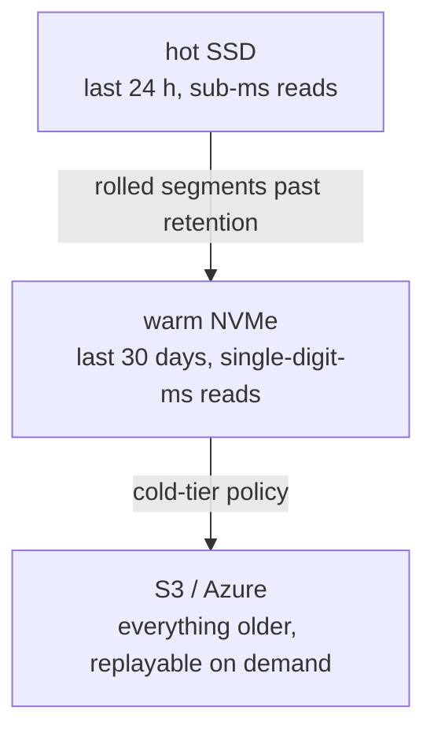

# Event sourcing & CQRS

Surgewave topics are the event log; tiered storage keeps the full history
replayable forever without paying for hot disk you don't need.

## Storage tiers

The Kafka client doesn't see the tier transition — `OffsetSpec.earliest`
returns offset 0 even when offset 0 lives on S3. The fetch path walks
back transparently.

## Why Surgewave fits

- **Built-in tiered storage** — S3, Azure Blob, GCP Cloud Storage as
  cold tiers without paid add-ons (Confluent gates this behind a Cloud
  tier). See [tiered storage](../storage/tiered.md).
- **Compaction + transactions** — log-compacted topics for snapshot
  tables; cross-topic transactions for atomic command-event pairs.
- **Exactly-once semantics** — KIP-892 server-side defence prevents
  zombie producers from duplicating events. See [transactions](../features/transactions.md).
- **Replay anywhere** — `consume --from-offset 0` walks the full history
  from S3 back through hot, no special tooling.

## Sample

[`Kuestenlogik/Surgewave.Samples/EventSourcing`](https://github.com/Kuestenlogik/Surgewave.Samples)
shows a CQRS-shaped service with command topic, event topic, and
materialised state via the Streams DSL.
