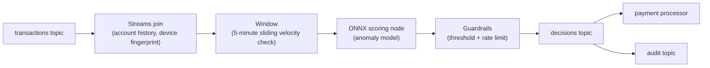

# Real-time fraud detection

Joins, windows, and ML scoring in a single .NET process. Surgewave's native
protocol shaves the round-trip so risk decisions ship inside the
tap-to-pay envelope.

## Pipeline shape

## Why Surgewave fits

- **Native low-latency transport** — sub-ms broker round-trip on the
  same host, removing the tens-of-ms tail you'd see via Kafka wire.
- **Streams DSL** — Kafka-Streams-style joins and windowing live
  in-process; no separate Flink cluster.
- **ONNX scoring node** — load a trained model file, score on the
  topic in microseconds. See [embedded ML](../ai/index.md).
- **Exactly-once across topics** — cross-topic transactions ensure the
  audit log and the decision are atomic.

## Sample

[`Kuestenlogik/Surgewave.Samples/FraudDetection`](https://github.com/Kuestenlogik/Surgewave.Samples)
shows the full topology end-to-end with a synthetic transaction
generator and a simple scoring model.
