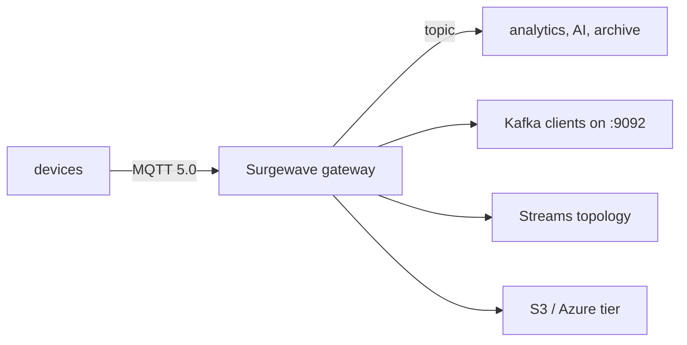

# IoT & edge ingestion

Surgewave's typical IoT shape: thousands of devices push readings via MQTT
to the gateway, downstream analytics and AI pipelines consume from the
same Surgewave topic via the Kafka wire — one event log, two access
patterns, no protocol bridge.

## Architecture

## Why Surgewave fits

- **MQTT in, Kafka out** — same topic, two wire protocols. No bridge
  service to maintain. See [MQTT transport](../transport/mqtt.md).
- **Embedded broker for the edge** — `Kuestenlogik.Surgewave.Broker` runs
  in-process on edge gateways. See [embedded mode](../setup/embedded.md).
- **QUIC for unreliable links** — 0-RTT resumption keeps cellular and
  Wi-Fi-roaming devices connected. See [QUIC transport](../transport/quic.md).
- **Tiered storage** — last 24 h on hot disk, history on cheap object
  storage. See the [tiered-storage guide](../storage/tiered.md).

## Sample

[`Kuestenlogik/Surgewave.Samples/IotDashboard`](https://github.com/Kuestenlogik/Surgewave.Samples)
walks through an end-to-end gateway-broker-dashboard setup with simulated
device traffic.
