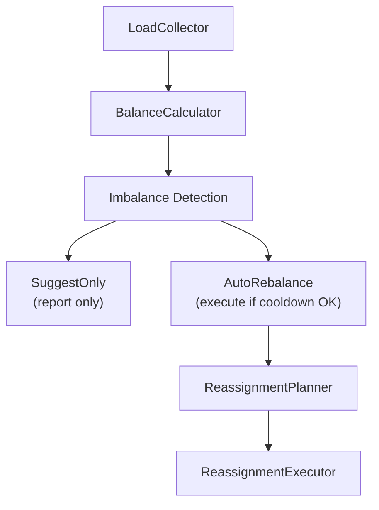

# Cruise Control

Automatic partition balancing for evenly distributed cluster workloads.

## Overview

Surgewave Cruise Control continuously monitors cluster load and generates (or auto-executes) partition reassignment plans to keep brokers balanced. Inspired by Confluent's Cruise Control, it uses weighted scoring across four metrics to detect and resolve imbalances.

Key characteristics:

- **Weighted scoring**: Partitions (30%), leaders (25%), disk (25%), network (20%)
- **Configurable goals**: Per-metric imbalance thresholds control sensitivity
- **Two modes**: `SuggestOnly` for manual review, `AutoRebalance` for hands-off operation
- **Cooldown protection**: Prevents rebalance thrashing with a configurable cooldown period
- **Throttled execution**: Data replication during rebalance is rate-limited to avoid disruption

## How It Works

1. The `LoadCollector` gathers per-broker metrics (partition count, leader count, disk usage, network throughput) from `ClusterState`.
2. The `BalanceCalculator` computes a 0-100 score per metric using coefficient of variation (stddev/mean), then produces a weighted `OverallScore`.
3. `DetectImbalances` compares each metric against the `BalanceGoals` thresholds. If any metric exceeds its threshold, the cluster is considered imbalanced.
4. The `ReassignmentPlanner` generates a partition move plan to restore balance.
5. In `AutoRebalance` mode, the `ReassignmentExecutor` applies the plan (respecting cooldown and throttle rate).



## Configuration

```json
{
  "Surgewave": {
    "CruiseControl": {
      "Enabled": true,
      "Mode": "SuggestOnly",
      "AnalysisIntervalSeconds": 300,
      "ThrottleRateBytesPerSec": 50000000,
      "CooldownMinutes": 30,
      "Goals": {
        "MaxPartitionImbalancePercent": 20.0,
        "MaxDiskImbalancePercent": 25.0,
        "MaxLeaderImbalancePercent": 15.0,
        "MaxNetworkImbalancePercent": 30.0,
        "MinPartitionsToRebalance": 3
      }
    }
  }
}
```

| Option | Type | Default | Description |
|--------|------|---------|-------------|
| `Enabled` | bool | `false` | Enable Cruise Control |
| `Mode` | enum | `SuggestOnly` | `SuggestOnly` or `AutoRebalance` |
| `AnalysisIntervalSeconds` | int | `300` | Seconds between analysis cycles |
| `ThrottleRateBytesPerSec` | int | `50000000` | Max replication throughput (50 MB/s) |
| `CooldownMinutes` | int | `30` | Min minutes between auto-rebalances |
| `Goals.MaxPartitionImbalancePercent` | double | `20.0` | Partition count imbalance threshold |
| `Goals.MaxDiskImbalancePercent` | double | `25.0` | Disk usage imbalance threshold |
| `Goals.MaxLeaderImbalancePercent` | double | `15.0` | Leader count imbalance threshold |
| `Goals.MaxNetworkImbalancePercent` | double | `30.0` | Network throughput imbalance threshold |
| `Goals.MinPartitionsToRebalance` | int | `3` | Suppress plans smaller than this |

## REST API

All endpoints are under `/api/cruise-control`.

| Method | Endpoint | Description |
|--------|----------|-------------|
| `GET` | `/api/cruise-control/status` | Current balance report |
| `GET` | `/api/cruise-control/history?count=10` | Historical reports |
| `POST` | `/api/cruise-control/analyze` | Force immediate analysis |
| `POST` | `/api/cruise-control/apply` | Apply suggested rebalance plan |
| `GET` | `/api/cruise-control/config` | Current configuration |
| `PUT` | `/api/cruise-control/config` | Update configuration at runtime |

### Force Analysis

```bash
curl -X POST http://localhost:9092/api/cruise-control/analyze
```

### Apply Suggestion

```bash
curl -X POST http://localhost:9092/api/cruise-control/apply
```

### Update Mode at Runtime

```bash
curl -X PUT http://localhost:9092/api/cruise-control/config \
  -H "Content-Type: application/json" \
  -d '{"mode": "AutoRebalance", "cooldownMinutes": 60}'
```

## Balance Score

The overall score is a weighted average of per-metric scores (0-100, where 100 = perfectly balanced):

```
OverallScore = Partitions * 0.30
             + Leaders    * 0.25
             + Disk       * 0.25
             + Network    * 0.20
```

Each metric score is calculated as `max(0, 100 - coefficientOfVariation%)`.

## Use Cases

- **Scaling up**: After adding brokers, trigger analysis to redistribute partitions
- **Hot spots**: Detect and resolve topics with skewed partition distribution
- **Disk balancing**: Prevent single brokers from running out of storage
- **Network fairness**: Ensure traffic is evenly spread across brokers

## Next Steps

- [Bandwidth Quotas](bandwidth-quotas.md) - Per-client bandwidth throttling
- [Cluster Linking](cluster-linking.md) - Cross-cluster topic mirroring
- [Quotas](quotas.md) - Request-rate limiting
