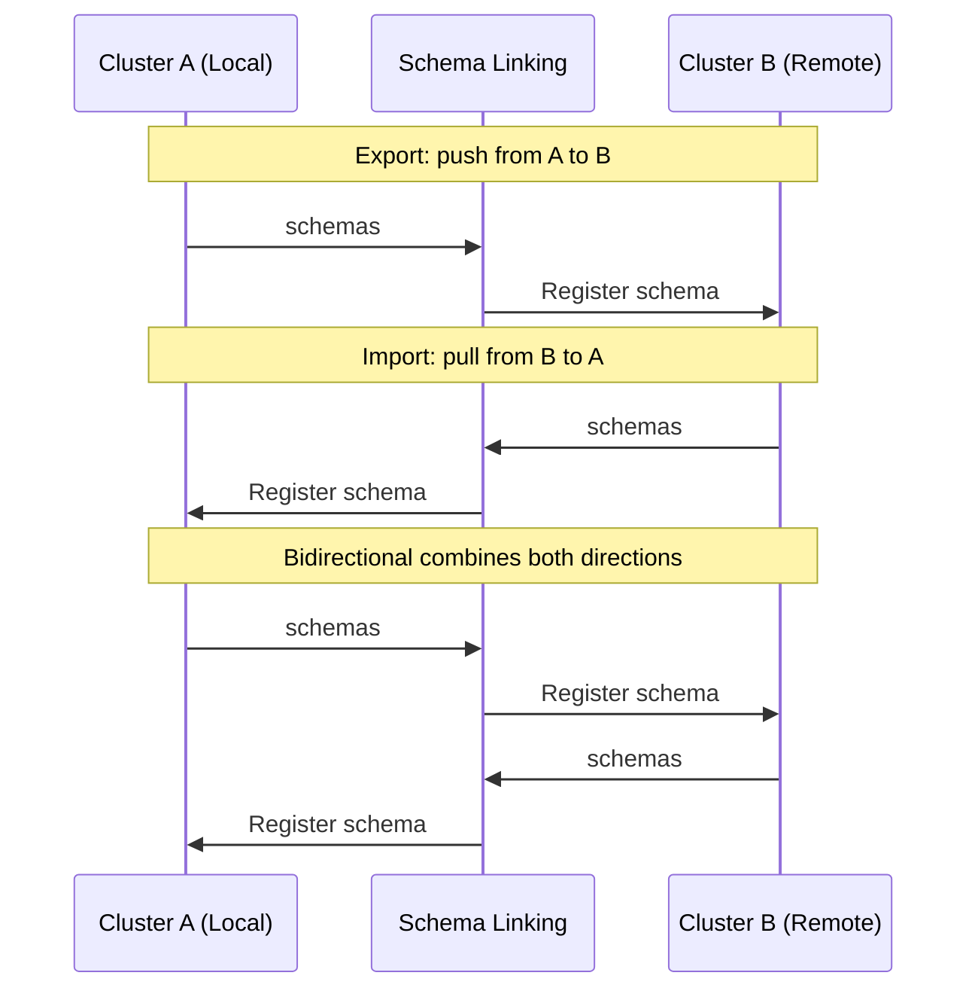

# Schema Linking

Cross-cluster schema synchronization with conflict resolution.

## Overview

Schema Linking keeps schema registries in sync across multiple Surgewave clusters. It uses a background service that periodically discovers and replicates schema versions between local and remote registries, with support for Confluent-compatible REST APIs.

Key characteristics:

- **Three sync modes**: Export (push), Import (pull), Bidirectional (both)
- **Subject pattern filtering**: Sync only matching subjects via glob patterns
- **Conflict resolution**: HighestVersion, LocalWins, or RemoteWins strategies
- **Compatibility sync**: Optionally replicates subject compatibility configuration
- **Confluent-compatible**: The `RemoteSchemaRegistryClient` speaks the standard Schema Registry REST API

## How It Works

1. The `SchemaLinkingService` runs as a background service on a configurable interval.
2. Each cycle iterates through configured remote registries.
3. In **Import** mode, it fetches remote subjects and versions, compares with local, and registers missing versions locally.
4. In **Export** mode, it pushes local versions that the remote is missing.
5. In **Bidirectional** mode, both directions execute. Version conflicts are resolved per the configured strategy.
6. State is persisted to disk so sync positions survive restarts.



## Configuration

```json
{
  "Surgewave": {
    "SchemaLinking": {
      "Enabled": true,
      "SyncMode": "Bidirectional",
      "SyncIntervalSeconds": 30,
      "SubjectPatterns": ["orders-*", "payments-*"],
      "SyncCompatibilityConfig": true,
      "ConflictResolution": "HighestVersion",
      "RemoteRegistries": [
        {
          "ClusterId": "us-west",
          "SchemaRegistryUrl": "http://us-west-surgewave:9092",
          "DisplayName": "US West"
        },
        {
          "ClusterId": "eu-central",
          "SchemaRegistryUrl": "http://eu-central-surgewave:9092",
          "DisplayName": "EU Central"
        }
      ]
    }
  }
}
```

| Option | Type | Default | Description |
|--------|------|---------|-------------|
| `Enabled` | bool | `false` | Enable schema linking |
| `SyncMode` | enum | `Bidirectional` | `Export`, `Import`, or `Bidirectional` |
| `SyncIntervalSeconds` | int | `30` | Seconds between sync cycles |
| `SubjectPatterns` | list | `["*"]` | Glob patterns for subjects to sync |
| `SyncCompatibilityConfig` | bool | `true` | Also sync compatibility settings |
| `ConflictResolution` | enum | `HighestVersion` | Conflict strategy |
| `RemoteRegistries` | list | `[]` | Remote registries to link with |

### Conflict Resolution Strategies

| Strategy | Behavior |
|----------|----------|
| `HighestVersion` | The registry with the higher version number wins |
| `LocalWins` | Local always takes precedence on conflict |
| `RemoteWins` | Remote always takes precedence on conflict |

## REST API

All endpoints are under `/api/schema-linking`.

| Method | Endpoint | Description |
|--------|----------|-------------|
| `GET` | `/api/schema-linking/status` | Overall linking status |
| `GET` | `/api/schema-linking/links` | List all schema links |
| `GET` | `/api/schema-linking/links/{subject}` | Links for a specific subject |
| `POST` | `/api/schema-linking/sync` | Force immediate sync cycle |
| `GET` | `/api/schema-linking/metrics` | Sync metrics |
| `GET` | `/api/schema-linking/conflicts` | Unresolved conflicts |
| `POST` | `/api/schema-linking/conflicts/{clusterId}/{subject}/resolve` | Resolve a conflict |

### Force Sync

```bash
curl -X POST http://localhost:9092/api/schema-linking/sync
```

### Resolve a Conflict

```bash
curl -X POST http://localhost:9092/api/schema-linking/conflicts/us-west/orders-value/resolve \
  -H "Content-Type: application/json" \
  -d '{"useLocal": true}'
```

### Check Status

```bash
curl http://localhost:9092/api/schema-linking/status
```

Response:

```json
{
  "enabled": true,
  "totalLinks": 12,
  "syncedLinks": 10,
  "pendingLinks": 1,
  "conflictLinks": 1,
  "failedLinks": 0,
  "lastSyncAt": "2026-03-19T10:30:00Z",
  "totalSchemasSynced": 47,
  "totalErrors": 0
}
```

## Use Cases

- **Multi-region consistency**: Keep schemas in sync across data centers
- **Migration**: Gradually migrate schemas to a new cluster
- **DR preparation**: Ensure disaster recovery clusters have all schemas
- **Hub-and-spoke**: Central registry exports to satellite clusters

## Next Steps

- [Schema Registry](schema-registry.md) - Schema management basics
- [Schema Migration](schema-migration.md) - Zero-downtime schema evolution
- [Cluster Linking](cluster-linking.md) - Topic-level cross-cluster mirroring
