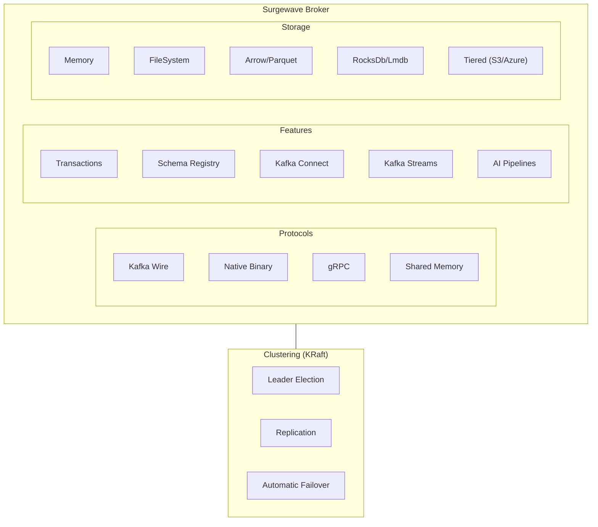

# Surgewave Documentation

Surgewave is a Kafka-wire-compatible message broker written in .NET 10. It implements the Kafka 4.x protocol, plus a native protocol for first-class .NET clients, and ships an embedded mode for in-process use in tests, CLI tools, and edge runtimes.

This is the technical reference. For a marketing overview, comparison tables, and use-case stories see the [Surgewave site](https://surgewave.io).

---

## Migrating from Apache Kafka

Surgewave accepts unmodified Kafka clients on port 9092. Three integration paths cover the typical scenarios:

| Path | Code Changes | Notes | Guide |
|------|--------------|-------|-------|
| Wire compatibility | None — point existing Confluent.Kafka at the broker | Kafka protocol baseline | — |
| API Wrapper | Swap NuGet package only | Native protocol under the same producer/consumer API | [Migration Guide](migration/index.md) |
| Native Client | Use `Kuestenlogik.Surgewave.Client` directly | Full native-protocol surface | [Surgewave.Client Docs](clients/dotnet.md) |

**Quick Start:**
```csharp
// Step 1: Replace NuGet package
// Confluent.Kafka → Kuestenlogik.Surgewave.Compatibility.Confluent.Kafka

// Step 2: Add one config line for low-latency native protocol
var config = new ProducerConfig
{
    BootstrapServers = "surgewave:9092",
    SurgewaveProtocol = "surgewave"  // Enable native protocol
};

// Step 3: Your existing code works unchanged!
```

**[Complete Migration Guide →](migration/index.md)**

---

## Choose Your Path

### Application Developers

Build applications that produce and consume messages.

| Guide | Description |
|-------|-------------|
| [Quickstart](quickstart/index.md) | Get started in 5 minutes |
| [.NET Client](clients/dotnet.md) | Native Surgewave client API |
| [Confluent.Kafka Wrapper](clients/confluent-kafka-wrapper.md) | Zero-code migration from Kafka |
| [Kafka Protocol Compatibility](clients/kafka-compat.md) | Use existing Kafka clients unchanged |
| [Producer API](clients/producer.md) | Sending messages |
| [Consumer API](clients/consumer.md) | Receiving messages |
| [Streams](features/streams.md) | Real-time stream processing |
| [AI & LLM](ai/index.md) | AI pipelines, guardrails, agent memory |
| [Connectors](connectors/index.md) | Pre-built data integrations |
| [Custom Connectors](connectors/custom-connectors.md) | Build your own connectors |

### DevOps / Administrators

Deploy, configure, and operate Surgewave in production.

| Guide | Description |
|-------|-------------|
| [Installation](setup/index.md) | All deployment options |
| [Docker](deployment/docker.md) | Container deployment |
| [Kubernetes](deployment/kubernetes.md) | K8s manifests and operators |
| [Helm Charts](deployment/helm.md) | Helm-based deployment |
| [Configuration](setup/configuration.md) | All configuration options |
| [Storage](storage/index.md) | Storage backend selection |
| [Clustering](clustering/index.md) | Multi-broker setup |
| [Security](security/index.md) | SASL, TLS, ACLs |
| [Monitoring](monitoring/index.md) | Metrics, tracing, dashboards |
| [Operations](operations/index.md) | Troubleshooting and maintenance |
| [CLI Reference](tools/cli-reference.md) | 65+ administrative commands |

### Contributors / Developers

Build Surgewave from source and contribute to the project.

| Guide | Description |
|-------|-------------|
| [Building from Source](setup/building.md) | Clone, build, and run |
| [Architecture](setup/architecture.md) | System design overview |
| [Testing](setup/testing.md) | Running tests and benchmarks |
| [Chaos Testing](testing/chaos-testing.md) | Resilience and fault injection testing |
| [Regression Suite](performance/regression-suite.md) | Automated performance regression detection |

---

## Key Features

| Feature | Description |
|---------|-------------|
| **Kafka 4.0 Compatible** | 100% protocol compatibility with existing clients |
| **Native Protocol** | Lower-latency .NET path alongside the Kafka wire (target — public benchmarks pending) |
| **Multi-Backend Storage** | Memory, FileSystem, Arrow, Parquet, RocksDb, Lmdb, DuckDb, Sqlite, NvmeDirect, S3, Tiered |
| **Multiple Transports** | Kafka protocol, Native binary, gRPC, Shared Memory IPC |
| **Enterprise Features** | Transactions, Schema Registry, Kafka Streams |
| **Kafka Connect** | 10+ built-in connectors for S3, Azure, GCS, databases, MQTT, Redis, HTTP |
| **Clustering** | Multi-broker with KRaft consensus, automatic failover |
| **Security** | SASL (PLAIN, SCRAM), TLS, ACL authorization |
| **Easy Operations** | Single binary, zero ZooKeeper, embedded option |

---

## Performance

**Throughput (100K messages, 100 bytes):**

| Metric | Apache Kafka | Surgewave Native | Improvement |
|--------|--------------|--------------|-------------|
| Producer | 68K msg/s | 1.25M msg/s | (see benchmarks) |
| Consumer | 138K msg/s | 1.28M msg/s | +826% |

**Latency:** The Surgewave native protocol targets lower latency than the Kafka wire on the same broker; comparative head-to-head numbers will be published with the 1.0 release.

---

## Architecture Overview



---

## Getting Help

- [Troubleshooting](operations/troubleshooting.md) - Common issues and solutions
- [Glossary](glossary.md) - Key terms and concepts
- [GitHub Issues](https://github.com/Kuestenlogik/Surgewave/issues) - Bug reports and feature requests
- [Roadmap](https://github.com/Kuestenlogik/Surgewave/blob/main/ROADMAP.md) - Development status and plans
