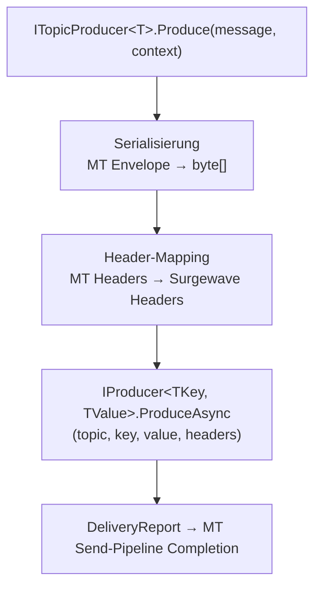

# MassTransit Rider für Kuestenlogik.Surgewave – Konzeptübersicht

**Status:** Konzept / Entwurf (Rev. 1)  
**Datum:** 2026-04  
**Kontext:** Kuestenlogik.Surgewave – Community-Integration und Ökosystem-Erschließung

---

## Motivation

MassTransit ist das meistverbreitete Messaging-Framework im .NET-Ökosystem. Tausende Produktionssysteme nutzen es als Abstraktionsschicht über Message Brokern (RabbitMQ, Azure Service Bus, Amazon SQS, ActiveMQ) und als Anwendungsframework für Consumers, Sagas, Routing Slips und Request/Response-Pattern. Die Community ist groß, aktiv und technisch versiert.

Mit dem Übergang von MassTransit v9 auf ein kommerzielles Lizenzmodell (Massient, Inc., April 2025) bleibt MassTransit v8 unter Apache 2.0 offen und wird bis mindestens Ende 2026 gepflegt. Viele Teams evaluieren aktuell ihre Architektur-Entscheidungen neu — ein idealer Moment, Surgewave als performante Alternative zu Kafka in bestehende MassTransit-Infrastrukturen einzuführen.

### Strategische Ziele

1. **Reichweite:** Surgewave wird dort sichtbar, wo Entwickler bereits Transport-Entscheidungen treffen — in der MassTransit-Konfiguration neben RabbitMQ, Azure Service Bus und Kafka.
2. **Zero-Friction-Einstieg:** Bestehende MassTransit-Nutzer können Surgewave ausprobieren, ohne ihre Consumer, Sagas oder Geschäftslogik zu ändern.
3. **Migrationspfad:** Teams, die von Kafka auf Surgewave migrieren wollen, können dies innerhalb von MassTransit tun — eine Konfigurationsänderung, kein Redesign.
4. **Doppelter Angriffsvektor:** Zusammen mit der bestehenden `Kuestenlogik.Surgewave.Compatibility.Confluent.Kafka`-Schicht und der Akka.NET-Persistence-Integration erschließt der MassTransit-Rider die dritte und größte .NET-Messaging-Community.

---

## Architekturentscheidung: Rider, nicht Transport

MassTransit unterscheidet zwischen **Transports** und **Riders**:

| Eigenschaft | Transport | Rider |
|-------------|-----------|-------|
| Broker-Modell | Queue-basiert (Dispatch) | Log-basiert (Pull) |
| Beispiele | RabbitMQ, Azure Service Bus, SQS | Kafka, Azure Event Hubs |
| Topologie | Automatisch (Exchanges, Queues, Subscriptions) | Manuell (Topics existieren vorab) |
| Consumer-Modell | Nachrichten werden dispatched und gelockt | Partitionen werden einem Consumer zugewiesen |
| Offset-Management | Broker verwaltet Delivery | Consumer verwaltet Commit |
| MassTransit-API | `UsingRabbitMq()`, `UsingAzureServiceBus()` | `AddRider()` → `UsingKafka()` |

Surgewave ist architektonisch ein Log-basierter Broker mit Kafka-kompatiblem Protokoll. Die semantische Zuordnung ist eindeutig: **Surgewave ist ein Rider**, analog zum bestehenden Kafka-Rider. Der Vorteil: Die Rider-API ist explizit auf Topic/Partition/Offset-Semantik ausgelegt — genau das, was Surgewave nativ liefert.

---

## Ist-Zustand in Surgewave

### Relevante Bausteine

| Baustein | Paket | Funktion |
|----------|-------|----------|
| `ISurgewaveClient` | `Kuestenlogik.Surgewave.Client` | Unified Client mit Protocol-Selection (Auto/Native/Kafka) |
| `IProducer<TKey, TValue>` | `Kuestenlogik.Surgewave.Client` | Typed Producer mit Topic/Partition/Headers-Support |
| `IConsumer<TKey, TValue>` | `Kuestenlogik.Surgewave.Client` | Typed Consumer mit Subscribe/Assign/Seek/Commit |
| `SurgewaveClientBuilder` | `Kuestenlogik.Surgewave.Client` | Fluent Builder mit `UseSurgewaveProtocol()` / `UseKafkaProtocol()` |
| `SurgewaveClientExtensions` | `Kuestenlogik.Surgewave.Hosting` | DI-Integration (`AddSurgewaveProducer<>`, `AddSurgewaveConsumer<>`) |
| `SurgewaveRequestReplyClient` | `Kuestenlogik.Surgewave.Client` | Request/Reply-Pattern über Topics |
| `Confluent.Kafka`-Wrapper | `Kuestenlogik.Surgewave.Compatibility.Confluent.Kafka` | Drop-in-Replacement für `Confluent.Kafka` |

### Protokoll-Optionen

| Protokoll | Latenz | Beschreibung |
|-----------|--------|--------------|
| `SurgewaveNative` | low (target) | Proprietäres Binärprotokoll, maximale Performance |
| `Kafka` | Kafka-protocol baseline | Kafka-Wire-Protokoll, Kompatibilität mit existierender Infrastruktur |
| `Auto` | Optimal | Versucht Surgewave Native, fällt auf Kafka zurück |

Der Rider nutzt `Kuestenlogik.Surgewave.Client` direkt — **nicht** den `Confluent.Kafka`-Wrapper. Begründung: Der Wrapper simuliert die Confluent-API mit synchronen Polling-Semantiken, während der Rider die nativen async-Abstraktionen von `IProducer`/`IConsumer` direkt nutzen kann und sollte.

---

## Zielarchitektur

### Paketstruktur

```
Kuestenlogik.Surgewave.Integration.MassTransit/         ← NuGet-Paket
├── Configuration/
│   ├── SurgewaveRiderRegistrationExtensions.cs    ← AddRider(r => r.UsingSurgewave(...))
│   ├── ISurgewaveRiderConfigurator.cs             ← Top-Level-Konfiguration
│   ├── ISurgewaveTopicEndpointConfigurator.cs     ← Consumer-Endpoint-Konfiguration
│   └── ISurgewaveProducerConfigurator.cs          ← Producer-Konfiguration
├── Transport/
│   ├── SurgewaveRider.cs                          ← IRider-Implementierung
│   ├── SurgewaveTopicReceiveEndpoint.cs           ← Partition-Consumer-Pump
│   ├── SurgewaveReceiveContext.cs                 ← MassTransit ReceiveContext-Adapter
│   ├── SurgewaveConsumeContext.cs                 ← Message → ConsumeContext<T> Mapping
│   ├── SurgewaveHeaderAdapter.cs                  ← Surgewave Headers ↔ MT Headers
│   └── SurgewaveSendTransport.cs                  ← ITopicProducer → Surgewave Producer
├── Serialization/
│   ├── SurgewaveMessageSerializer.cs              ← MT Envelope → Surgewave Value
│   └── SurgewaveMessageDeserializer.cs            ← Surgewave Value → MT Envelope
└── Diagnostics/
    ├── SurgewaveRiderHealthCheck.cs               ← IHealthCheck für Consumer/Producer
    └── SurgewaveActivitySource.cs                 ← OpenTelemetry-Integration
```

### Abhängigkeiten

```
Kuestenlogik.Surgewave.Integration.MassTransit
├── Kuestenlogik.Surgewave.Client           (Surgewave-Zugriff)
├── Kuestenlogik.Surgewave.Hosting          (DI-Integration, optional)
├── MassTransit               (>= 8.0, < 10.0)
└── MassTransit.Abstractions  (Rider-Interfaces)
```

Die Zielversion ist **MassTransit v8** (Apache 2.0). Kompatibilität mit v9 (kommerziell) ist wünschenswert, aber sekundär — v8 hat die größere installierte Basis und ist lizenzkostenfrei. Die API-Oberfläche der Rider-Abstraktion ist zwischen v8 und v9 stabil, sodass ein Upgrade voraussichtlich keine Breaking Changes erfordert.

---

## API-Design

### Registrierung (Developer-Facing)

```csharp
services.AddMassTransit(bus =>
{
    bus.UsingInMemory((context, cfg) => cfg.ConfigureEndpoints(context));

    bus.AddRider(rider =>
    {
        // Consumer registrieren
        rider.AddConsumer<OrderEventConsumer>();

        // Producer registrieren
        rider.AddProducer<string, OrderEvent>("order-events");

        // Surgewave als Rider konfigurieren
        rider.UsingSurgewave((context, surgewave) =>
        {
            surgewave.Host("localhost:9092");

            // Optionale Protokoll-Auswahl (default: Auto)
            surgewave.UseSurgewaveProtocol();  // oder: UseKafkaProtocol(), UseAutoProtocol()

            // Consumer-Endpoint
            surgewave.TopicEndpoint<OrderEvent>("order-events", "order-service", e =>
            {
                e.ConfigureConsumer<OrderEventConsumer>(context);
                e.AutoOffsetReset = AutoOffsetReset.Earliest;
                e.ConcurrentConsumerLimit = 4;
                e.ConcurrentDeliveryLimit = 1;  // Ordering innerhalb Key
            });
        });
    });
});
```

### Producer-Nutzung

```csharp
public class OrderService(ITopicProducer<string, OrderEvent> producer)
{
    public async Task SubmitOrder(Order order)
    {
        await producer.Produce(new OrderEvent
        {
            OrderId = order.Id,
            CustomerId = order.CustomerId,
            Total = order.Total
        }, context =>
        {
            context.Headers.Set("correlation-id", order.CorrelationId.ToString());
        });
    }
}
```

### Consumer-Implementierung

```csharp
public class OrderEventConsumer : IConsumer<OrderEvent>
{
    public async Task Consume(ConsumeContext<OrderEvent> context)
    {
        var order = context.Message;
        var correlationId = context.Headers.Get<string>("correlation-id");

        // Geschäftslogik — identisch zu Kafka-Rider oder jedem anderen Transport
        await ProcessOrderAsync(order);
    }
}
```

### Vergleich mit Kafka-Rider

| Aspekt | Kafka-Rider | Surgewave-Rider |
|--------|-------------|-------------|
| Host-Konfiguration | `k.Host("localhost:9092")` | `s.Host("localhost:9092")` |
| TopicEndpoint | `k.TopicEndpoint<T>(...)` | `s.TopicEndpoint<T>(...)` |
| AddProducer | `rider.AddProducer<T>(topic)` | `rider.AddProducer<TKey,TValue>(topic)` |
| Client-Bibliothek | `Confluent.Kafka` | `Kuestenlogik.Surgewave.Client` |
| Protokoll-Wahl | Nur Kafka | Surgewave Native / Kafka / Auto |
| Performance | Kafka-Latenz | Bis zu geringere Latenz (Surgewave Native) |

Die API-Oberfläche ist bewusst nahezu identisch zum Kafka-Rider. Entwickler, die MassTransit mit Kafka kennen, sollen den Surgewave-Rider sofort verstehen. Der einzige sichtbare Unterschied ist `UsingSurgewave()` statt `UsingKafka()` und die optionale Protokoll-Auswahl.

---

## Komponentendesign

### 1. SurgewaveRider (IRider)

Der `SurgewaveRider` implementiert MassTransits `IRider`-Interface und ist verantwortlich für:

- Lifecycle-Management: Start/Stop des `ISurgewaveClient` mit dem Host
- Endpoint-Verwaltung: Starten der konfigurierten TopicEndpoints als Consumer-Pumpen
- Producer-Registry: Verwaltung der registrierten `ITopicProducer<TKey, TValue>`-Instanzen
- Health-Reporting: Aggregierter Health-Status aller Endpoints

```
IRider
├── Start()      → SurgewaveClient.ConnectAsync() + alle TopicEndpoints starten
├── Stop()       → alle TopicEndpoints stoppen + SurgewaveClient.DisposeAsync()
└── GetProducer() → ITopicProducer<TKey, TValue> aus Registry
```

### 2. SurgewaveTopicReceiveEndpoint

Jeder konfigurierte TopicEndpoint wird zu einer `SurgewaveTopicReceiveEndpoint`-Instanz:

```
SurgewaveTopicReceiveEndpoint
├── Consumer-Pool:  N Consumer-Instanzen (ConcurrentConsumerLimit)
├── Partition-Loop: Pro Partition eine ConsumeAsync-Schleife
├── Delivery:       ConsumeResult → SurgewaveConsumeContext → MassTransit Pipeline
├── Commit:         Nach erfolgreicher Verarbeitung → CommitAsync
└── Error:          Bei Fault → Retry/DLQ nach MT-Konfiguration
```

**Concurrency-Modell:**

Der Kafka-Rider nutzt `ConcurrentConsumerLimit` zur Skalierung über Partitionen und `ConcurrentDeliveryLimit` für parallele Verarbeitung innerhalb einer Partition (nach Key). Der Surgewave-Rider übernimmt dieses Modell:

- `ConcurrentConsumerLimit = N` → N Surgewave-Consumer-Instanzen, jede liest von eigenen Partitionen
- `ConcurrentDeliveryLimit = 1` (default) → Ordering innerhalb Key garantiert
- `ConcurrentDeliveryLimit > 1` → Parallele Delivery, Ordering nur innerhalb Key

### 3. SurgewaveSendTransport (Producer)

Der `SurgewaveSendTransport` adaptiert MassTransits `ITopicProducer<T>` auf Surgewaves `IProducer<TKey, TValue>`:



### 4. Serialisierung

MassTransit nutzt ein eigenes Envelope-Format mit Message-Type-URN, Headers, Conversation-ID, Correlation-ID und weiteren Metadaten. Der Surgewave-Rider muss diese Envelope transparent serialisieren:

**Empfohlene Strategie: MassTransit-native Serialisierung**

- **Value:** MassTransit-Envelope als JSON (oder MessagePack, wenn konfiguriert) in den Surgewave-Message-Value. Das entspricht dem Verhalten des Kafka-Riders.
- **Headers:** MassTransit-Transport-Headers (MessageId, ConversationId, CorrelationId, SourceAddress, DestinationAddress, MessageType) als Surgewave-Message-Headers.
- **Key:** Konfigurierbarer Key-Selector, default: CorrelationId oder MessageId.

Diese Strategie gewährleistet, dass MassTransit-Consumers die vollen MT-Metadaten erhalten und Features wie Sagas, Retry und Fault-Handling korrekt funktionieren.

### 5. Offset-Commit-Strategie

| Modus | Verhalten | Einsatz |
|-------|-----------|---------|
| `AutoCommit` | Commit nach jeder erfolgreichen Delivery | Default, einfach |
| `BatchCommit` | Commit nach N Nachrichten oder Zeitintervall | Throughput-optimiert |
| `ManualCommit` | Consumer kontrolliert Commit explizit | Exakt-once-Semantik |

Der Default ist `AutoCommit` nach erfolgreicher Consumer-Pipeline-Completion — analog zum Kafka-Rider.

### 6. Health Checks und Diagnostics

```csharp
// Automatisch registriert via AddRider
services.AddHealthChecks()
    .AddSurgewaveRiderHealthCheck("surgewave-rider");

// OpenTelemetry
builder.Services.AddOpenTelemetry()
    .WithTracing(t => t.AddSource("Kuestenlogik.Surgewave.MassTransit"));
```

Der Health Check meldet:

- **Healthy:** Alle Consumer verbunden, alle Partitionen zugewiesen
- **Degraded:** Einige Partitionen nicht zugewiesen (Rebalance in progress)
- **Unhealthy:** Keine Verbindung zum Broker

OpenTelemetry-Spans werden für Produce und Consume erstellt, mit Propagation der TraceContext-Header über Surgewave-Message-Headers.

---

## Migrationspfade

### Pfad 1: Kafka → Surgewave (innerhalb MassTransit)

```diff
 bus.AddRider(rider =>
 {
     rider.AddConsumer<OrderEventConsumer>();
-    rider.UsingKafka((context, k) =>
+    rider.UsingSurgewave((context, s) =>
     {
-        k.Host("kafka:9092");
-        k.TopicEndpoint<OrderEvent>("order-events", "order-service", e =>
+        s.Host("surgewave:9092");
+        s.TopicEndpoint<OrderEvent>("order-events", "order-service", e =>
         {
             e.ConfigureConsumer<OrderEventConsumer>(context);
         });
     });
 });
```

Consumer-Code, Saga-Code, Routing-Slips — alles bleibt unverändert. Nur die Rider-Konfiguration ändert sich.

### Pfad 2: Confluent.Kafka → Surgewave (Migration auf MassTransit)

Für Teams, die bisher `Confluent.Kafka` direkt nutzen und auf MassTransit migrieren wollen, bietet der Surgewave-Rider einen Anreiz: Sie bekommen MassTransit-Features (Sagas, Retry, Outbox-Pattern) und Surgewave-Performance in einem Schritt.

### Pfad 3: Dual-Rider (Kafka + Surgewave parallel)

MassTransit unterstützt mehrere Rider nebeneinander. Ein Team kann Kafka und Surgewave parallel betreiben und schrittweise migrieren:

```csharp
bus.AddRider(rider =>
{
    // Legacy-Topics auf Kafka
    rider.UsingKafka((context, k) =>
    {
        k.Host("kafka:9092");
        k.TopicEndpoint<LegacyEvent>("legacy-topic", "group", e => { /* ... */ });
    });
});

bus.AddRider(rider =>
{
    // Neue Topics auf Surgewave
    rider.UsingSurgewave((context, s) =>
    {
        s.Host("surgewave:9092");
        s.TopicEndpoint<NewEvent>("new-topic", "group", e => { /* ... */ });
    });
});
```

---

## Feature-Parität mit Kafka-Rider

| Feature | Kafka-Rider | Surgewave-Rider (Ziel) | Priorität |
|---------|-------------|---------------------|-----------|
| TopicEndpoint mit Consumer | ✓ | ✓ | P0 |
| ITopicProducer | ✓ | ✓ | P0 |
| Consumer Groups | ✓ | ✓ | P0 |
| Offset-Commit (Auto/Manual) | ✓ | ✓ | P0 |
| Headers-Propagation | ✓ | ✓ | P0 |
| ConcurrentConsumerLimit | ✓ | ✓ | P0 |
| ConcurrentDeliveryLimit | ✓ | ✓ | P1 |
| Retry / Kill Switch | ✓ | ✓ | P1 |
| Health Checks | ✓ | ✓ | P1 |
| OpenTelemetry-Spans | ✓ | ✓ | P1 |
| CreateIfMissing (Topic) | ✓ | ✓ | P2 |
| Schema Registry | ✓ (Confluent) | ✓ (Surgewave Schema Registry) | P2 |
| Avro/Protobuf-Serializer | ✓ | ✓ (via Surgewave SchemaRegistry-Pakete) | P2 |
| Multiple Types per Topic | ✓ (Custom) | ✓ | P3 |

---

## Lizenzierung und Veröffentlichung

### Paketlizenz

`Kuestenlogik.Surgewave.Integration.MassTransit` wird unter **Apache 2.0** veröffentlicht. Begründung:

- MassTransit v8 ist Apache 2.0 — ein Apache-2.0-Rider passt lizenzrechtlich nahtlos
- Apache 2.0 eliminiert Adoptionshürden für Anwender vollständig
- Das Paket hat eine Runtime-Abhängigkeit auf `Kuestenlogik.Surgewave.Client`, das Teil des Apache-2.0 Surgewave-Cores ist — sowohl die Integration als auch Client und Broker sind kostenfrei und permissiv lizenziert

### NuGet-Paketname

**Empfehlung:** `Kuestenlogik.Surgewave.Integration.MassTransit`

Alternativen:
- `MassTransit.Surgewave` — stärker in der MassTransit-Welt verankert, aber suggeriert Zugehörigkeit zum MassTransit-Projekt
- `Kuestenlogik.Surgewave.MassTransit` — kürzer, aber unklar ob es sich um einen Consumer oder ein Tool handelt

Der Name `Kuestenlogik.Surgewave.Integration.MassTransit` folgt dem Namensschema des Küstenlogik-Ökosystems und signalisiert klar die Richtung der Abhängigkeit.

### NuGet-Veröffentlichung

Das Paket wird auf nuget.org publiziert mit:
- Tags: `masstransit`, `surgewave`, `kafka`, `messaging`, `event-streaming`, `rider`
- README mit Migrationspfad-Dokumentation
- Icon: Surgewave-Logo
- Minimum-Dependencies: MassTransit >= 8.0, Kuestenlogik.Surgewave.Client

---

## Implementierungsplan

### Phase 1: Core Rider (P0)

**Ziel:** Funktionale Parität für Produce/Consume mit dem Kafka-Rider.

1. `ISurgewaveRiderConfigurator` — Host, Protocol, Client-Optionen
2. `SurgewaveRider : IRider` — Lifecycle, Client-Management
3. `SurgewaveTopicReceiveEndpoint` — Consumer-Pump mit Partition-Assignment
4. `SurgewaveSendTransport` — Producer mit MT-Envelope-Serialisierung
5. `SurgewaveConsumeContext` / `SurgewaveReceiveContext` — Message-Pipeline-Adapter
6. `SurgewaveHeaderAdapter` — Bidirektionales Header-Mapping
7. Registrierungs-Extensions: `UsingSurgewave()`, `TopicEndpoint<T>()`, `AddProducer<>()`

**Ergebnis:** Ein MassTransit-Nutzer kann Surgewave als Rider konfigurieren, Nachrichten produzieren und konsumieren.

### Phase 2: Production-Readiness (P1)

1. ConcurrentDeliveryLimit mit Key-basierter Parallelisierung
2. Retry-Integration (MassTransit Retry-Pipeline)
3. Kill-Switch-Support
4. Health Checks (`IHealthCheck`)
5. OpenTelemetry-Instrumentation (`ActivitySource`)
6. Testcontainers-Integration (`Testcontainers.Surgewave` + MassTransit Test Harness)

**Ergebnis:** Produktionsreif mit Observability und Resilience.

### Phase 3: Ökosystem-Integration (P2/P3)

1. Schema-Registry-Integration (Surgewave Schema Registry ↔ MT Serializer)
2. CreateIfMissing via Surgewave Admin API
3. Topic-Konfiguration (Partitionen, Retention) über Endpoint-Config
4. Multiple Message Types per Topic
5. Saga-State-Machine-Support (Validierung/Dokumentation)

**Ergebnis:** Feature-vollständig, vergleichbar mit dem Kafka-Rider.

---

## Community-Strategie

### Sichtbarkeit

1. **NuGet-Paket** als primärer Entdeckungsvektor — Entwickler suchen nach "MassTransit" + Transport-Name
2. **MassTransit GitHub Discussions** — Ankündigung als Community-Transport, nicht als PR
3. **Blog-Post** auf dem Surgewave-Blog: "Using Surgewave with MassTransit" — vollständiges Tutorial
4. **Beispiel-Repository** (`surgewave-samples/masstransit`) mit Docker Compose, Surgewave-Broker, MassTransit-Consumer/Producer

### Timing

Der optimale Zeitpunkt ist **jetzt** (Q2 2026):
- MassTransit v8 wird Ende 2026 End-of-Life — Teams evaluieren aktiv Alternativen
- MassTransit v9 ist kommerziell ($400+/Monat) — preissensitive Teams suchen Apache-2.0-Optionen
- Die Kombination "Surgewave (Apache 2.0, kostenfrei und permissiv) + MassTransit v8 (Apache 2.0)" ist ein starkes Argument gegen "Kafka + MassTransit v9 ($$$)"

### Differenzierung gegenüber Kafka-Rider

| Argument | Kafka-Rider | Surgewave-Rider |
|----------|-------------|-------------|
| Broker-Setup | ZooKeeper/KRaft + JVM | Single Binary, .NET-native |
| Latenz | ms-Bereich | µs-Bereich (Surgewave Native) |
| Protokoll-Flexibilität | Nur Kafka | Surgewave Native + Kafka |
| .NET-Ökosystem | Confluent-Client (C-Wrapper) | Nativer .NET-Client |
| Operational Overhead | Hoch (JVM-Tuning, GC, Partitions) | Niedrig (Single Process) |

---

## Offene Fragen

1. **MassTransit v9-Kompatibilität:** Soll das Paket aktiv gegen v9 getestet werden, obwohl v9 kommerziell ist? Empfehlung: Ja, aber v8 als Primärziel.
2. **Confluent.Kafka-Fallback:** Soll der Rider optional den `Confluent.Kafka`-Wrapper nutzen können, um mit echten Kafka-Clustern über MassTransit zu sprechen? Das würde Surgewave als "besseren Kafka-Client" positionieren, auch wenn der Broker Kafka ist.
3. **Separate Repository oder Monorepo:** Lebt das Paket im Surgewave-Repo oder in einem eigenen `surgewave-integrations`-Repo? Empfehlung: Eigenes Repo (`Kuestenlogik.Surgewave.Integrations`) mit eigenem Release-Zyklus, da MassTransit-Versionssprünge unabhängig von Surgewave-Releases passieren.
4. **Chris-Patterson-Kontakt:** Soll Surgewave aktiv als Community-Transport bei MassTransit vorgestellt werden? Ein Mention in der MassTransit-Dokumentation wäre der stärkste Sichtbarkeits-Hebel.
