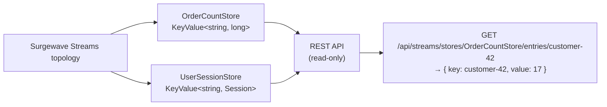

# Interactive Query Service

The Interactive Query Service (IQS) exposes the state stores inside a running Streams application
via a read-only REST API. This lets external services, dashboards, and scripts inspect aggregated
state without having to subscribe to output topics or maintain a separate read model.

## Overview

When a Streams topology runs aggregations, joins, or windowed counts, the results are stored in
state stores (in-memory or persistent). Normally these stores are opaque to the outside world.
IQS makes them queryable over HTTP without any additional infrastructure.



## Enabling IQS

Add to `appsettings.json`:

```json
{
  "Surgewave": {
    "Streams": {
      "InteractiveQueries": {
        "Enabled": true,
        "MaxEntriesPerPage": 1000
      }
    }
  }
}
```

Map the endpoints in `Program.cs`:

```csharp
app.MapSurgewaveInteractiveQueries(registry, executor);
```

Where `registry` is an `IStateStoreRegistry` and `executor` is a `StateStoreQueryExecutor`,
both registered automatically when IQS is enabled via `AddSurgewaveStreams()`.

## Configuration

| Setting | Type | Default | Description |
|---------|------|---------|-------------|
| `Enabled` | bool | `false` | Enable the Interactive Query REST API |
| `MaxEntriesPerPage` | int | `1000` | Hard limit on entries returned per page |

## REST API Reference

All endpoints are under `/api/streams/stores` and return JSON.

### List all stores

```
GET /api/streams/stores
```

Returns metadata for every registered state store.

**Response:**
```json
{
  "stores": [
    { "name": "order-counts", "type": "KeyValue", "persistent": true },
    { "name": "user-sessions", "type": "KeyValue", "persistent": false }
  ],
  "totalCount": 2
}
```

### Get store metadata

```
GET /api/streams/stores/{name}
```

Returns metadata for a single store. Returns `404` if the store does not exist.

### Get all entries (paginated)

```
GET /api/streams/stores/{name}/entries?offset=0&limit=100
```

Returns a page of entries from the store.

| Query param | Type | Default | Description |
|-------------|------|---------|-------------|
| `offset` | int | `0` | Zero-based start index |
| `limit` | int | `100` | Number of entries to return |

**Response:**
```json
{
  "storeName": "order-counts",
  "entries": [
    { "storeName": "order-counts", "key": "customer-1", "value": 42 },
    { "storeName": "order-counts", "key": "customer-2", "value": 7 }
  ],
  "offset": 0,
  "limit": 100,
  "totalCount": 850,
  "hasMore": true
}
```

### Get a single entry

```
GET /api/streams/stores/{name}/entries/{key}
```

Returns the value for a specific key. Returns `404` if the store or key does not exist.

**Response:**
```json
{
  "storeName": "order-counts",
  "key": "customer-42",
  "value": 17
}
```

### Get approximate entry count

```
GET /api/streams/stores/{name}/count
```

Returns the approximate number of entries in the store.

**Response:**
```json
{
  "storeName": "order-counts",
  "approximateCount": 850
}
```

## StateStoreRegistry

`IStateStoreRegistry` tracks all stores that have been materialised during topology construction.
Stores are registered automatically when you use `Materialized.As(...)`:

```csharp
var builder = new StreamsBuilder();

var orderCounts = builder.Stream<string, Order>("orders")
    .GroupBy<string>((_, order) => order.CustomerId)
    .Count(Materialized.As<string, long>("order-counts"));
```

The store named `"order-counts"` is then available at:

```
GET /api/streams/stores/order-counts/entries/{customerId}
```

## Querying from .NET

You can also query stores directly in-process via `StateStoreQueryExecutor`:

```csharp
// Get all entries (paginated)
var entries = executor.GetAll("order-counts", offset: 0, limit: 50);
foreach (var (key, value) in entries)
    Console.WriteLine($"{key}: {value}");

// Get a single entry
var count = executor.GetByKey("order-counts", "customer-42");
Console.WriteLine($"Orders for customer-42: {count}");

// Get approximate count
long total = executor.GetCount("order-counts");
Console.WriteLine($"Total customers tracked: {total}");
```

## Complete Example

```csharp
// topology setup
var builder = new StreamsBuilder();

builder.Stream<string, Order>("orders")
    .GroupBy<string>((_, o) => o.CustomerId)
    .Aggregate(
        initializer: () => new CustomerStats(),
        aggregator: (key, order, stats) => stats.Add(order),
        materialized: Materialized.As<string, CustomerStats>("customer-stats"));

var topology = builder.Build();
var config = new StreamsConfig { ApplicationId = "my-app", BootstrapServers = "localhost:9092" };

var runtime = new StreamsRuntime(topology, config);
await runtime.StartAsync(cancellationToken);

// In Program.cs, expose the REST API
app.MapSurgewaveInteractiveQueries(runtime.StateStoreRegistry, runtime.QueryExecutor);
```

External consumers can now query:

```bash
# Get stats for a specific customer
curl http://localhost:5050/api/streams/stores/customer-stats/entries/customer-99

# List all tracked customers (first page)
curl "http://localhost:5050/api/streams/stores/customer-stats/entries?limit=50"
```

## Limitations

- **Read-only** — IQS provides read access only; state cannot be modified via the API.
- **Local state only** — each broker instance exposes only the partitions it owns. In a
  multi-broker deployment, query all instances and merge results, or route requests to the
  instance owning the target partition key using the partition assignment metadata.
- **Approximate counts** — `GetCount` returns an approximate figure; it may differ slightly
  from the true entry count for RocksDB-backed stores.
- **Window stores** — windowed aggregations expose a flattened key format (`key@windowStart`);
  filtering by window range must be done client-side.

## Next Steps

- [Kafka Streams](features/streams.md) — Building stream processing topologies
- [Circuit Breaker](circuit-breaker.md) — Resilience for stream processing
- [Monitoring](monitoring/index.md) — Metrics for state stores
