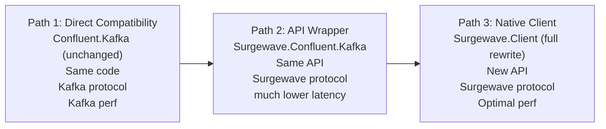

# Migrating from Apache Kafka to Surgewave

This guide covers all migration paths from Apache Kafka to Surgewave, from zero-code migration to full native API adoption.

## Migration Overview

Surgewave offers three migration paths with increasing performance benefits:

| Path | Effort | Code Changes | Performance | Best For |
|------|--------|--------------|-------------|----------|
| [Path 1: Direct Compatibility](#path-1-direct-compatibility) | Zero | None | Kafka baseline | Testing Surgewave |
| [Path 2: API Wrapper](#path-2-confluentkafka-wrapper) | Minimal | Package swap | Low-latency native path | Production migration |
| [Path 3: Native Client](#path-3-native-client) | Full rewrite | Complete | Optimal | New development |



---

## Path 1: Direct Compatibility

**Zero code changes** - Use your existing Confluent.Kafka code with Surgewave broker.

### When to Use

- Quick proof of concept
- Testing Surgewave before committing to migration
- Environments requiring Kafka wire protocol
- Hybrid Kafka/Surgewave deployments

### How It Works

Surgewave implements the Kafka 4.0 wire protocol. Simply point your existing Kafka client to Surgewave:

```csharp
// Existing code - no changes needed
using Confluent.Kafka;

var config = new ProducerConfig
{
    BootstrapServers = "surgewave-broker:9092"  // Point to Surgewave instead of Kafka
};

using var producer = new ProducerBuilder<string, string>(config).Build();
await producer.ProduceAsync("my-topic", new Message<string, string>
{
    Key = "key-1",
    Value = "Hello from Kafka client!"
});
```

### Supported Features

| Feature | Status | Notes |
|---------|--------|-------|
| Producer | Full | All produce modes |
| Consumer | Full | Subscribe, poll, commit |
| Consumer Groups | Full | Rebalancing, offsets |
| Transactions | Full | Exactly-once semantics |
| Admin Client | Full | Topic/group management |
| Headers | Full | Message metadata |
| Compression | Full | gzip, snappy, lz4, zstd |
| SASL/TLS | Full | Authentication & encryption |

### Limitations

- Performance limited to Kafka protocol speed (Kafka-protocol baseline latency)
- No access to Surgewave-specific features
- Wire protocol overhead

### Try It

```bash
# Start Surgewave broker
dotnet run --project src/Kuestenlogik.Surgewave.Broker

# Run sample with existing Confluent.Kafka
dotnet run --project samples/KafkaCompatibility
```

---

## Path 2: Confluent.Kafka Wrapper

**Minimal changes** - Same API, lower latency.

### When to Use

- Production migration from Kafka
- Team familiar with Confluent.Kafka API
- Need Surgewave performance with minimal code changes
- Gradual migration strategy

### How It Works

Replace the NuGet package, keep your code:

```xml
<!-- Before: Original Kafka client -->
<PackageReference Include="Confluent.Kafka" Version="2.12.0" />

<!-- After: Surgewave wrapper -->
<PackageReference Include="Kuestenlogik.Surgewave.Compatibility.Confluent.Kafka" Version="1.0.0" />
```

```csharp
// Code stays the same!
using Confluent.Kafka;  // Now resolves to Surgewave wrapper

var config = new ProducerConfig
{
    BootstrapServers = "surgewave-broker:9092",
    SurgewaveProtocol = "surgewave"  // Optional: Enable native protocol
};

using var producer = new ProducerBuilder<string, string>(config).Build();
await producer.ProduceAsync("my-topic", new Message<string, string>
{
    Key = "key-1",
    Value = "Hello from Surgewave!"
});
```

### Protocol Selection

The wrapper supports three protocol modes:

| Mode | Config Value | Description |
|------|--------------|-------------|
| Auto | `"auto"` (default) | Tries Surgewave first, falls back to Kafka |
| Surgewave | `"surgewave"` | Force Surgewave native protocol (fastest) |
| Kafka | `"kafka"` | Force Kafka protocol (compatibility) |

```csharp
// Auto-detect (default)
var config = new ProducerConfig { BootstrapServers = "localhost:9092" };

// Force Surgewave native protocol
var config = new ProducerConfig
{
    BootstrapServers = "localhost:9092",
    SurgewaveProtocol = "surgewave"
};

// Force Kafka protocol
var config = new ProducerConfig
{
    BootstrapServers = "localhost:9092",
    SurgewaveProtocol = "kafka"
};
```

### Performance Comparison

| Metric | Kafka Protocol | Surgewave Protocol | Improvement |
|--------|---------------|----------------|-------------|
| P50 Latency | Kafka-protocol baseline | low (target) | lower-latency |
| P99 Latency | 28.4 ms | 156 µs | 182x |
| Throughput | 68K msg/s | 1.25M msg/s | 18x |

### API Compatibility

All Confluent.Kafka APIs are supported:

```csharp
// Producer with all features
var producer = new ProducerBuilder<string, string>(config)
    .SetKeySerializer(Serializers.Utf8)
    .SetValueSerializer(Serializers.Utf8)
    .SetErrorHandler((p, e) => Console.WriteLine($"Error: {e.Reason}"))
    .SetLogHandler((p, log) => Console.WriteLine($"[{log.Level}] {log.Message}"))
    .Build();

// Consumer with all features
var consumer = new ConsumerBuilder<string, string>(config)
    .SetPartitionsAssignedHandler((c, p) => Console.WriteLine($"Assigned: {p}"))
    .SetPartitionsRevokedHandler((c, p) => Console.WriteLine($"Revoked: {p}"))
    .SetOffsetsCommittedHandler((c, o) => Console.WriteLine($"Committed: {o}"))
    .Build();

consumer.Subscribe(new[] { "topic1", "topic2" });

// Consume with manual commit
var result = consumer.Consume(TimeSpan.FromSeconds(10));
if (result != null && !result.IsPartitionEOF)
{
    ProcessMessage(result.Message);
    consumer.Commit(result);
}
```

### Migration Checklist

- [ ] Replace NuGet package reference
- [ ] Build and run tests (no code changes needed)
- [ ] Add `SurgewaveProtocol = "surgewave"` to configs for performance
- [ ] Deploy to staging environment
- [ ] Monitor metrics and verify behavior
- [ ] Deploy to production

### Try It

```bash
# Start Surgewave broker
dotnet run --project src/Kuestenlogik.Surgewave.Broker

# Run wrapper sample
dotnet run --project samples/ConfluentKafkaMigration -- surgewave 1000
```

See: [Confluent.Kafka Wrapper Documentation](../clients/confluent-kafka-wrapper.md)

---

## Path 3: Native Client

**Full rewrite** - Maximum performance with Surgewave-native API.

### When to Use

- New Surgewave-native applications
- Maximum performance requirements
- Need Surgewave-specific features
- No Kafka compatibility requirement

### How It Works

Use Surgewave's native client API directly:

```csharp
using Kuestenlogik.Surgewave.Client;
using Kuestenlogik.Surgewave.Client.Native;

// Create client
await using var client = await SurgewaveClient.Create("surgewave-broker:9092")
    .UseSurgewaveProtocol()
    .BuildAsync();

// Produce
var producer = client.CreateProducer<string, string>();
await producer.ProduceAsync("orders", "order-123", """{"item": "widget", "qty": 5}""");

// Consume
var consumer = client.CreateConsumer<string, string>(opts =>
{
    opts.GroupId = "my-group";
    opts.AutoOffsetReset = AutoOffsetReset.Earliest;
});
consumer.Subscribe("orders");
while (true)
{
    var result = await consumer.ConsumeAsync();
    if (result != null)
        Console.WriteLine($"Received: {result.Key} = {result.Value}");
}
```

### API Comparison

| Confluent.Kafka | Surgewave.Client | Notes |
|-----------------|--------------|-------|
| `ProducerBuilder<K,V>` | `SurgewaveClient.Create().BuildAsync()` | Fluent builder |
| `producer.ProduceAsync()` | `producer.ProduceAsync()` | Same pattern |
| `consumer.Subscribe()` | `consumer.Subscribe()` | Same pattern |
| `consumer.Consume()` | `consumer.ConsumeAsync()` | Async with null check |
| `consumer.Commit()` | `consumer.CommitAsync()` | Async commit |
| `AdminClient` | `nativeClient.Topics`, `.Groups`, `.Admin` | Domain-specific groups |

### Producer Example

```csharp
// Confluent.Kafka style
await producer.ProduceAsync("topic", new Message<string, string>
{
    Key = "key",
    Value = "value",
    Headers = new Headers { { "trace-id", bytes } }
});

// Surgewave.Client style (low-level)
await nativeClient.Messaging.Send("topic")
    .WithKey("key")
    .WithValue("value")
    .WithHeader("trace-id", bytes)
    .ExecuteAsync();
```

### Consumer Example

```csharp
// Confluent.Kafka style
consumer.Subscribe("topic");
while (true)
{
    var result = consumer.Consume(TimeSpan.FromSeconds(1));
    if (result != null) ProcessMessage(result);
}

// Surgewave.Client style
var consumer = new SurgewaveConsumer<string, string>(opts =>
{
    opts.BootstrapServers = "localhost:9092";
});
consumer.Assign("topic", partition: 0, offset: 100);
while (!cancellationToken.IsCancellationRequested)
{
    var msg = await consumer.ConsumeAsync(cancellationToken);
    if (msg != null) ProcessMessage(msg);
}
```

### Admin Operations

```csharp
// Create topic
await client.Topics.CreateAsync("new-topic", partitions: 6, replicationFactor: 3);

// List topics
var topics = await client.Topics.ListAsync();

// Consumer groups
var groups = await client.Groups.ListAsync();
var description = await client.Groups.DescribeAsync("my-group");
```

### Performance

| Metric | Surgewave.Client |
|--------|--------------|
| P50 Latency | low (target) |
| P99 Latency | 156 µs |
| Throughput | 1.25M msg/s |
| Memory | Minimal allocations |

### Try It

```bash
# Start Surgewave broker
dotnet run --project src/Kuestenlogik.Surgewave.Broker

# Run native client sample
dotnet run --project samples/NativeClient
```

See: [.NET Client Documentation](../clients/dotnet.md)

---

## Migration Strategy

### Recommended Approach

1. **Evaluate** (Week 1)
   - Run samples with existing Confluent.Kafka code
   - Verify compatibility with your use cases
   - Benchmark performance

2. **Pilot** (Weeks 2-3)
   - Deploy Surgewave broker in staging
   - Point dev/test environments to Surgewave
   - Use Path 1 (direct compatibility) for initial testing

3. **Migrate** (Weeks 4-6)
   - Switch to Path 2 (API wrapper) for Surgewave protocol benefits
   - Add `SurgewaveProtocol = "surgewave"` configuration
   - Monitor and tune performance

4. **Optimize** (Optional)
   - Consider Path 3 (native client) for critical paths
   - Use native client for new development
   - Keep wrapper for existing code

### Rollback Strategy

Each path supports easy rollback:

| Path | Rollback Method |
|------|-----------------|
| Path 1 | Change `BootstrapServers` back to Kafka |
| Path 2 | Swap NuGet package back to Confluent.Kafka |
| Path 3 | N/A (different API) |

### Hybrid Deployment

Surgewave supports running alongside Kafka:

```csharp
// Kafka producer (original cluster)
var kafkaConfig = new ProducerConfig { BootstrapServers = "kafka:9092" };

// Surgewave producer (new cluster)
var surgewaveConfig = new ProducerConfig
{
    BootstrapServers = "surgewave:9092",
    SurgewaveProtocol = "surgewave"
};

// Mirror messages during migration
await kafkaProducer.ProduceAsync("topic", message);
await surgewaveProducer.ProduceAsync("topic", message);
```

---

## Configuration Mapping

### Producer Configuration

| Confluent.Kafka | Surgewave Equivalent | Notes |
|-----------------|------------------|-------|
| `BootstrapServers` | Same | Required |
| `ClientId` | Same | Optional |
| `Acks` | Same | All, Leader, None |
| `LingerMs` | Same | Batching delay |
| `BatchNumMessages` | Same | Batch size |
| `CompressionType` | Same | gzip, snappy, lz4, zstd |
| `EnableIdempotence` | Same | Exactly-once |
| `TransactionalId` | Same | Transactions |
| N/A | `SurgewaveProtocol` | "surgewave", "kafka", "auto" |

### Consumer Configuration

| Confluent.Kafka | Surgewave Equivalent | Notes |
|-----------------|------------------|-------|
| `BootstrapServers` | Same | Required |
| `GroupId` | Same | Consumer group |
| `ClientId` | Same | Optional |
| `AutoOffsetReset` | Same | Earliest, Latest |
| `EnableAutoCommit` | Same | Auto commit |
| `AutoCommitIntervalMs` | Same | Commit frequency |
| `SessionTimeoutMs` | Same | Group timeout |
| `MaxPollIntervalMs` | Same | Processing timeout |
| N/A | `SurgewaveProtocol` | "surgewave", "kafka", "auto" |

---

## Troubleshooting

### Common Issues

**Connection refused**
```
Solution: Ensure Surgewave broker is running on the specified address
Command: dotnet run --project src/Kuestenlogik.Surgewave.Broker
```

**Topic not found**
```
Solution: Create the topic first or enable auto-create
Command: surgewave topic create my-topic --partitions 6
```

**Consumer group rebalancing**
```
Solution: Ensure all consumers use same GroupId and protocol
Check: Consumer logs for rebalance events
```

**Performance not as expected**
```
Solution: Verify SurgewaveProtocol = "surgewave" is set
Check: Broker logs for protocol detection
```

### Verification Commands

```bash
# Check broker status
surgewave status

# List topics
surgewave topic list

# Describe consumer group
surgewave group describe my-group

# Check lag
surgewave group lag my-group
```

---

## Next Steps

- [Confluent.Kafka Wrapper API](../clients/confluent-kafka-wrapper.md) - Complete API reference
- [Surgewave.Client Native API](../clients/dotnet.md) - Native client documentation
- [Performance Tuning](../performance/tuning.md) - Optimization guide
- [Kafka Compatibility](../clients/kafka-compat.md) - Protocol details
