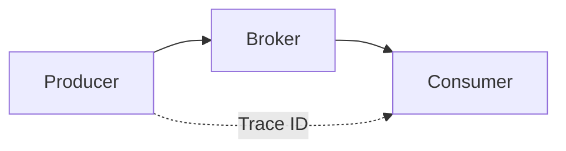

# OpenTelemetry Tracing

Distributed tracing for Surgewave.

## Overview

Surgewave uses OpenTelemetry for:
- **Metrics** - System.Diagnostics.Metrics
- **Tracing** - ActivitySource

## Activity Types

| Activity | Description |
|----------|-------------|
| `surgewave.produce` | Produce operation |
| `surgewave.fetch` | Fetch operation |
| `surgewave.transaction` | Transaction lifecycle |
| `surgewave.request.{api}` | Request by API |

## Configuration

### ASP.NET Core

```csharp
builder.Services.AddOpenTelemetry()
    .WithTracing(tracing => tracing
        .AddSource("Surgewave")
        .AddOtlpExporter());
```

### Export to Jaeger

```csharp
builder.Services.AddOpenTelemetry()
    .WithTracing(tracing => tracing
        .AddSource("Surgewave")
        .AddJaegerExporter(o =>
        {
            o.AgentHost = "localhost";
            o.AgentPort = 6831;
        }));
```

### Export to Zipkin

```csharp
builder.Services.AddOpenTelemetry()
    .WithTracing(tracing => tracing
        .AddSource("Surgewave")
        .AddZipkinExporter(o =>
        {
            o.Endpoint = new Uri("http://localhost:9411/api/v2/spans");
        }));
```

## Trace Context

Surgewave propagates trace context:



### Producer

```csharp
using var activity = ActivitySource.StartActivity("produce");
activity?.SetTag("topic", "orders");
activity?.SetTag("key", messageKey);

await producer.ProduceAsync("orders", key, value);
```

### Consumer

```csharp
while (!cancellationToken.IsCancellationRequested)
{
    var record = await consumer.ConsumeAsync(cancellationToken);
    if (record == null) continue;

    using var activity = ActivitySource.StartActivity("process");
    activity?.SetTag("topic", record.Topic);
    activity?.SetTag("offset", record.Offset);

    Process(record);
}
```

## Span Attributes

### Produce

| Attribute | Description |
|-----------|-------------|
| `messaging.system` | "surgewave" |
| `messaging.destination` | Topic name |
| `messaging.destination_kind` | "topic" |
| `messaging.message_id` | Offset |

### Consume

| Attribute | Description |
|-----------|-------------|
| `messaging.system` | "surgewave" |
| `messaging.source` | Topic name |
| `messaging.consumer.group` | Consumer group |
| `messaging.kafka.partition` | Partition |
| `messaging.kafka.offset` | Offset |

## Metrics via OpenTelemetry

```csharp
builder.Services.AddOpenTelemetry()
    .WithMetrics(metrics => metrics
        .AddMeter("Surgewave")
        .AddPrometheusExporter());
```

## Example Trace

```
[surgewave.produce]  low (target)
  └─ topic: orders
  └─ partition: 2
  └─ offset: 12345

  [surgewave.storage.write] 20µs
    └─ segment: 00000000000012000

  [surgewave.replication.send] 15µs
    └─ broker: 2
    └─ broker: 3
```

## Sampling

For high-volume:

```csharp
builder.Services.AddOpenTelemetry()
    .WithTracing(tracing => tracing
        .AddSource("Surgewave")
        .SetSampler(new TraceIdRatioBasedSampler(0.1)));  // 10%
```

## Next Steps

- [Metrics](metrics.md) - Prometheus metrics
- [Performance](../performance/index.md) - Optimization
