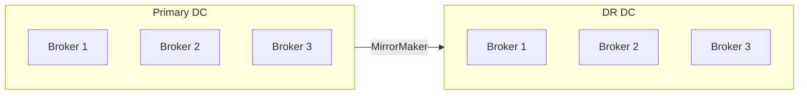

# Backup & Recovery

Strategies for protecting Surgewave data and recovering from failures.

## Backup Strategies

### Replication (Primary)

The primary protection mechanism is replication:

```json
{
  "Surgewave": {
    "DefaultReplicationFactor": 3,
    "MinInSyncReplicas": 2
  }
}
```

With replication factor 3, data survives loss of 2 brokers.

### Cross-Cluster Replication

Use MirrorMaker for disaster recovery:

```bash
surgewave mirror create \
    --name prod-to-dr \
    --source-alias prod \
    --source-servers prod-kafka:9092 \
    --target-alias dr \
    --target-servers dr-kafka:9092 \
    --sync-offsets
```

### File-Level Backup

For offline backup of data directories:

```bash
# Stop broker or use consistent snapshot
surgewave broker shutdown --graceful

# Backup data directory
tar -czf surgewave-backup-$(date +%Y%m%d).tar.gz /var/surgewave/data

# Restart broker
surgewave broker start
```

### Tiered Storage

Offload old data to cloud storage:

```json
{
  "Surgewave": {
    "TieredStorage": {
      "Enabled": true,
      "Provider": "S3",
      "Bucket": "surgewave-archive",
      "LocalRetentionHours": 24
    }
  }
}
```

## Recovery Procedures

### Single Broker Failure

With replication, no action needed:

1. Other replicas continue serving
2. Restart failed broker
3. Data resyncs automatically

```bash
# Check cluster status
surgewave cluster status

# After broker restart
surgewave cluster nodes
```

### Data Directory Loss

If a broker loses its data directory:

1. Start broker with empty data directory
2. Broker re-registers with cluster
3. Data replicates from other brokers

```bash
# Clear corrupt data
rm -rf /var/surgewave/data/*

# Start broker
surgewave broker start
```

### Full Cluster Recovery

From backup:

1. Stop all brokers
2. Restore data directories from backup
3. Start brokers

```bash
# On each broker
tar -xzf surgewave-backup.tar.gz -C /var/surgewave/

# Start in order (controller first)
surgewave broker start
```

### Consumer Group Recovery

Reset consumer offsets after recovery:

```bash
# Reset to earliest (replay all)
surgewave groups reset my-group --topic my-topic --to-earliest

# Reset to specific offset
surgewave groups reset my-group --topic my-topic --to-offset 12345

# Reset to timestamp
surgewave groups reset my-group --topic my-topic --to-datetime "2024-01-15T10:00:00"
```

## Disaster Recovery

### DR Architecture



### Failover Process

1. Stop MirrorMaker
2. Fail over consumer groups
3. Point producers to DR cluster

```bash
# Preview failover
surgewave mirror failover \
    --group my-consumer-group \
    --source prod \
    --target dr \
    --dry-run

# Execute failover
surgewave mirror failover \
    --group my-consumer-group \
    --source prod \
    --target dr \
    --force
```

### Failback Process

1. Ensure primary is healthy
2. Set up reverse replication
3. Sync missed data
4. Switch traffic back

## Best Practices

1. **Test recovery regularly** - Don't wait for a real disaster
2. **Document procedures** - Runbooks for each scenario
3. **Monitor replication lag** - Alert on high lag
4. **Use multiple availability zones** - Spread brokers
5. **Automate where possible** - Reduce human error

## See Also

- [Troubleshooting](troubleshooting.md) - Fix issues
- [Clustering](../clustering/index.md) - Multi-broker setup
- [Monitoring](../monitoring/index.md) - Observability
