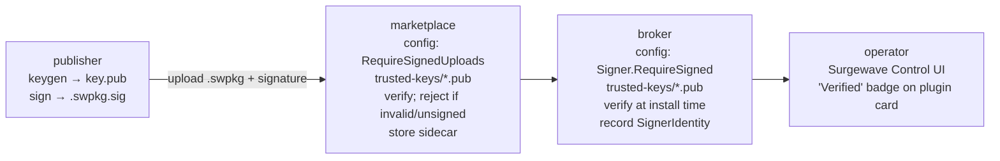

# Plugin Signing & Verification

Surgewave plugin packages (`.swpkg`) can be cryptographically signed so that operators and the
marketplace can reject tampered or unauthorised code. Signing is end-to-end: the publisher
signs the package, the marketplace verifies at upload, the broker verifies at install, and
operators see a "Verified" badge in the Surgewave Control UI.

The signer surface is pluggable via `ISppSignerProvider`. Two providers ship:

| Provider | Where it lives | Trust model | Use case |
|----------|---------------|-------------|----------|
| `builtin-ecdsa` | `Kuestenlogik.Surgewave.Plugins.Packaging` (OSS) | Flat directory of ECDSA P-256 public keys | Zero-config OSS signing |
| `charter` | `Kuestenlogik.Surgewave.Plugins.Signing.Charter` (Surgewave.Licensing, enterprise) | X.509 certificate chains, RFC-3161 timestamps, OCSP/CRL | Enterprise PKI |

Surgewave core depends only on the `ISppSigner` / `ISppSignerProvider` abstraction — the Charter
provider is loaded at runtime from the plugins directory via an isolated `AssemblyLoadContext`,
so the OSS broker has no compile-time dependency on Charter.

## Quick start — built-in ECDSA

### 1. Generate a publisher key pair

```bash
surgewave plugins keygen mycompany --output ./keys
# writes ./keys/mycompany.key (private) and ./keys/mycompany.pub (public)
```

Keep `mycompany.key` secret. Ship `mycompany.pub` to anyone who needs to trust your plugins.

### 2. Sign a package

**Ad-hoc (after building):**

```bash
surgewave plugins sign ./artifacts/pkg/my-plugin-1.0.0.swpkg --key ./keys/mycompany.key
# writes ./artifacts/pkg/my-plugin-1.0.0.swpkg.sig
```

**Automated via MSBuild:** pass the signing key when publishing — the `Kuestenlogik.Surgewave.Build` task
packs the plugin and signs it in one step:

```bash
dotnet publish -c Release -p:SurgewavePackPlugin=true -p:SurgewaveSigningKey=./keys/mycompany.key
```

### 3. Trust a publisher and verify

```bash
# Register the publisher's public key in the local trust store
surgewave plugins trust ./keys/mycompany.pub --plugins-dir ./plugins
# copies the key to ./plugins/trusted-keys/mycompany.pub

# Verify an untrusted package before installing
surgewave plugins verify ./my-plugin-1.0.0.swpkg --plugins-dir ./plugins
# Signature verified (signed by: mycompany)
```

A tampered package, or one signed by a publisher not in `plugins/trusted-keys/`, exits non-zero
with a clear reason.

## Install-time verification on the broker

The broker's plugin-install endpoint runs the same verifier. Configure it via
`Surgewave:Plugins:Signer` in `appsettings.json`:

```json
{
  "Surgewave": {
    "Plugins": {
      "Signer": {
        "Name": "builtin-ecdsa",
        "Options": {
          "trusted-keys-dir": "plugins/trusted-keys"
        },
        "RequireSignedPackages": true
      }
    }
  }
}
```

With `RequireSignedPackages=true`, unsigned uploads are rejected. Signed-but-untrusted uploads
are rejected regardless of the flag.

The CLI install command accepts the same flags:

```bash
surgewave plugins install my-plugin.swpkg --require-signed --plugins-dir ./plugins
```

## Marketplace signature enforcement

When a marketplace operator wants to enforce publisher signing, configure
`Surgewave:Marketplace:Signing`:

```json
{
  "Surgewave": {
    "Marketplace": {
      "Signing": {
        "SignerName": "builtin-ecdsa",
        "SignerOptions": {
          "trusted-keys-dir": "trusted-keys"
        },
        "RequireSignedUploads": true
      }
    }
  }
}
```

Publishers then upload the package **and** its signature sidecar:

```bash
curl -X PUT http://marketplace.example.com/api/v1/packages \
  -F "file=@my-plugin-1.0.0.swpkg" \
  -F "signature=@my-plugin-1.0.0.swpkg.sig"
```

The marketplace stores the sidecar alongside the package; downstream `surgewave plugins install`
commands download both and verify locally using the configured trust store. The package's
`PackageMetadata` records `IsSigned` + `SignerIdentity` + `SignerProvider`, surfaced as a
"Verified" badge in both the marketplace's Browse page and Surgewave Control's Plugins page.

## Enterprise — Charter provider

`Kuestenlogik.Surgewave.Plugins.Signing.Charter` (proprietary, part of Surgewave.Licensing) adds CMS/PKCS#7
signing with X.509 certificate chains, RFC-3161 timestamp tokens, and OCSP/CRL revocation
checks. Options:

```json
{
  "Surgewave": {
    "Plugins": {
      "Signer": {
        "Name": "charter",
        "Options": {
          "cert-path": "/etc/surgewave/signing.pfx",
          "cert-password": "...",
          "roots": "/etc/surgewave/publisher-root.cer,/etc/surgewave/partner-root.cer",
          "timestamp-authority": "http://timestamp.digicert.com",
          "require-revocation-check": "true"
        },
        "RequireSignedPackages": true
      }
    }
  }
}
```

Signatures are written as `{package}.swpkg.cms` instead of `.sig`.

**Long-lived signatures:** if a `timestamp-authority` is configured, the signer attaches an
RFC-3161 timestamp token. During verification the signer chain's `VerificationTime` is pinned
to the TSA's `genTime`, so signing certs that were valid at stamp time but have since expired
still verify — the canonical use case for long-lived archive packages.

**Keygen:** Charter issues signer certificates through its own PKI workflow; `surgewave plugins keygen`
is builtin-only and intentionally does not cover the Charter case.

## Custom signer providers

Implement `ISppSignerProvider` and `ISppSigner` in your own assembly, install it as a plugin
next to the broker / marketplace (whichever host should discover it), and reference it by its
provider `Name` in the signer config. The registry loads the assembly in an isolated
`AssemblyLoadContext`, so a broken signer plugin cannot corrupt the host.

```csharp
public sealed class MySigner : ISppSigner
{
    public string Name => "my-signer";
    public bool HasSignature(string packagePath) => File.Exists(packagePath + ".mysig");
    public Task<string> SignAsync(string packagePath, CancellationToken ct) { ... }
    public Task<SignatureVerification> VerifyAsync(string packagePath, CancellationToken ct) { ... }
}

public sealed class MySignerProvider : ISppSignerProvider
{
    public string Name => "my-signer";
    public ISppSigner Create(IReadOnlyDictionary<string, string> options) => new MySigner(options);
}
```

Contract-test your implementation against `PluginPackageSignerContract` from
`Kuestenlogik.Surgewave.Plugins.Packaging.Testing` to confirm round-trip, tamper-detection, and unsigned
behaviour match the built-in providers.

## Software Bill of Materials (SBOM)

Every `.swpkg` produced by `PluginPackageManager.PackAsync` — and therefore every package signed
via `surgewave plugins sign`, the MSBuild task, or the CLI pack command — ships a CycloneDX 1.5
SBOM at `sbom.json` in the archive root. The SBOM records:

- **Top-level component** — the plugin's id, name, version, description; `purl` of the form
  `pkg:surgewave/<id>@<version>`.
- **Required components** — every assembly listed in the manifest's `assemblies` field, with
  the SHA-256 hash of its on-disk bytes at pack time.
- **Optional components** — every `deps/*.dll` that ships inside the archive, excluding Surgewave
  host assemblies. Each carries its SHA-256 hash and a best-effort `pkg:nuget/<name>@<version>`
  purl from the assembly version metadata.

The marketplace extracts `sbom.json` on upload and exposes it at
`GET /api/v1/packages/{id}/{version}/sbom` (media type `application/vnd.cyclonedx+json`).
`PackageMetadata.HasSbom` flips to `true` so UIs can link out to the SBOM alongside the
"Verified" badge. Older packages without an SBOM upload fine and simply set `HasSbom` to false —
SBOM presence is additive, not required.

Together with signing this gives operators two pieces of supply-chain provenance per install:

- **Who** — the signer identity from the verified signature.
- **What** — the list of assemblies and deps in the SBOM, each pinned by SHA-256.

## Trust chain summary


