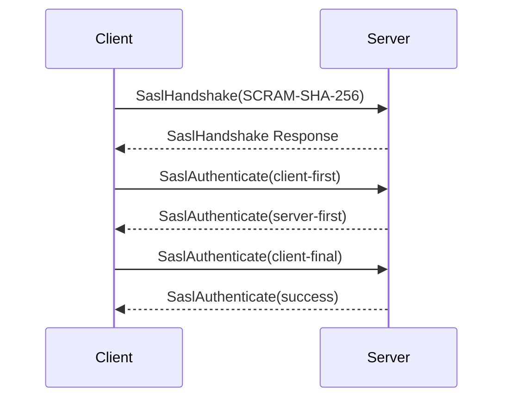

# SASL Authentication

Simple Authentication and Security Layer for client authentication.

## Supported Mechanisms

| Mechanism | Security | Use Case |
|-----------|----------|----------|
| PLAIN | Low | Development, internal |
| SCRAM-SHA-256 | High | Production |
| SCRAM-SHA-512 | Highest | High security |

## Configuration

### PLAIN

Simple username/password:

```json
{
  "Surgewave": {
    "Security": {
      "SaslEnabled": true,
      "SaslMechanisms": ["PLAIN"],
      "Users": [
        { "Username": "admin", "Password": "admin-secret" },
        { "Username": "producer", "Password": "prod-secret" },
        { "Username": "consumer", "Password": "cons-secret" }
      ]
    }
  }
}
```

### SCRAM-SHA-256

Salted Challenge Response:

```json
{
  "Surgewave": {
    "Security": {
      "SaslEnabled": true,
      "SaslMechanisms": ["SCRAM-SHA-256"],
      "ScramCredentialsFile": "/config/credentials.json"
    }
  }
}
```

Credentials file format:

```json
{
  "users": [
    {
      "username": "admin",
      "password": "admin-secret",
      "iterations": 4096
    },
    {
      "username": "app",
      "password": "app-secret",
      "iterations": 4096
    }
  ]
}
```

### SCRAM-SHA-512

Same as SCRAM-SHA-256 with stronger hash:

```json
{
  "Surgewave": {
    "Security": {
      "SaslMechanisms": ["SCRAM-SHA-512"]
    }
  }
}
```

## Client Configuration

### Surgewave.Client

SASL authentication is configured at the broker level. Native clients connect normally:

```csharp
await using var client = new SurgewaveNativeClient("localhost", 9092);
await client.ConnectAsync();
```

### Confluent.Kafka

```csharp
var config = new ProducerConfig
{
    BootstrapServers = "localhost:9092",
    SecurityProtocol = SecurityProtocol.SaslPlaintext,
    SaslMechanism = SaslMechanism.ScramSha256,
    SaslUsername = "app",
    SaslPassword = "app-secret"
};
```

## SASL Handshake



## User Management

### Add User

```bash
# Add to credentials file
{
  "username": "newuser",
  "password": "password",
  "iterations": 4096
}
```

### CLI (Future)

```bash
surgewave users add newuser --password secret
surgewave users list
surgewave users delete olduser
```

## Anonymous Access

Allow during migration:

```json
{
  "Surgewave": {
    "Security": {
      "SaslEnabled": true,
      "AllowAnonymous": true
    }
  }
}
```

## Troubleshooting

### Authentication Failed

```
Error: Authentication failed for user 'app'
```

- Verify username/password
- Check credentials file format
- Ensure mechanism matches

### Unsupported Mechanism

```
Error: Unsupported SASL mechanism
```

- Check `SaslMechanisms` in server config
- Verify client uses supported mechanism

## Best Practices

1. **Use SCRAM** over PLAIN in production
2. **Strong passwords** - Min 16 characters
3. **Separate accounts** - Per application
4. **Audit logins** - Monitor auth events

## Next Steps

- [TLS](tls.md) - Encrypt connections
- [ACL](acl.md) - Access control
