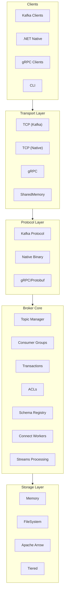
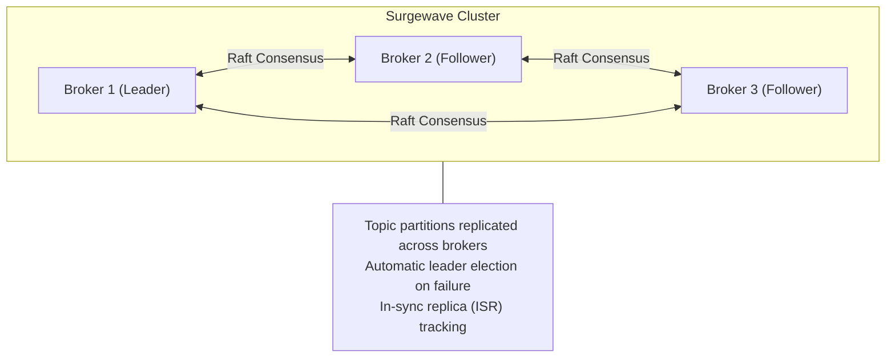

# Architecture Overview

Surgewave is designed as a modular, high-performance message broker with multiple protocol support and pluggable storage backends.

## High-Level Architecture



## Core Components

### Protocol Layer

| Protocol | Purpose | Performance |
|----------|---------|-------------|
| **Kafka Protocol** | 100% compatibility with Kafka clients | Baseline |
| **Native Protocol** | Maximum performance for .NET clients | much lower latency |
| **gRPC** | Cross-platform, streaming support | 2-3x faster |
| **SharedMemory** | Same-machine IPC | ultra-low latency (target) |

### Storage Engines

| Engine | Persistence | Best For |
|--------|-------------|----------|
| **Memory** | No | Testing, caching |
| **FileSystem** | Yes | General purpose |
| **ZeroCopyWal** | Yes | High performance |
| **Apache Arrow** | Yes | Analytics workloads |
| **Tiered** | Yes | Cost-optimized retention |

### Clustering

Surgewave uses **KRaft** (Kafka Raft) for consensus:



## Key Design Decisions

### Zero-Copy I/O

Surgewave minimizes memory copies using:
- `Span<T>` and `Memory<T>` for buffer management
- Memory-mapped files for storage
- `ArrayPool<T>` for allocation reuse

### Lock-Free Structures

Performance-critical paths use:
- `Channel<T>` for async queuing
- `ConcurrentDictionary` for shared state
- Interlocked operations for counters

### Source Generators

Compile-time code generation for:
- Protocol serialization (Kafka wire format)
- Configuration binding
- Regex patterns

## Request Flow

### Produce Request

```
1. Client sends ProduceRequest
2. Protocol layer deserializes
3. Broker validates (ACL, schema)
4. Storage engine appends to partition
5. Replication to followers (if clustered)
6. Response sent to client
```

### Consume Request

```
1. Client sends FetchRequest
2. Broker checks consumer group membership
3. Storage engine reads from partition
4. Optional: decompress, schema decode
5. Response with messages sent to client
6. Offset committed (if auto-commit)
```

## Extension Points

- **Storage Engines**: Implement `ISurgewaveStorageEngine`
- **Protocol Handlers**: Implement protocol-specific handlers
- **Connect Connectors**: Implement `ISourceConnector` / `ISinkConnector`
- **Schema Handlers**: Implement `ISchemaHandler` for new formats
