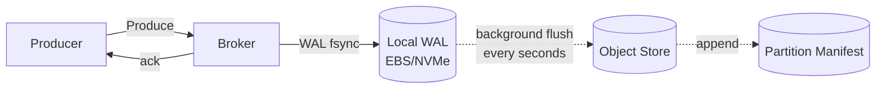
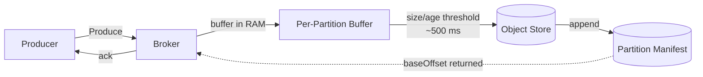

# Disaggregated Storage

Opt-in topic mode that decouples a topic's durability from the broker
process: instead of replicating data across brokers (ISR), the bytes
live on object storage (S3/Azure/GCS) and the broker is the metadata
+ coordination layer. Cuts cross-AZ replication traffic to near zero
and shifts the storage bill from "EBS × replication factor" to "S3
once". Designed for cost-sensitive analytical and audit workloads.

Architectural decision: [ADR-014](../adr/014-disaggregated-storage.md).

## When to use it

| Workload                                       | Recommended mode               |
|------------------------------------------------|--------------------------------|
| Real-time / sub-10 ms produce ack required     | `replicated` (default)         |
| Cost-cheap, real-time-ish, sub-10 ms still ok  | `disaggregated-wal`            |
| Batch / analytics, ~500 ms produce ack ok      | `disaggregated-stateless`      |

`replicated` topics keep the existing behaviour and are unchanged by
this feature. Disaggregated modes are opt-in per topic and never
implicit.

## The two disaggregated modes

### `disaggregated-wal` (AutoMQ-style)



- Produce ack returns after the local-disk fsync — **sub-10 ms P99**.
- A background flusher (`WalFlusher`) packs sealed segments and
  uploads them to the object store, then commits a `StreamObjectRef`
  to the per-partition manifest.
- Durability: until the first S3 flush, the un-flushed window lives
  only on local disk. Lose the disk before the flush and you lose
  that window (seconds, configurable via `pollInterval`).
- Embedded-friendly: the WAL works locally even without an object
  store configured; the flusher just becomes a no-op.

### `disaggregated-stateless` (WarpStream-style)



- Produce ack returns **only after the S3 PUT + manifest commit
  succeed** — `acks=all` semantics mean no false-durability acks.
- Tail latency: **~400–600 ms P99**, dominated by the S3 PUT.
- No local persistence. A broker crash mid-buffer loses the un-
  flushed records, but they were also never acked, so the producer
  retries as normal.
- **Not supported in embedded mode** — needs the object store
  reachable. The broker rejects this combination at topic-create
  time.

## Enabling on a topic

Per-topic config knob `storage.mode`. Pick one of the three values
at create time; **mid-life switching between modes is not supported
in v1** (recreate the topic with `surgewave topics mirror` if you
need to migrate).

```bash
# disaggregated-wal — sub-10 ms ack, async S3 offload
surgewave topics create orders \
  --partitions 12 \
  --replication-factor 1 \
  --config storage.mode=disaggregated-wal

# disaggregated-stateless — cheap batch, ~500 ms ack
surgewave topics create audit-log \
  --partitions 4 \
  --replication-factor 1 \
  --config storage.mode=disaggregated-stateless

# replicated (default) — sub-10 ms ack, ISR durability
surgewave topics create payments --partitions 8 --replication-factor 3
```

Surgewave enforces `replication-factor=1` for disaggregated topics
(S3 already replicates internally — extra ISR replicas burn money
without adding durability). The validator returns a clear error if
you try `replication-factor>1` with a disaggregated mode.

Control UI: `Topics → Create` exposes the same `storage.mode`
selector with inline help text describing the latency/cost trade-off.

## Trade-off matrix

| Property                       | `replicated` | `disaggregated-wal`   | `disaggregated-stateless` |
|--------------------------------|--------------|-----------------------|---------------------------|
| Produce P99                    | sub-10 ms    | sub-10 ms             | ~400–600 ms               |
| Durability after ack           | ISR replicas | local disk → S3 (s)   | S3 (11×9 immediately)     |
| Cross-AZ traffic               | high (RF×)   | near zero             | near zero                 |
| Storage cost                   | EBS × RF     | EBS (small) + S3      | S3 only                   |
| Embedded mode supported        | yes          | yes                   | no                        |
| Read latency (hot data)        | sub-ms       | sub-ms (from WAL)     | S3 GET (~50–200 ms)       |
| Read latency (cold data)       | S3 GET       | S3 GET                | S3 GET                    |

## Object-store requirements

Configure once at the broker level. The disaggregated subsystem uses
the same `IRemoteStorageProvider` contract as Tiered Storage —
existing AWS S3 / Azure Blob / GCS plugins work without changes.

```json
{
  "Surgewave": {
    "Storage": {
      "Disaggregated": {
        "Enabled": true,
        "Provider": "s3",
        "Wal": {
          "PollInterval": "00:00:05",
          "MaxSegmentsPerScan": 16
        },
        "Stateless": {
          "MaxBufferBytes": 4194304,
          "MaxBufferAge": "00:00:00.500",
          "AgePollInterval": "00:00:00.050"
        }
      },
      "S3": {
        "Endpoint": "https://s3.eu-central-1.amazonaws.com",
        "Bucket": "my-surgewave-bucket",
        "Region": "eu-central-1"
      }
    }
  }
}
```

IAM permissions required on the bucket (S3): `s3:PutObject`,
`s3:GetObject`, `s3:DeleteObject`, `s3:ListBucket`.

## Failure modes

- **`disaggregated-wal` broker crash before flush**: `WalFlusher`
  recovery on restart re-flushes any pending sealed segments. No data
  loss.
- **`disaggregated-wal` broker disk loss before flush**: the un-
  flushed window (typically seconds) is gone. Operators who cannot
  accept that window must keep `replicated`.
- **`disaggregated-stateless` agent crash mid-buffer**: in-flight
  records that have not received an ack are lost. `acks=all` semantics
  ensure the producer was never told they were durable; standard
  retry semantics apply.
- **Object store unreachable**: produce blocks for disaggregated
  topics with error `STORAGE_UNAVAILABLE`. `replicated` topics on the
  same broker are unaffected.

## What is out of v1

These limitations are explicit in ADR-014 and are tracked as
follow-up roadmap items:

- **Log compaction** on disaggregated topics. Combining
  `storage.mode=disaggregated-*` with `cleanup.policy=compact` is
  rejected at create time.
- **Cross-topic transactions** that touch a disaggregated topic. The
  transaction coordinator rejects with `INVALID_TXN_STATE`.
- **Mid-life storage.mode alter**. Mode is fixed at topic create.
  Recreate-with-mirror is the workaround.
- **Client-side direct-S3 produce** (presigned URLs). The
  `ProduceStrategy.StatelessDirect` wire value is reserved for this
  future optimisation; v1 brokers always advertise via-broker relay.
- **Aggressive WAL trim after flush**. Today's `disaggregated-wal`
  keeps the local segments after they've been uploaded; retention
  follows the topic's `retention.ms`. Trim-after-flush lands as a
  follow-up.

## How the read path stays transparent

Consumers do not need to know whether a topic is disaggregated. On
fetch, the broker:

1. Checks the partition manifest for a `StreamObjectRef` covering
   the requested offset.
2. If yes → fetches the bytes from the object store
   (`DisaggregatedSegmentReader`) and serves them.
3. If no (offset is past the manifest tail, i.e. freshly produced) →
   serves from the local WAL (for `disaggregated-wal`) or the in-
   memory buffer (for `disaggregated-stateless`).

The Kafka wire protocol does not change — classical Kafka clients
work against disaggregated topics without modification.

## See also

- [ADR-014](../adr/014-disaggregated-storage.md) — Architecture
  decisions, alternatives considered, implementation plan.
- [Tiered Storage](tiered.md) — the lazy-offload sibling that keeps
  the ISR path. Use when you want long-term cheap storage without
  giving up replication-based durability.
- [Storage Engines](index.md) — the per-engine durability +
  performance characteristics that disaggregated mode layers on top
  of.
