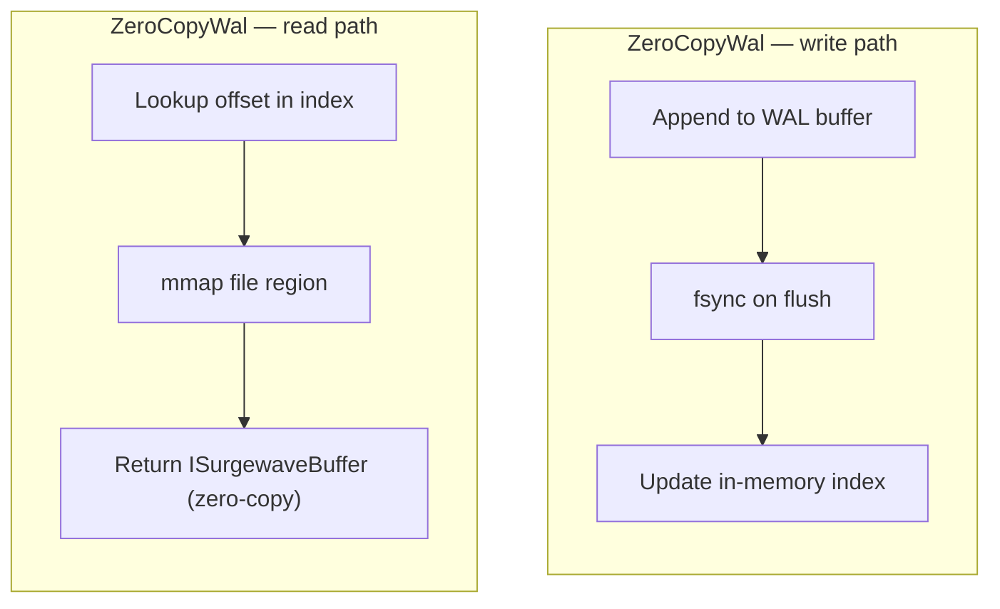

# FileSystem Storage

File-based storage provides durable persistence with good performance.

## Configuration

### Standard File Storage

```json
{
  "Surgewave": {
    "StorageMode": "File",
    "DataDirectory": "/var/surgewave/data",
    "LogSegmentBytes": 1073741824,
    "LogRetentionHours": 168
  }
}
```

### Zero-Copy WAL

For higher performance with memory-mapped reads:

```json
{
  "Surgewave": {
    "StorageMode": "ZeroCopyWal",
    "DataDirectory": "/var/surgewave/data"
  }
}
```

## Characteristics

| Property | File | ZeroCopyWal |
|----------|------|-------------|
| Persistence | Yes | Yes |
| Write Latency | ~100 µs | ~100 µs |
| Read Latency | ~50 µs | ~20 µs |
| Throughput | 286K msg/s | 549K msg/s |

## Directory Structure

```
data/
├── topics/
│   └── my-topic/
│       ├── 0/                    # Partition 0
│       │   ├── 00000000000000000000.log
│       │   ├── 00000000000000000000.index
│       │   └── 00000000000000000000.timeindex
│       ├── 1/                    # Partition 1
│       └── 2/                    # Partition 2
├── __consumer_offsets/           # Consumer group offsets
└── __transaction_state/          # Transaction logs
```

## Segment Management

Messages are stored in segments:

| Setting | Default | Description |
|---------|---------|-------------|
| `LogSegmentBytes` | 1 GB | Max segment size before roll |
| `LogRetentionHours` | 168 | Delete segments older than this |
| `LogRetentionBytes` | -1 | Max bytes per topic partition |

## Index Files

Each segment has associated index files:

- `.log` - Message data
- `.index` - Offset → position mapping
- `.timeindex` - Timestamp → offset mapping

## Zero-Copy WAL

The Write-Ahead Log (WAL) backend uses memory-mapped files for optimal read performance:



## Disk Requirements

Calculate disk requirements:

```
Storage = (message_rate × avg_size × retention_hours × 3600)
        + (10% index overhead)
```

Example:
- 10K msg/s × 1KB × 168h × 3600s = 6 TB
- With 3x replication: 18 TB

## Performance Optimization

### SSD Recommended

```json
{
  "Surgewave": {
    "DataDirectory": "/ssd/surgewave/data"
  }
}
```

### Separate Log Directory

```json
{
  "Surgewave": {
    "DataDirectory": "/ssd/surgewave/data",
    "LogDirectory": "/hdd/surgewave/logs"
  }
}
```

### Tune fsync

For maximum durability:
```json
{
  "Surgewave": {
    "LogFlushIntervalMessages": 1
  }
}
```

For maximum throughput:
```json
{
  "Surgewave": {
    "LogFlushIntervalMessages": 10000,
    "LogFlushIntervalMs": 1000
  }
}
```

## Cleanup Policies

### Delete (Default)

Remove segments older than retention:

```json
{
  "Surgewave": {
    "LogRetentionHours": 168,
    "LogCleanupPolicy": "delete"
  }
}
```

### Compact

Keep only latest value per key:

```json
{
  "Surgewave": {
    "LogCleanupPolicy": "compact",
    "LogCleanerMinCleanableRatio": 0.5
  }
}
```

### Ephemeral

Ephemeral topics do not use filesystem storage - they use an in-memory ring buffer (`EphemeralPartitionLog`). On a file-backed broker, persistent and ephemeral topics coexist: persistent topics use disk while ephemeral topics are ring-buffer only. See [Memory Storage - Ephemeral Topics](memory.md#ephemeral-topics) for details.

## Monitoring

Check disk usage:

```bash
surgewave broker info
du -sh /var/surgewave/data/topics/*
```

## Next Steps

- [Apache Arrow](arrow.md) - Columnar storage
- [Tiered Storage](tiered.md) - Offload to cloud
- [Performance Tuning](../performance/tuning.md) - Optimization
