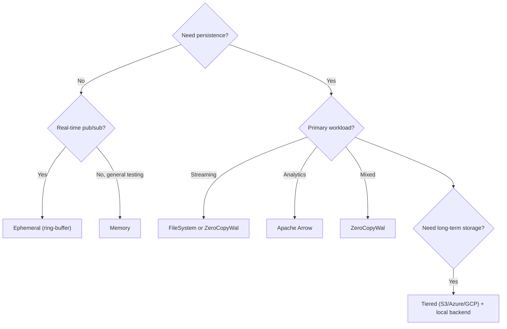
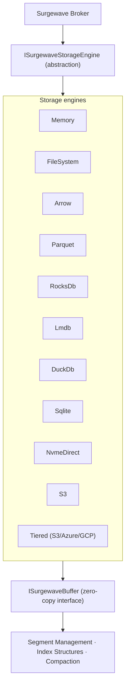

# Storage Overview

Surgewave provides multiple storage backends optimized for different workloads.

## Available Backends

| Backend | Persistence | Latency | Use Case |
|---------|-------------|---------|----------|
| [Memory](memory.md) | No | Lowest | Testing, caching |
| [FileSystem](filesystem.md) | Yes | Low | General purpose |
| [ZeroCopyWal](filesystem.md#zero-copy-wal) | Yes | Very Low | High performance |
| [Apache Arrow](arrow.md) | Yes | Medium | Analytics, columnar |
| [Parquet](arrow.md) | Yes | Medium | Columnar storage, analytics export |
| [RocksDb](filesystem.md) | Yes | Low | LSM-tree, high write throughput |
| [Lmdb](filesystem.md) | Yes | Low | Memory-mapped B+ tree |
| [DuckDb](arrow.md) | Yes | Medium | Embedded OLAP analytics |
| [Sqlite](filesystem.md) | Yes | Low | Lightweight embedded storage |
| [NvmeDirect](filesystem.md) | Yes | Lowest | Direct NVMe I/O, ultra-low latency |
| [S3](tiered.md) | Yes | High | Cloud object storage |
| [Tiered](tiered.md) | Yes | Variable | Cost optimization (S3/Azure/GCP) |
| [Ephemeral](memory.md#ephemeral-topics) | No (ring-buffer) | Lowest | Real-time distribution |

## Selection Guide



## Configuration

Set storage backend in `appsettings.json`:

```json
{
  "Surgewave": {
    "StorageMode": "File"
  }
}
```

Valid values:
- `Memory` - In-memory storage
- `File` - Traditional file-based
- `ZeroCopyWal` - Zero-copy WAL with mmap
- `ZeroCopyMemory` - Zero-copy in-memory with pooling
- `Arrow` - Apache Arrow columnar storage
- `Parquet` - Parquet columnar storage
- `RocksDb` - RocksDB LSM-tree storage
- `Lmdb` - LMDB memory-mapped B+ tree
- `DuckDb` - DuckDB embedded analytics
- `Sqlite` - SQLite embedded storage
- `NvmeDirect` - Direct NVMe I/O
- `S3` - Amazon S3 object storage

## Performance Comparison

| Message Size | File | ZeroCopyWal | Memory |
|-------------|------|-------------|--------|
| 100 bytes | 286K msg/s | 549K msg/s | 625K msg/s |
| 1 KB | 221K msg/s | 235K msg/s | 450K msg/s |
| 10 KB | 120K msg/s | 145K msg/s | 280K msg/s |

## Storage Architecture



## Common Settings

| Setting | Default | Description |
|---------|---------|-------------|
| `LogSegmentBytes` | 1 GB | Max segment size |
| `LogRetentionHours` | 168 (7 days) | Data retention |
| `LogRetentionBytes` | -1 (unlimited) | Max bytes per topic |

## Next Steps

- [Memory Storage](memory.md) - In-memory configuration
- [FileSystem Storage](filesystem.md) - Persistent storage
- [Apache Arrow](arrow.md) - Columnar storage for analytics
- [Tiered Storage](tiered.md) - Cloud object storage integration
