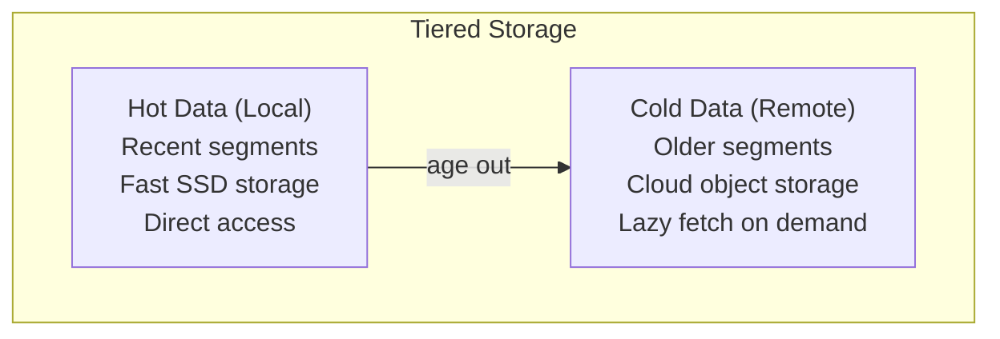

# Tiered Storage

Offload old data to cloud object storage for cost-effective long-term retention.

## Overview

Tiered storage (KIP-405) moves cold segments to remote storage:



## Cloud Providers

> **Enterprise Plugins**: Cloud tiering providers are available as separate plugins. Each provider is delivered as an enterprise .swpkg plugin that integrates via the `ITieredStoragePlugin` interface.

| Provider | Repository | Installation |
|----------|------------|--------------|
| AWS S3 | Surgewave.Storage.Tiering.S3 | `surgewave plugin install Kuestenlogik.Surgewave.Storage.Tiering.S3-x.y.z.swpkg` |
| Azure Blob | Surgewave.Storage.Tiering.Azure | `surgewave plugin install Kuestenlogik.Surgewave.Storage.Tiering.Azure-x.y.z.swpkg` |
| GCP Cloud Storage | Surgewave.Storage.Tiering.Gcp | `surgewave plugin install Kuestenlogik.Surgewave.Storage.Tiering.Gcp-x.y.z.swpkg` |

See each provider's repository for configuration and usage documentation.

### Local (Testing/Dev)

The local filesystem provider is included in the core tiering framework for development and testing:

```json
{
  "Surgewave": {
    "TieredStorage": {
      "Enabled": true,
      "Provider": "Local",
      "Local": {
        "BasePath": "/archive/surgewave"
      }
    }
  }
}
```

## Tiering Policy

Configure when segments are offloaded:

```json
{
  "Surgewave": {
    "TieredStorage": {
      "LocalRetentionMs": 86400000,      // Keep 24h locally
      "RemoteLogCopyBytesPerSec": 52428800, // 50 MB/s upload
      "RemoteLogDeleteLagMs": 3600000    // Wait 1h before delete
    }
  }
}
```

## Protocol Support

Kafka protocol extensions for tiered storage:

| API | Extension |
|-----|-----------|
| ListOffsets v8+ | `EarliestLocalTimestamp` (-4) |
| ListOffsets v9+ | `LastTieredOffset` (-5) |
| ListOffsets v11+ | `EarliestPendingUploadOffset` (-6) |
| Fetch v14+ | `OffsetMovedToTieredStorageException` |

## Consumer Behavior

When consuming tiered data:

1. Consumer requests offset in remote storage
2. Broker fetches segment from remote
3. Data is cached locally temporarily
4. Response sent to consumer

```csharp
// Consumer automatically handles tiered data
while (!cancellationToken.IsCancellationRequested)
{
    var message = await consumer.ConsumeAsync(cancellationToken);
    if (message != null)
    {
        // Seamless access regardless of storage tier
    }
}
```

## Monitoring

```bash
# Check tiered storage status
surgewave broker info --tiered-storage

# List tiered segments
surgewave topics describe my-topic --show-tiered
```

Metrics:
- `surgewave_tiered_segments_total` - Segments in remote storage
- `surgewave_tiered_bytes_total` - Bytes in remote storage
- `surgewave_tiered_fetch_latency_ms` - Remote fetch latency

## Limitations

- **Fetch Latency** - Remote fetches add latency
- **Ordering** - Must fetch sequentially
- **No Transactions** - Transaction markers may be remote

## Best Practices

1. **SSD for Local** - Keep local tier on fast storage
2. **Monitor Upload Lag** - Ensure uploads keep up
3. **Set Appropriate Retention** - Balance cost vs latency
4. **Use Compression** - Reduce storage costs

## Next Steps

- [Performance Tuning](../performance/tuning.md) - Optimization
- [Monitoring](../monitoring/metrics.md) - Tiered storage metrics
