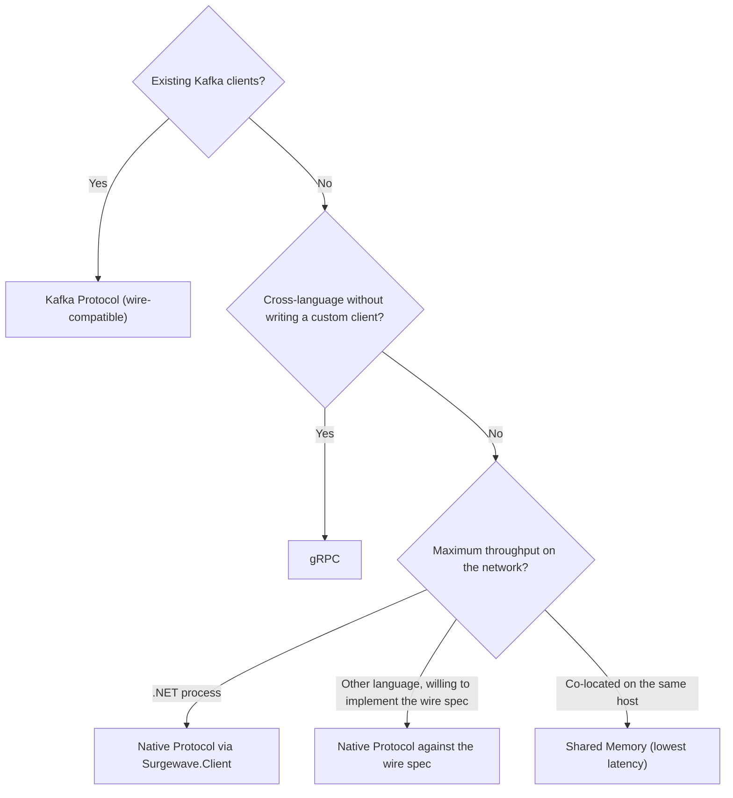
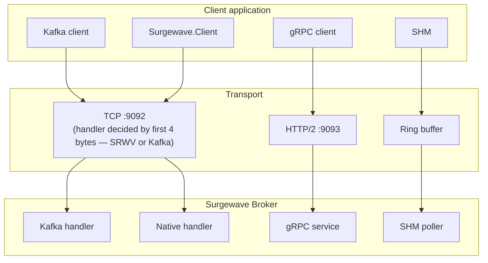

# Transport Overview

Surgewave supports multiple transport protocols for different use cases.

## Available Transports

| Transport | Default port | Language reach |
|-----------|--------------|----------------|
| [Kafka Protocol](kafka-protocol.md) | 9092 (shared) | Any Kafka client (Java, librdkafka, Confluent.Kafka, …) |
| [Native Protocol](native-protocol.md) | 9092 (shared) | Reference client is .NET; the wire spec is documented for third-party implementations in any language |
| [gRPC](grpc.md) | 9093 | Any gRPC-supported language |
| [Shared Memory](shared-memory.md) | IPC region | Co-located processes |

Kafka and Native share port 9092 — the broker decides which handler to
dispatch to per connection based on the first 4 bytes the client writes
(see [Protocol Detection](#protocol-detection)).

> Per-protocol P50/P99 latency targets: Native ≤ Kafka wire, Shared Memory ≪ Native, gRPC roughly on par with Kafka. Comparative head-to-head throughput and latency numbers will be published alongside the 1.0 release.

## Selection Guide



## Architecture



## Configuration

### Kafka Protocol (Default)

```json
{
  "Surgewave": {
    "Port": 9092
  }
}
```

### gRPC

```json
{
  "Surgewave": {
    "GrpcPort": 9093
  }
}
```

### Shared Memory

```json
{
  "Surgewave": {
    "SharedMemory": {
      "Enabled": true,
      "BasePath": "/dev/shm/surgewave"
    }
  }
}
```

## Protocol Detection

Surgewave does not negotiate the wire protocol in-band. The handler is
chosen per connection from the very first bytes a client writes:

1. **Port 9092 — Kafka vs Native.** The broker reads exactly 4 bytes before
   doing anything else. If those bytes equal `0x53 0x52 0x57 0x56` (`SRWV`),
   the connection is dispatched to the Native handler. Any other 4-byte
   value is reinterpreted as the Kafka request-size prefix and dispatched
   to the Kafka handler. There is no API-key sniffing.
2. **Port 9093 — gRPC.** Bound to its own dedicated port; standard HTTP/2
   framing applies.
3. **Shared memory.** Selected by the client opening the mapped IPC region
   instead of a socket — there is no TCP step at all.

The 4-byte Native magic is documented in detail under
[Native Protocol — Prelude](native-protocol.md#prelude).

## Next Steps

- [Kafka Protocol](kafka-protocol.md) - Full Kafka compatibility
- [Native Protocol](native-protocol.md) - High-performance binary
- [gRPC](grpc.md) - Cross-language streaming
- [Shared Memory](shared-memory.md) - Ultra-low latency IPC
