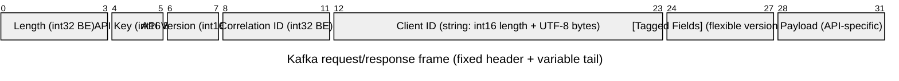

# Kafka Protocol

Surgewave implements ~93% of the Kafka 4.0 wire protocol and tracks Kafka 4.2.

## Compatibility

The authoritative, per-RPC and per-KIP status table — including which RPCs
are wired, which reject with structured errors, and which are intentionally
out of scope — lives under [Conformance](../conformance/index.md) in this docs site
(canonical source: [`CONFORMANCE.md`](https://github.com/Kuestenlogik/Surgewave/blob/main/CONFORMANCE.md)
at the repository root). It is generated from the same
`ApiVersionsResponse.CreateDefault` source and per-handler
`SupportedApiKeys` lists used at runtime.

Quick highlights:

| API Key | API Name | Version Range |
|---------|----------|---------------|
| 0 | Produce | 0-13 |
| 1 | Fetch | 4-18 |
| 2 | ListOffsets | 1-11 |
| 3 | Metadata | 0-13 |
| 8 | OffsetCommit | 2-10 |
| 9 | OffsetFetch | 1-10 |
| 10 | FindCoordinator | 0-6 |
| 11 | JoinGroup | 0-9 |
| 12 | Heartbeat | 0-4 |
| 13 | LeaveGroup | 0-5 |
| 14 | SyncGroup | 0-5 |
| 18 | ApiVersions | 0-5 |
| 19 | CreateTopics | 2-7 |
| 20 | DeleteTopics | 1-6 |
| 68 | ConsumerGroupHeartbeat (KIP-848) | 0-1 |
| 76 | ShareGroupHeartbeat (KIP-932) | 1 |
| 88 | StreamsGroupHeartbeat (KIP-1071) | 0 |

For the full matrix and the complete KIP coverage list, see
[Conformance / Kafka API matrix](../conformance/kafka-rpcs.md) and
[Conformance / KIP coverage](../conformance/kips.md).

## Using Kafka Clients

### Confluent.Kafka (.NET)

```csharp
var config = new ProducerConfig
{
    BootstrapServers = "localhost:9092"
};

using var producer = new ProducerBuilder<string, string>(config).Build();
await producer.ProduceAsync("my-topic", new Message<string, string>
{
    Key = "key",
    Value = "value"
});
```

### librdkafka (C/C++)

```c
rd_kafka_conf_t *conf = rd_kafka_conf_new();
rd_kafka_conf_set(conf, "bootstrap.servers", "localhost:9092", NULL, 0);

rd_kafka_t *producer = rd_kafka_new(RD_KAFKA_PRODUCER, conf, NULL, 0);
```

### kafka-python

```python
from kafka import KafkaProducer

producer = KafkaProducer(bootstrap_servers='localhost:9092')
producer.send('my-topic', b'message')
```

### kafka-go

```go
conn, _ := kafka.DialLeader(context.Background(), "tcp", "localhost:9092", "my-topic", 0)
conn.WriteMessages(kafka.Message{Value: []byte("message")})
```

## Protocol Features

### Topic IDs (UUID)

Fetch/Produce v13+ use TopicId instead of topic name:

```
TopicId: 550e8400-e29b-41d4-a716-446655440000
```

### Flexible Versions

Protocol v2+ supports tagged fields:

- Produce v9+
- Fetch v12+
- Metadata v9+

### Compression

| Codec | Type | Support |
|-------|------|---------|
| None | 0 | Yes |
| GZIP | 1 | Yes |
| Snappy | 2 | Yes |
| LZ4 | 3 | Yes |
| ZSTD | 4 | Yes |

### New Consumer Protocol (KIP-848)

OffsetCommit/OffsetFetch v9-10:
- MemberId field
- MemberEpoch field

## Wire Format

The first 12 bytes of every Kafka frame are fixed; everything from byte 12
onwards is variable-length and version-dependent.



Note: only the first 12 bytes are at fixed offsets. `Client ID`,
tagged-fields, and the payload occupy variable byte ranges — the diagram
shows their *order* on the wire, not exact widths.

## Troubleshooting

### Version Mismatch

```
Error: Unsupported API version
```

Check client version compatibility:

```bash
surgewave broker info
```

### Connection Issues

```bash
# Test connectivity
nc -zv localhost 9092

# Check broker logs
surgewave diagnose
```

## Configuration

```json
{
  "Surgewave": {
    "Port": 9092,
    "MaxRequestSize": 104857600,
    "SocketSendBufferBytes": 102400,
    "SocketReceiveBufferBytes": 102400
  }
}
```

## Next Steps

- [Native Protocol](native-protocol.md) - Higher performance
- [Clients](../clients/index.md) - Client library usage
