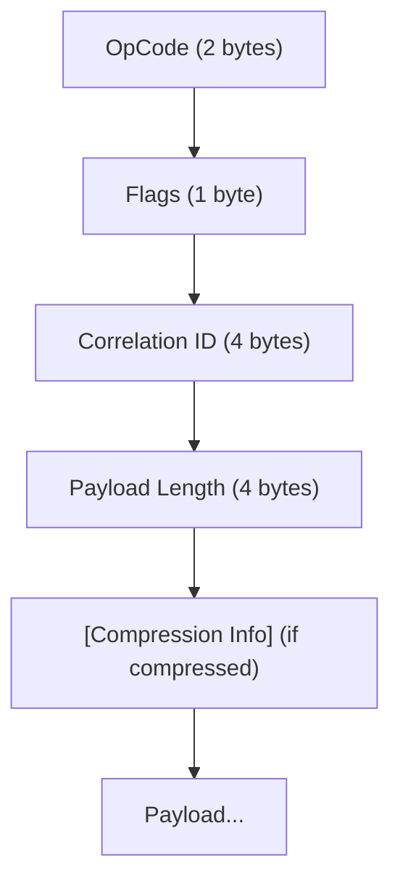
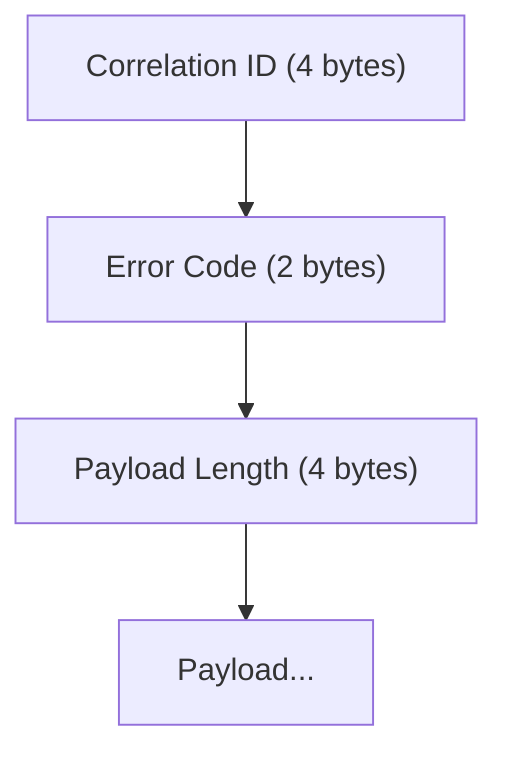

# Native Protocol

Surgewave's high-performance binary protocol for .NET applications.

## Overview

The native protocol provides:
- **lower latency** than Kafka protocol (lower latency than Kafka wire)
- **18x higher throughput** (1.25M msg/s vs 68K msg/s)
- Single-pass serialization
- SIMD-optimized encoding

## Usage

### Basic Client

```csharp
using Kuestenlogik.Surgewave.Client.Native;

await using var client = new SurgewaveNativeClient("localhost", 9092);
await client.ConnectAsync();

// Produce
await client.Messaging.Send("my-topic")
    .WithKey("order-123")
    .WithValue("order data")
    .ExecuteAsync();
```

### Fluent API

```csharp
await client.Messaging.Send("orders")
    .ToPartition(Partitioner.ByKey)
    .WithKey("order-123")
    .WithValue(orderData)
    .WithHeader("correlation-id", correlationId)
    .WithHeader("source", "order-service")
    .UsePreset(SendPreset.LowLatency)
    .ExecuteAsync();
```

## Operation Codes

| Range | Category | Operations |
|-------|----------|------------|
| 0x00xx | Connection | Handshake, Ping, GetMetadata |
| 0x01xx | Produce | Produce, ProduceBatch |
| 0x02xx | Consume | Fetch, Subscribe |
| 0x03xx | Offset | CommitOffset, FetchOffset, ListOffsets |
| 0x04xx | Consumer Groups | JoinGroup, SyncGroup, LeaveGroup |
| 0x05xx | Admin | CreateTopic (with config), DeleteTopic, AlterConfig |
| 0x06xx | Transactions | InitProducerId, EndTxn |
| 0x07xx | Quotas | GetQuotaConfig, SetQuotaConfig |
| 0x08xx | Security | DescribeAcls, CreateAcls |
| 0x09xx | Leader | ElectLeader, DescribeBrokerConfig |
| 0x0Axx | Schema | ListSubjects, RegisterSchema |
| 0x0Bxx | Connect | ListConnectors, CreateConnector |

## Wire Format

### Request Header



### Response Header



## Compression

Native protocol supports compression:

```csharp
await using var client = new SurgewaveNativeClient("localhost", 9092);
await client.ConnectAsync();
client.CompressionEnabled = true;  // Enable compression for large payloads
```

| Codec | Speed | Ratio |
|-------|-------|-------|
| None | Fastest | 1x |
| LZ4 | Very Fast | 2-3x |
| Zstd | Fast | 3-5x |

## Performance Optimizations

### SIMD Encoding

Big-endian conversions use SIMD when available:
- SSE4.2 on x64
- ARM CRC32 on ARM64

### Zero-Copy

```csharp
// Returns ISurgewaveBuffer with direct memory access
var buffer = await client.Messaging.FetchAsync("my-topic", 0, offset);
var span = buffer.AsSpan();  // No copy
```

### Batching

```csharp
await client.Messaging.Send("orders")
    .WithKey("key1").WithValue(data1)
    .And("key2", data2)
    .And("key3", data3)
    .SendAllAsync();
```

## Send Presets

| Preset | Batch Size | Linger | Use Case |
|--------|------------|--------|----------|
| LowLatency | 1 | 0ms | Real-time |
| Balanced | 16KB | 5ms | General |
| HighThroughput | 64KB | 50ms | Bulk |
| Reliable | 16KB | 5ms | Acks=all |

```csharp
await client.Messaging.Send("topic")
    .UsePreset(SendPreset.HighThroughput)
    .WithValue(data)
    .ExecuteAsync();
```

## Error Handling

```csharp
try
{
    await client.Messaging.Send("topic").WithValue(data).ExecuteAsync();
}
catch (ProtocolException ex)
{
    // Handle protocol-level error from broker
    Console.WriteLine($"Error: {ex.ErrorCode}");
}
```

## Configuration

```json
{
  "Surgewave": {
    "NativeProtocolCompressionEnabled": true,
    "SimdBatchThreshold": 1000
  }
}
```

## Next Steps

- [gRPC](grpc.md) - Cross-language support
- [Performance](../performance/benchmarks.md) - Benchmark details
