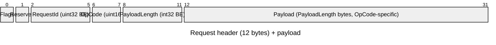
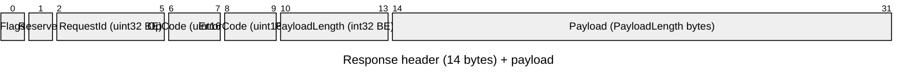

# Native Protocol — Wire Specification

This page is the on-the-wire specification of the Surgewave Native Protocol.
It is the reference for anyone implementing a third-party client (in any
language) or auditing the protocol. .NET users do not normally need to read
this — the `Kuestenlogik.Surgewave.Client` NuGet package wraps every detail
described here.

## Audience

- Authors of native clients in non-.NET languages (Rust, Go, C++, Python, …)
- Reviewers verifying the on-the-wire behaviour
- Operators capturing and inspecting Surgewave traffic on the wire

For the .NET SDK usage guide, see [.NET Client](../clients/dotnet.md).

## Transport

- TCP, default port **9092** (same port as the Kafka protocol — see
  [Auto-detection](#auto-detection) below)
- All integers are encoded **big-endian** (network byte order)
- No TLS framing of its own — wrap the TCP socket in TLS where required;
  the protocol is opaque to the transport layer

## Connection lifecycle

```
Client                                  Broker
  │                                       │
  ├─── TCP connect ──────────────────────►│
  │                                       │
  ├─── 4 bytes:  "SRWV"  (magic)          │
  │     1 byte:  0x01    (version) ──────►│
  │                                       │   Broker peeks first 4 bytes:
  │                                       │   match SRWV → native path
  │                                       │   else      → Kafka path
  │                                       │
  │◄────── Handshake response ────────────┤   carries broker capabilities
  │                                       │   (compression-supported flag,
  │                                       │    broker id, ...)
  │                                       │
  ├─── Request 1 (header + payload) ─────►│
  │◄── Response 1 (header + payload) ─────┤
  ├─── Request 2 ────────────────────────►│
  │◄── Response 2 ────────────────────────┤
  │              ...                      │
  │                                       │
  ├─── TCP close ────────────────────────►│
```

### Prelude

The very first bytes a client writes after a successful TCP connect are:

| Offset | Size | Field   | Value                          |
|-------:|-----:|---------|--------------------------------|
| 0      | 4    | Magic   | `0x53 0x52 0x57 0x56` (`SRWV`) |
| 4      | 1    | Version | `0x01` (current)               |

The broker reads exactly these 5 bytes before issuing the first
**Handshake** response (OpCode `0x0001`). The version byte is a single
global protocol version — there is no per-RPC versioning.

If the broker reads any other 4 bytes in the magic slot, it routes the
connection to the Kafka handler instead (see [Auto-detection](#auto-detection)).

## Request frame

After the prelude, every client request is **12 header bytes** followed by
`PayloadLength` payload bytes.



| Offset | Size | Field         | Type     | Notes                              |
|-------:|-----:|---------------|----------|------------------------------------|
| 0      | 1    | Flags         | uint8    | See [Flags](#flags)                |
| 1      | 1    | Reserved      | uint8    | Always `0x00`                      |
| 2      | 4    | RequestId     | uint32   | Client-chosen correlation ID       |
| 6      | 2    | OpCode        | uint16   | See [OpCodes](#opcodes)            |
| 8      | 4    | PayloadLength | int32    | Bytes of payload that follow       |
| 12     | N    | Payload       | bytes    | OpCode-specific, see Payloads      |

`RequestId` is opaque to the broker — it is echoed unmodified in the
matching response, allowing the client to multiplex many in-flight
requests on one connection.

## Response frame

Every broker response is **14 header bytes** followed by `PayloadLength`
payload bytes.



| Offset | Size | Field         | Type     | Notes                              |
|-------:|-----:|---------------|----------|------------------------------------|
| 0      | 1    | Flags         | uint8    | See [Flags](#flags)                |
| 1      | 1    | Reserved      | uint8    | Always `0x00`                      |
| 2      | 4    | RequestId     | uint32   | Echoes the request's RequestId     |
| 6      | 2    | OpCode        | uint16   | Echoes the request's OpCode, or `0xFF00` (Error) |
| 8      | 2    | ErrorCode     | uint16   | `0x0000` = success, see [Error codes](#error-codes) |
| 10     | 4    | PayloadLength | int32    | Bytes of payload that follow       |
| 14     | N    | Payload       | bytes    | OpCode-specific or error-message string for `0xFF00` |

The error code lives in the **response header**, not the payload — clients
can detect a failure and skip the payload without parsing the OpCode-specific
body.

## Flags

The `Flags` byte is a bitfield. The same enumeration is used for both
requests and responses; not all flags apply to both directions.

| Bit | Value  | Name         | Meaning                                                  |
|----:|--------|--------------|----------------------------------------------------------|
| 0   | `0x01` | Compressed   | Payload is LZ4-compressed (see [Compression](#compression)) |
| 1   | `0x02` | Streaming    | Response is part of a server-pushed stream              |
| 2   | `0x04` | BatchRequest | Payload contains multiple sub-operations                |
| 3   | `0x08` | NoResponse   | Fire-and-forget; the broker MUST NOT send a response    |
| 4   | `0x10` | LastInBatch  | Marks the final message in a streamed/batched sequence  |

## Primitive type encoding

All payloads are composed from fixed-width primitives. **There are no
varints, no zigzag encoding, and no compact arrays** — this is a deliberate
departure from Kafka.

| Type    | Wire format                                                     |
|---------|-----------------------------------------------------------------|
| int8    | 1 byte, two's complement                                        |
| uint8   | 1 byte                                                          |
| int16   | 2 bytes, big-endian, two's complement                           |
| uint16  | 2 bytes, big-endian                                             |
| int32   | 4 bytes, big-endian, two's complement                           |
| uint32  | 4 bytes, big-endian                                             |
| int64   | 8 bytes, big-endian, two's complement                           |
| uint64  | 8 bytes, big-endian                                             |
| boolean | 1 byte (`0x00` = false, `0x01` = true)                          |
| string  | int16 byte-length prefix + UTF-8 bytes. Length `-1` denotes null. Length `0` denotes an empty string. |
| bytes   | int32 byte-length prefix + raw bytes                            |
| array   | int32 element-count prefix + that many elements (each in the element's wire format) |

## Compression

When the `Compressed` flag is set on a frame, the payload bytes are
LZ4-compressed with a 4-byte big-endian original-size prefix:

```
┌──────────────────────────┬──────────────────────────────┐
│ OriginalSize (int32 BE)  │ LZ4-encoded bytes            │
└──────────────────────────┴──────────────────────────────┘
```

Rules:

- Brokers and clients **MUST NOT** compress payloads smaller than 1024
  bytes (the compression threshold). Smaller payloads are sent uncompressed
  with the `Compressed` flag clear.
- Implementations that try to compress and find the result is **not
  smaller** than the input MUST drop the `Compressed` flag and emit the
  original bytes unchanged.
- LZ4 codec: block format, `LZ4Level.L00_FAST` is the reference compression
  level (any decoder-compatible level is acceptable on the sending side).

The broker advertises whether it accepts compressed input via the
handshake-response flags. Clients MUST honour that flag — do not send
compressed frames to a broker that has not advertised support.

## OpCodes

OpCodes are 16-bit unsigned integers. The high byte is a category, the low
byte is the operation within that category. `0xFF00` is reserved for the
generic error envelope (sent when the broker has no meaningful OpCode to
echo, e.g. malformed header).

### Category map

| Range    | Category               |
|----------|------------------------|
| `0x00xx` | Connection & metadata  |
| `0x01xx` | Produce                |
| `0x02xx` | Consume & ack          |
| `0x03xx` | Offsets                |
| `0x04xx` | Consumer groups (v1)   |
| `0x05xx` | Topic & cluster admin  |
| `0x06xx` | Transactions           |
| `0x07xx` | Quotas                 |
| `0x08xx` | Security (ACLs)        |
| `0x09xx` | Leader election & broker config |
| `0x0Axx` | Schema registry        |
| `0x0Bxx` | Connect                |
| `0x0Cxx` | Delegation tokens      |
| `0x0Dxx` | Plugin marketplace     |
| `0x0Exx` | Cross-topic transactions |
| `0x0Fxx` | Share groups (KIP-932) |
| `0x10xx` | Consumer groups v2 (KIP-848) |
| `0x11xx` | Client telemetry (KIP-714) |
| `0x12xx` | Streams groups (KIP-1071) |
| `0x13xx` | Key-value store        |
| `0x14xx` | Object store           |
| `0xFFxx` | Error envelope         |

### Full OpCode list

| Code     | Name                          | Notes                                  |
|----------|-------------------------------|----------------------------------------|
| `0x0001` | Handshake                     | First response after prelude           |
| `0x0002` | Ping                          |                                        |
| `0x0003` | Pong                          |                                        |
| `0x0004` | GetMetadata                   |                                        |
| `0x0100` | Produce                       | Single record                          |
| `0x0101` | ProduceBatch                  | Multiple records in one request        |
| `0x0102` | ProduceAck                    | Response to Produce/ProduceBatch       |
| `0x0200` | Fetch                         | Single pull                            |
| `0x0201` | FetchResponse                 |                                        |
| `0x0202` | Subscribe                     | Initiates push-streaming               |
| `0x0203` | Unsubscribe                   |                                        |
| `0x0204` | Nack                          | Negative ack (Share-Group DLQ flow)    |
| `0x0205` | NackAck                       |                                        |
| `0x0206` | StreamAck                     | Ack of a streamed record               |
| `0x0300` | CommitOffset                  |                                        |
| `0x0301` | FetchOffset                   |                                        |
| `0x0302` | ListOffsets                   |                                        |
| `0x0400` | JoinGroup                     | Consumer groups v1                     |
| `0x0401` | SyncGroup                     |                                        |
| `0x0402` | LeaveGroup                    |                                        |
| `0x0403` | Heartbeat                     |                                        |
| `0x0404` | ListGroups                    |                                        |
| `0x0405` | DescribeGroup                 |                                        |
| `0x0406` | DeleteGroup                   |                                        |
| `0x0407` | FindCoordinator               |                                        |
| `0x0408` | GetGroupLag                   |                                        |
| `0x0409` | GetLagSummary                 |                                        |
| `0x0500` | CreateTopic                   |                                        |
| `0x0501` | DeleteTopic                   |                                        |
| `0x0502` | ListTopics                    |                                        |
| `0x0503` | DescribeTopic                 |                                        |
| `0x0504` | AlterConfig                   |                                        |
| `0x0505` | DescribeConfig                |                                        |
| `0x0506` | GetClusterInfo                |                                        |
| `0x0507` | ListBrokers                   |                                        |
| `0x0508` | AlterPartitionReassignments   |                                        |
| `0x0509` | ListPartitionReassignments    |                                        |
| `0x050A` | TriggerLogCompaction          |                                        |
| `0x050B` | GetCompactionStatus           |                                        |
| `0x050C` | VerifyLogIntegrity            |                                        |
| `0x050D` | CreatePartitions              |                                        |
| `0x050E` | DeleteRecords                 |                                        |
| `0x0600` | InitProducerId                |                                        |
| `0x0601` | AddPartitionsToTxn            |                                        |
| `0x0602` | AddOffsetsToTxn               |                                        |
| `0x0603` | TxnOffsetCommit               |                                        |
| `0x0604` | EndTxn                        |                                        |
| `0x0605` | ListTransactions              |                                        |
| `0x0606` | DescribeTransactions          |                                        |
| `0x0700` | GetQuotaConfig                |                                        |
| `0x0701` | SetQuotaConfig                |                                        |
| `0x0702` | DescribeClientQuotas          |                                        |
| `0x0703` | ListClientQuotas              |                                        |
| `0x0800` | DescribeAcls                  |                                        |
| `0x0801` | CreateAcls                    |                                        |
| `0x0802` | DeleteAcls                    |                                        |
| `0x0900` | ElectLeader                   |                                        |
| `0x0901` | DescribeBrokerConfig          |                                        |
| `0x0902` | AlterBrokerConfig             |                                        |
| `0x0A00` | ListSubjects                  | Schema registry                        |
| `0x0A01` | GetSubjectVersions            |                                        |
| `0x0A02` | RegisterSchema                |                                        |
| `0x0A03` | GetSchemaById                 |                                        |
| `0x0A04` | GetSchemaByVersion            |                                        |
| `0x0A05` | DeleteSubject                 |                                        |
| `0x0A06` | DeleteSchemaVersion           |                                        |
| `0x0A07` | CheckCompatibility            |                                        |
| `0x0A08` | GetCompatibilityConfig        |                                        |
| `0x0A09` | SetCompatibilityConfig        |                                        |
| `0x0A0A` | GetSchemaTypes                |                                        |
| `0x0B00` | ListConnectors                |                                        |
| `0x0B01` | GetConnector                  |                                        |
| `0x0B02` | CreateConnector               |                                        |
| `0x0B03` | DeleteConnector               |                                        |
| `0x0B04` | GetConnectorConfig            |                                        |
| `0x0B05` | UpdateConnectorConfig         |                                        |
| `0x0B06` | GetConnectorStatus            |                                        |
| `0x0B07` | RestartConnector              |                                        |
| `0x0B08` | PauseConnector                |                                        |
| `0x0B09` | ResumeConnector               |                                        |
| `0x0B0A` | GetConnectorTasks             |                                        |
| `0x0B0B` | RestartConnectorTask          |                                        |
| `0x0B0C` | ListConnectorPlugins          |                                        |
| `0x0C00` | CreateDelegationToken         |                                        |
| `0x0C01` | RenewDelegationToken          |                                        |
| `0x0C02` | ExpireDelegationToken         |                                        |
| `0x0C03` | DescribeDelegationTokens      |                                        |
| `0x0D00` | SearchPlugins                 | Plugin marketplace                     |
| `0x0D01` | GetPlugin                     |                                        |
| `0x0D02` | InstallPlugin                 |                                        |
| `0x0D03` | UninstallPlugin               |                                        |
| `0x0D04` | ListInstalledPlugins          |                                        |
| `0x0D05` | GetPluginDependencies         |                                        |
| `0x0D06` | UploadPlugin                  |                                        |
| `0x0D07` | PushPluginNotification        |                                        |
| `0x0D08` | PullPlugin                    |                                        |
| `0x0E00` | CrossTopicTxnBegin            |                                        |
| `0x0E01` | CrossTopicTxnBeginAck         |                                        |
| `0x0E02` | CrossTopicTxnAddWrite         |                                        |
| `0x0E03` | CrossTopicTxnAddWriteAck      |                                        |
| `0x0E04` | CrossTopicTxnCommit           |                                        |
| `0x0E05` | CrossTopicTxnCommitAck        |                                        |
| `0x0E06` | CrossTopicTxnAbort            |                                        |
| `0x0E07` | CrossTopicTxnAbortAck         |                                        |
| `0x0F00` | ShareGroupHeartbeat           | KIP-932                                |
| `0x0F01` | ShareGroupDescribe            |                                        |
| `0x0F02` | ShareFetch                    |                                        |
| `0x0F03` | ShareAcknowledge              |                                        |
| `0x0F04` | ShareGroupJoin                |                                        |
| `0x0F05` | ShareGroupLeave               |                                        |
| `0x0F06` | DescribeShareGroupOffsets     |                                        |
| `0x0F07` | AlterShareGroupOffsets        |                                        |
| `0x0F08` | DeleteShareGroupOffsets       |                                        |
| `0x1000` | ConsumerGroupHeartbeat        | KIP-848                                |
| `0x1001` | ConsumerGroupDescribe         |                                        |
| `0x1100` | GetTelemetrySubscriptions     | KIP-714                                |
| `0x1101` | PushTelemetry                 |                                        |
| `0x1200` | StreamsGroupHeartbeat         | KIP-1071                               |
| `0x1201` | StreamsGroupDescribe          |                                        |
| `0x1300` | KvCreateBucket                | Key-value store                        |
| `0x1301` | KvDeleteBucket                |                                        |
| `0x1302` | KvListBuckets                 |                                        |
| `0x1303` | KvGet                         |                                        |
| `0x1304` | KvPut                         |                                        |
| `0x1305` | KvDelete                      |                                        |
| `0x1306` | KvListKeys                    |                                        |
| `0x1307` | KvHistory                     |                                        |
| `0x1308` | KvWatch                       |                                        |
| `0x1309` | KvPurge                       |                                        |
| `0x1400` | ObjCreateStore                | Object store                           |
| `0x1401` | ObjPutObject                  |                                        |
| `0x1402` | ObjGetObject                  |                                        |
| `0x1403` | ObjDeleteObject               |                                        |
| `0x1404` | ObjListObjects                |                                        |
| `0x1405` | ObjGetObjectInfo              |                                        |
| `0xFF00` | Error                         | Generic error envelope                 |

The authoritative source for OpCode values is
`src/Kuestenlogik.Surgewave.Protocol.Native/SurgewaveOpCode.cs`.

## Error codes

The `ErrorCode` field of the response header is a 16-bit unsigned integer.
`0x0000` always means success; any non-zero value means the broker rejected
the request.

| Code | Name                            |
|-----:|---------------------------------|
| 0    | None (success)                  |
| 1    | UnknownError                    |
| 2    | InvalidRequest                  |
| 3    | TopicNotFound                   |
| 4    | PartitionNotFound               |
| 5    | NotLeader                       |
| 6    | AuthenticationFailed            |
| 7    | AuthorizationFailed             |
| 8    | InvalidOffset                   |
| 9    | MessageTooLarge                 |
| 10   | GroupNotFound                   |
| 11   | RebalanceInProgress             |
| 12   | InvalidSession                  |
| 13   | Timeout                         |
| 14   | MemberIdRequired                |
| 15   | UnknownMemberId                 |
| 16   | IllegalGeneration               |
| 17   | InconsistentGroupProtocol       |
| 18   | GroupNotEmpty                   |
| 19   | GroupAuthorizationFailed        |
| 20   | NotCoordinator                  |
| 21   | CoordinatorNotAvailable         |
| 30-37 | Transaction errors             |
| 40-42 | Security errors                |
| 50-51 | Config errors                  |
| 60-62 | Leader-election errors         |
| 70-75 | Schema-registry errors         |
| 80-85 | Connect errors                 |
| 90-95 | Plugin/marketplace errors      |
| 100-105 | Cross-topic transaction errors |
| 110-112 | Streaming/subscription errors  |
| 120-123 | Key-value store errors         |
| 130-131 | Object-store errors            |

The authoritative source for error codes is
`src/Kuestenlogik.Surgewave.Protocol.Native/SurgewaveErrorCode.cs`.

## Auto-detection

Surgewave runs the Native Protocol and the Kafka wire protocol on the **same
TCP port** (default `9092`). The broker decides which path to take by
reading the first 4 bytes of every new connection:

- Bytes equal to `0x53 0x52 0x57 0x56` (`SRWV`) → Native handler.
- Anything else → Kafka handler. The 4 bytes are pushed back and
  reinterpreted as the Kafka request-size prefix.

This means a Native-protocol client identifies itself implicitly by the
first 4 bytes it writes. There is no in-band negotiation, no upgrade
handshake — choose your handler before connecting.

## Differences from Kafka

For implementers who already know the Kafka wire protocol, this is the
short summary of where Surgewave Native diverges:

| Aspect                | Kafka                                              | Surgewave Native                              |
|-----------------------|----------------------------------------------------|-----------------------------------------------|
| Framing               | int32 size-prefix per request                      | Fixed 12/14-byte headers, no size-prefix      |
| Magic / handshake     | None (request type implies protocol)               | 4-byte `SRWV` magic + 1-byte version          |
| Versioning            | Per-RPC (API key + API version), `ApiVersions` RPC | One global protocol version byte at connect   |
| Integer encoding      | Mix of fixed-width and varints (zigzag for signed) | All fixed-width big-endian. No varints.       |
| String encoding       | int16 length + UTF-8 (`-1` null), or compact-string varint | int16 length + UTF-8 (`-1` null). No compact form. |
| Array encoding        | int32 length, or compact-array varint              | int32 length. No compact form.                |
| Tagged fields         | Yes (KIP-482 flexible versions)                    | No                                            |
| Error reporting       | Per-record / per-partition inside payload          | Single `ErrorCode` in response header (plus per-record in payloads where it makes sense) |
| Correlation           | int32 correlation ID inside request header         | uint32 RequestId in fixed header position 2-5 |
| Compression           | Per-record-batch (gzip, snappy, lz4, zstd)         | Per-frame (LZ4 only) with explicit size prefix |
| Server push           | Long-poll Fetch                                    | Native `Subscribe` + `Streaming`-flagged frames |
| Fire-and-forget       | Acks=0 producer only                               | `NoResponse` flag on any request              |
| Batching              | RecordBatch within Produce/Fetch                   | `BatchRequest` flag on any OpCode + explicit batch payloads |

## Reference implementation

The .NET reference client (`Kuestenlogik.Surgewave.Client`) implements
this specification. The protocol primitives live in the
`Kuestenlogik.Surgewave.Protocol.Native` assembly — when in doubt about a
detail not covered here, that assembly is the ground truth.

## Next steps

- [Kafka Protocol](kafka-protocol.md) — for clients that already speak Kafka
- [Auto-detection algorithm](index.md#protocol-detection) — broker-side dispatch
- [ADR-003: Native Protocol Design](../adr/003-native-protocol-design.md) — design rationale
